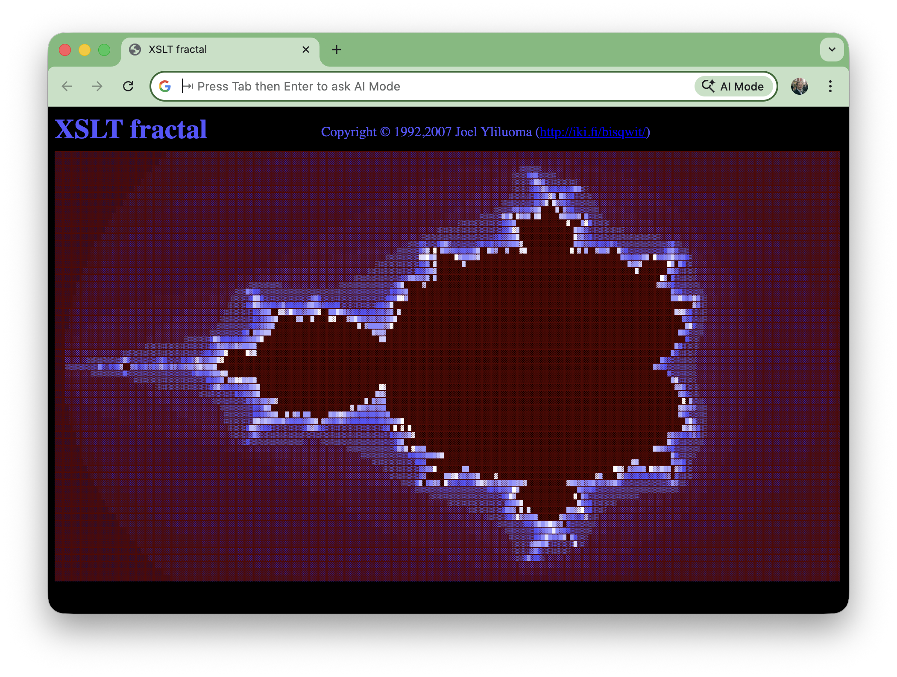
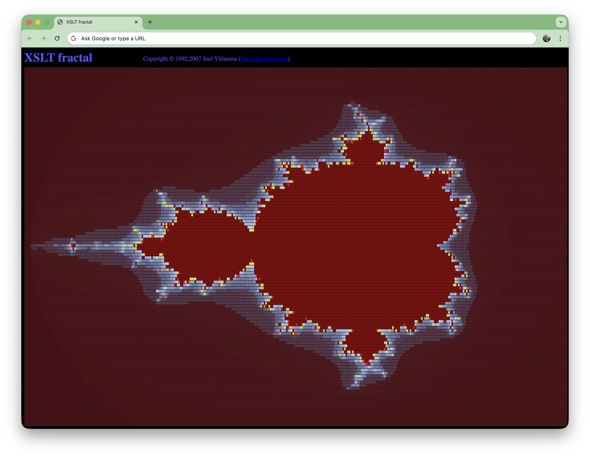

# #xxx XSLT Mandelbrot

Playing with Joel Yliluoma's demonstration of the power of XSLT: generating a Mandelbrot set, rendered with HTML.

## Notes

I found this featured on [The Daily WTF](https://thedailywtf.com/articles/stupid-coding-tricks-xslt-mandelbrot) back in the day.
The original author is [Joel Yliluoma](https://iki.fi/bisqwit/)

The [mandelbrot.xml](./mandelbrot.xml) defines the parameters of the Mandelbrot set, and the colour mapping for magnitudes.
The calculation of the Mandelbrot set is performed by the transform [mandelbrot.xsl](./mandelbrot.xsl).

I am running this on macOS, and using
[xsltproc](https://linux.die.net/man/1/xsltproc), which is installed by default as part of the
[libxslt](https://developer.apple.com/library/archive/documentation/System/Conceptual/ManPages_iPhoneOS/man3/libxslt.3.html).
I use this to perform the transformation:

```sh
xsltproc mandelbrot.xsl mandelbrot.xml > mandelbrot.html
```

The resulting image:

[](./mandelbrot.html)

I modified some parameters in [mandelbrot2.xml](./mandelbrot2.xml)
and generated a new image:

```sh
xsltproc mandelbrot.xsl mandelbrot2.xml > mandelbrot2.html
```

[](./mandelbrot2.html)

## Credits and References

* [Stupid Coding Tricks: XSLT Mandelbrot](https://thedailywtf.com/articles/stupid-coding-tricks-xslt-mandelbrot)
* [Joel Yliluoma](https://iki.fi/bisqwit/)
* <https://en.wikipedia.org/wiki/Mandelbrot_set>
