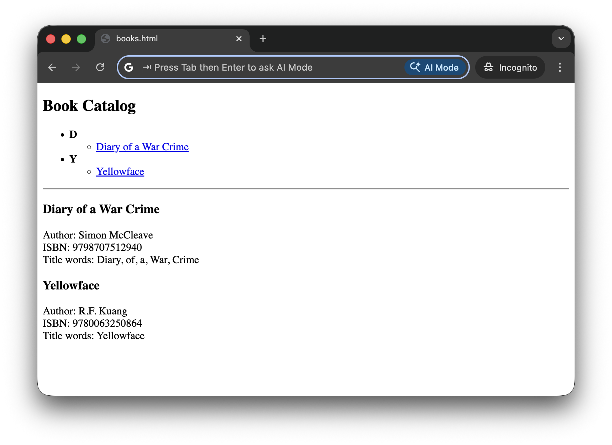

# #434 Saxon Processor

Setting up and using Saxon for XSLT, XQuery, and XML Schema, including XSLT 3.0 compatible processing on macOS.

## Notes

On macOS,
[xsltproc](https://linux.die.net/man/1/xsltproc) is installed by default as part of the
[libxslt](https://developer.apple.com/library/archive/documentation/System/Conceptual/ManPages_iPhoneOS/man3/libxslt.3.html).
This is handy for baseline handling of XSLT, however it only supports XSLT 1.1 features.

The Saxon processor is the leading alternative for XSLT, XQuery, and XML Schema, including the only XSLT 3.0 conformant toolset.

Let's install and test Saxon on macOS.

### macOS Installation

Here are the steps I used to setup Saxon for use on macOS.

We need Java...

```sh
$ brew install openjdk
$ java --version
openjdk 25.0.1 2025-10-21
OpenJDK Runtime Environment Homebrew (build 25.0.1)
OpenJDK 64-Bit Server VM Homebrew (build 25.0.1, mixed mode, sharing)
```

Download the latest Saxon package, available from the [downloads](https://www.saxonica.com/download/download_page.xml) page
or [GitHub](https://github.com/Saxonica/Saxon-HE/releases).

```sh
$ wget https://github.com/Saxonica/Saxon-HE/releases/download/SaxonHE12-9/SaxonHE12-9J.zip
$ unzip SaxonHE12-9J.zip -d SaxonHE12-9J
$ java -cp "./SaxonHE12-9J/saxon-he-12.9.jar:./SaxonHE12-9J/lib/*" net.sf.saxon.Transform -?
SaxonJ-HE 12.9 from Saxonica
Usage: see https://www.saxonica.com/documentation/index.html#!using-xsl/commandline
Format: net.sf.saxon.Transform options params
Options available: -? -a -catalog -config -dtd -ea -expand -explain -export -ext -im -init -it -jit -json -l -lib -license -nogo -now -ns -o -opt -or -outval -p -quit -r -relocate -repeat -s -sa -scmin -strip -stublib -t -T -target -threads -TJ -Tlevel -Tout -TP -TPxsl -traceout -tree -u -val -versionmsg -warnings -x -xi -xmlversion -xsd -xsdversion -xsiloc -xsl -y --?
Use -XYZ:? for details of option XYZ
Params:
  param=value           Set stylesheet string parameter
  +param=filename       Set stylesheet document parameter
  ?param=expression     Set stylesheet parameter using XPath
  !param=value          Set serialization parameter
```

Defining a handy alias for invoking Saxon:

```sh
alias xslt3="java -cp \"$(pwd)/SaxonHE12-9J/saxon-he-12.9.jar:$(pwd)/SaxonHE12-9J/lib/*\" net.sf.saxon.Transform"
```

### Transform Example

I am using the [books.xml](../books.xml) collection from [LCK#431 XSLT](../),
but now using an enhanced transformer [books.xsl](./books.xsl) that demonstrates some XSLT 2.0 and 3.0 features, specifically:

* XSLT 2.0 Features
    * `lower-case()`, `upper-case()`, `replace()`
    * `tokenize()` and `string-join()`
    * `for-each-group` (grouping, big upgrade over 1.0)
    * inline `if (...) then ... else ...` expressions
    * user-defined functions (`xsl:function`)
* XSLT 3.0 Features
    * `xsl:mode on-no-match="shallow-skip"` (clean default processing)
    * `expand-text="yes"` allows `{expr}` directly in text (much cleaner syntax)
    * more functional style with `xsl:sequence`

Running the transform:

```sh
xslt3 -s:../books.xml -xsl:books.xsl -o:books.html
```

See the result in [books.html](./books.html):

[](./books.html)

## Credits and References

* <https://en.wikipedia.org/wiki/Saxon_XSLT>
* <https://www.saxonica.com/> - new home of Saxon
* <https://github.com/Saxonica/>
* <https://saxon.sourceforge.net/> - old home of Saxon
