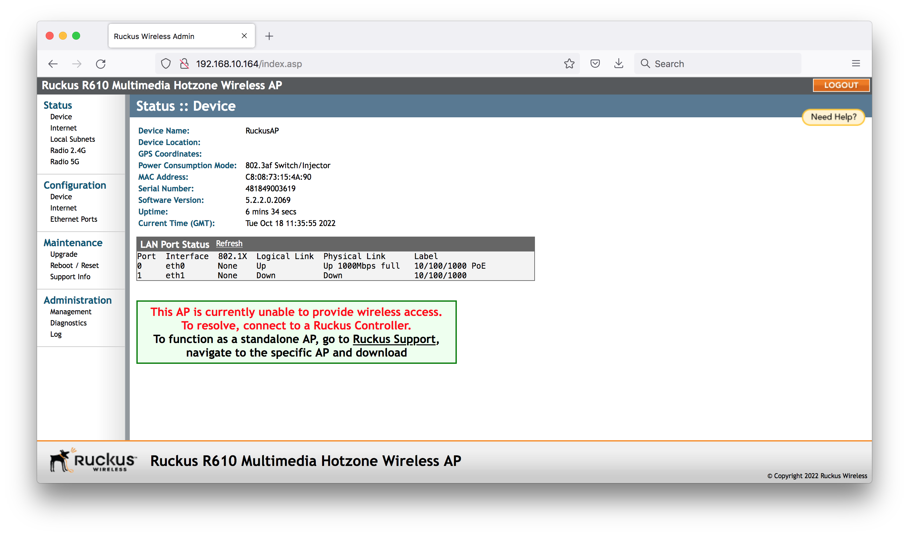
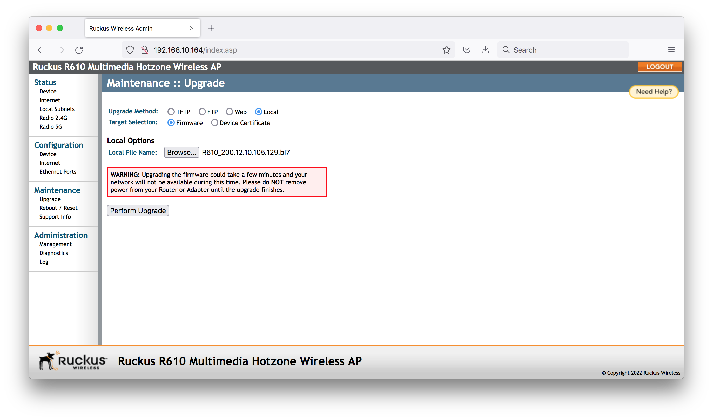
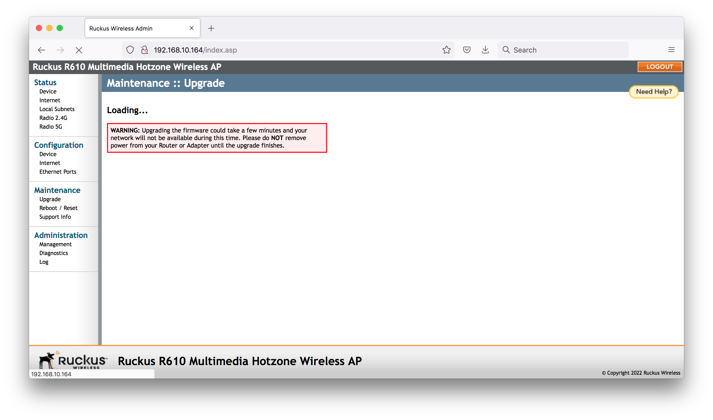
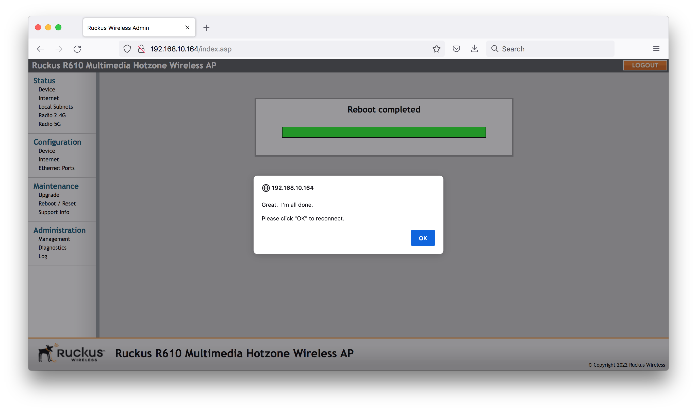
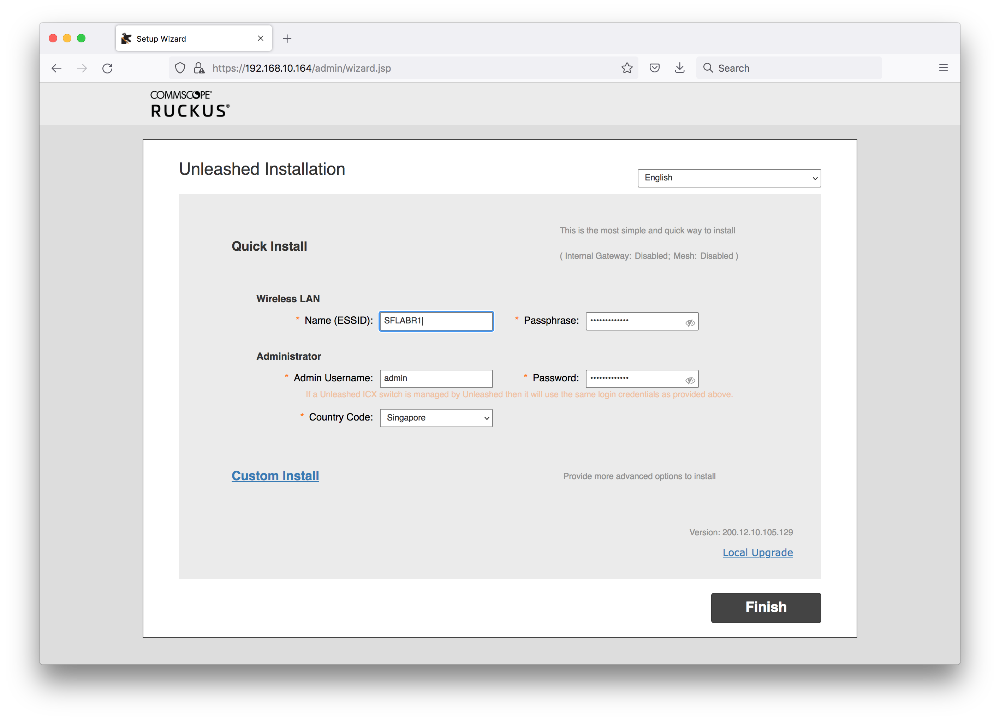
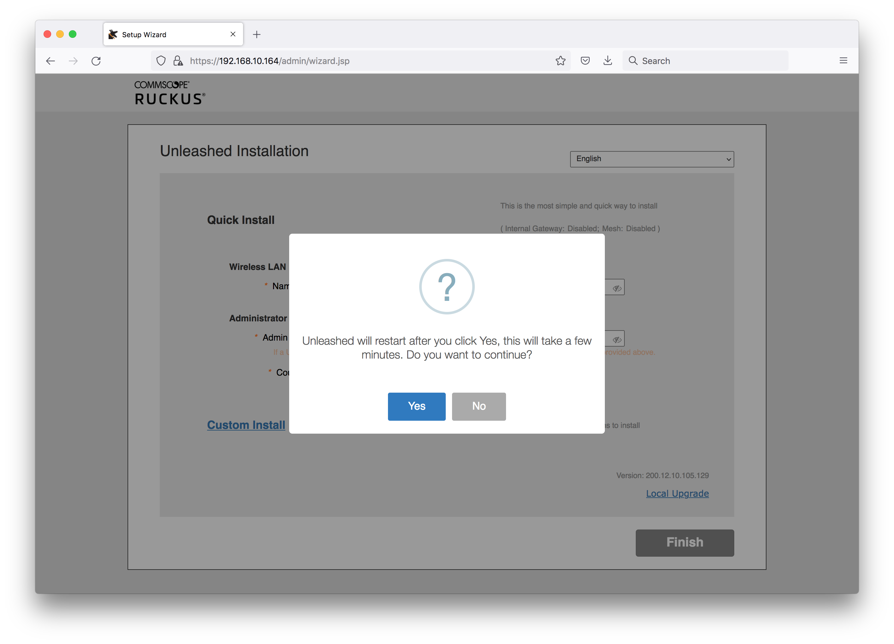
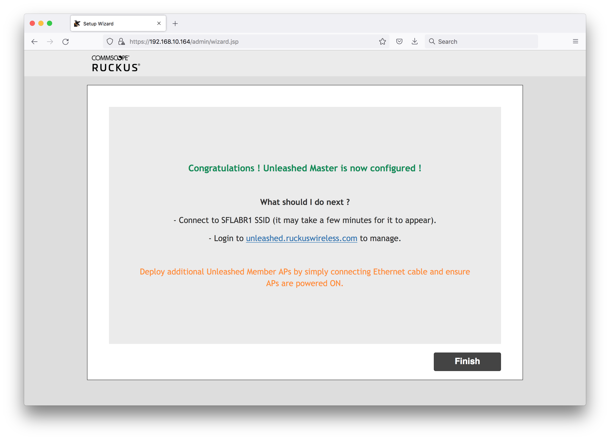
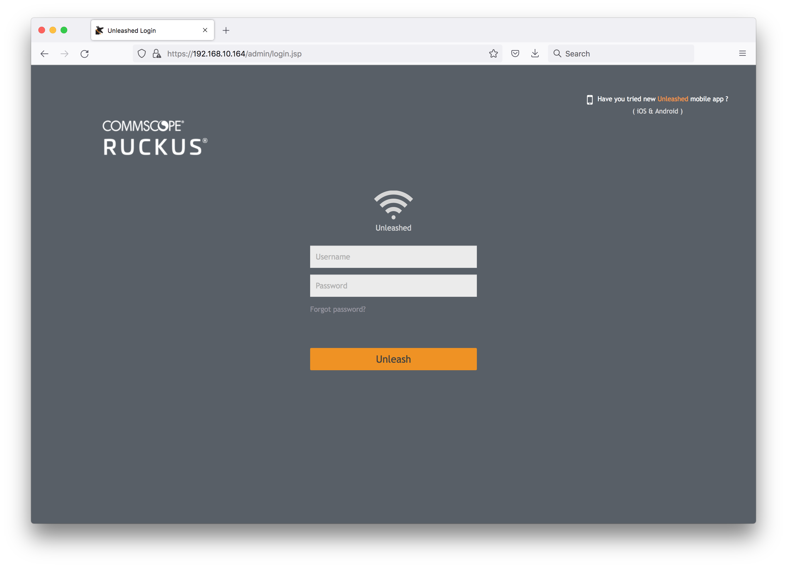
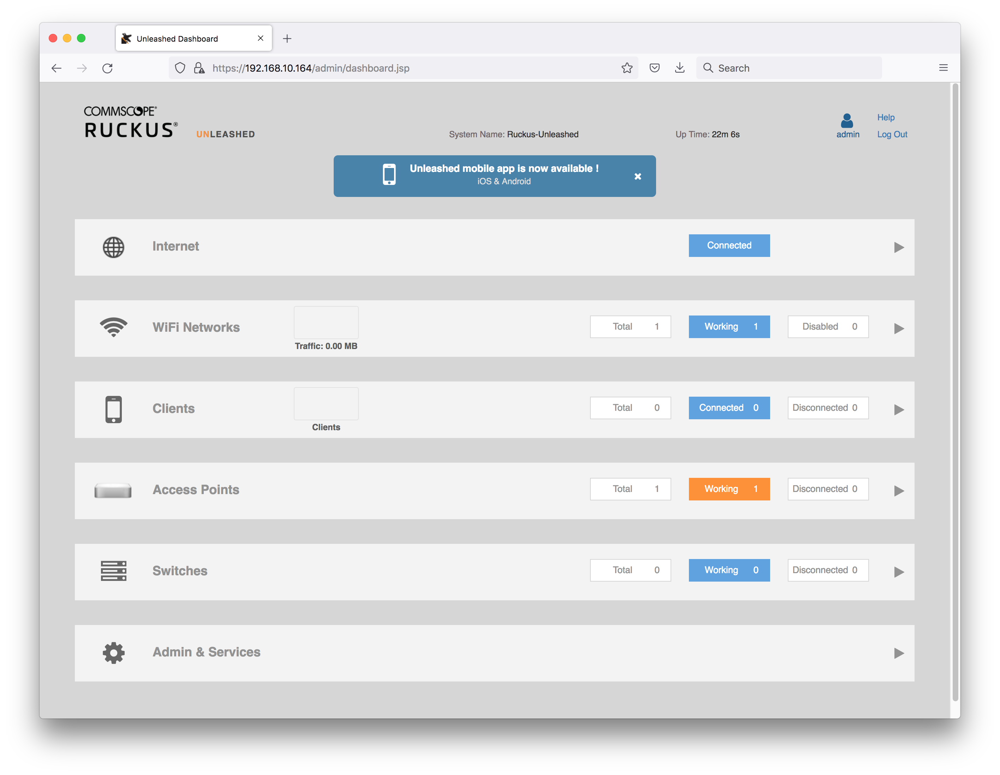

# #232 Convert SZ AP to Unleashed

Demonstrating the procedure for converting a SZ-managed Ruckus R610 AP to Unleashed.

## Notes

The following procedure is based on
[Convert Standalone/SZ/ZD managed AP to Unleashed Code](https://support.ruckuswireless.com/articles/000005720).

Initial situation:

* Ruckus R610 that was managed by Virtual SmartZone
* Running AP firmware 5.2.2.0.2069

ssh to the AP to confirm details:

    rkscli: get version
    Ruckus R610 Multimedia Hotzone Wireless AP
    Version: 5.2.2.0.2069

### Factory reset the R610

Officially, it should be sufficient to press the reset button for > 6 sec,
or if possible to ssh and sign-in to the AP, issue factory reset command, which is different in various firmware version. Either:

    rkscli: get version
    Ruckus R610 Multimedia Hotzone Wireless AP
    Version: 5.2.2.0.2069
    OK
    rkscli: set factory
    Factory defaults will take effect after reboot
    OK
    rkscli: reboot
    OK

Or

    enable
    set-factory
    reboot

However I found these didn't bring the AP back to a state where I could login to the web UI.
Instead I needed to do a full "30-30-30" reset:

* hold reset button down for 30s while power on
* keep holding reset button down for another 30s with power off
* keep holding reset button down for another 30s after power back on

### Connect to the AP Web UI

The AP is assigned 192.168.10.164 on the local network, and the web UI is accessible at <https://192.168.10.164>
Login with default credentials super/sp-admin:

### Upgrade the Firmware

Downloaded the most recent Unleashed software for the R610 from
<https://support.ruckuswireless.com/software/3462-ruckus-unleashed-ap-200-12-mr1-refresh1-software-for-r610>

* RUCKUS Unleashed AP 200.12 (MR1 Refresh1) Software for R610
* Availability: All Users
* Version: 200.12.10.105.129
* File: `R610_200.12.10.105.129.bl7`

Going to the Maintenance > Upgrade of the local web admin and uploading the firmware file:

After clicking perform upgrade:

All done:

### Unleashed Initial Configuration

See also [YouTube: RUCKUS UNLEASHED SETUP IN 5 MINUTES](https://www.youtube.com/watch?v=j8I5aVwMNMg)

After the firmware upgrade, reloading <https://192.168.10.164> presents the Unleashed setup wizard.

NB: this can also be loaded by connected to the "Configure.Me-XXXXX" SSID (no password)
and browsing to `unleashed.ruckuswireless.com`

I've set an initial SSID and admin password.

Confirmation after clicking finished:

Configuration complete:

### Unleashed Management UI

Connecting to the PA requires sign-in with the admin credentials set during setup:

Management page after sign-in:

## Credits and References

* [Convert Standalone/SZ/ZD managed AP to Unleashed Code](https://support.ruckuswireless.com/articles/000005720)
* [30-30-30 Hard Reset](https://www.lifewire.com/hard-reset-rule-for-routers-3971318)
* [YouTube: RUCKUS UNLEASHED SETUP IN 5 MINUTES](https://www.youtube.com/watch?v=j8I5aVwMNMg)
