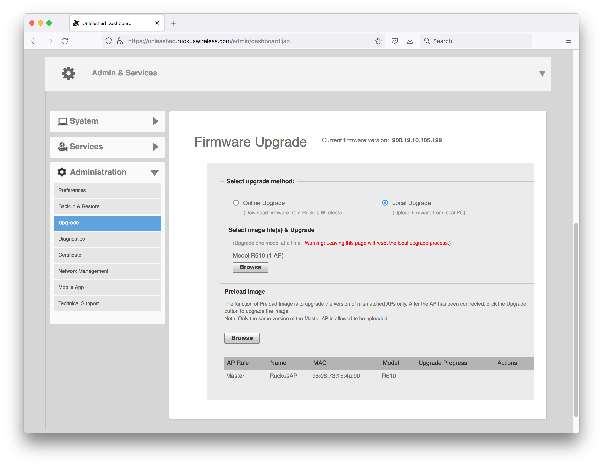
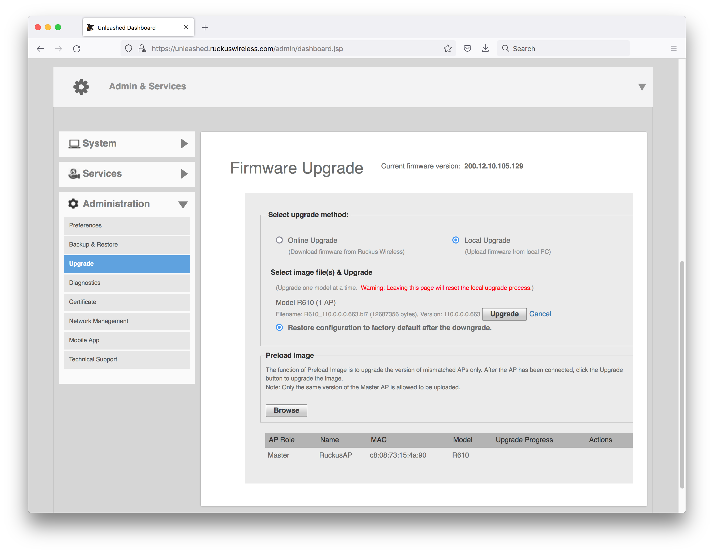
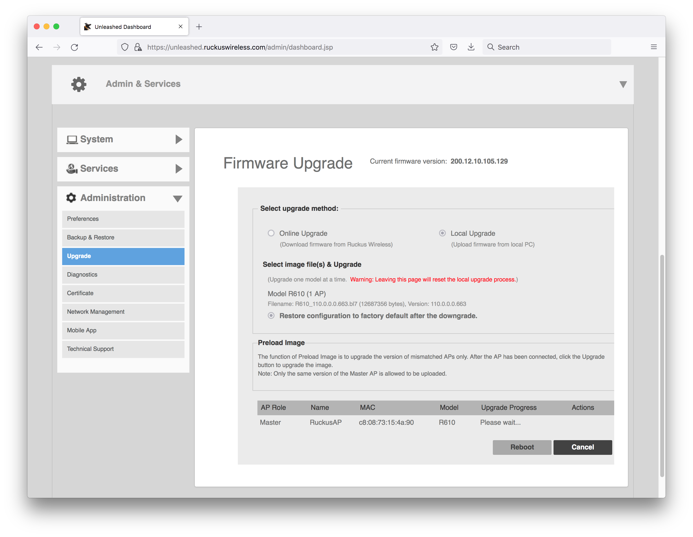
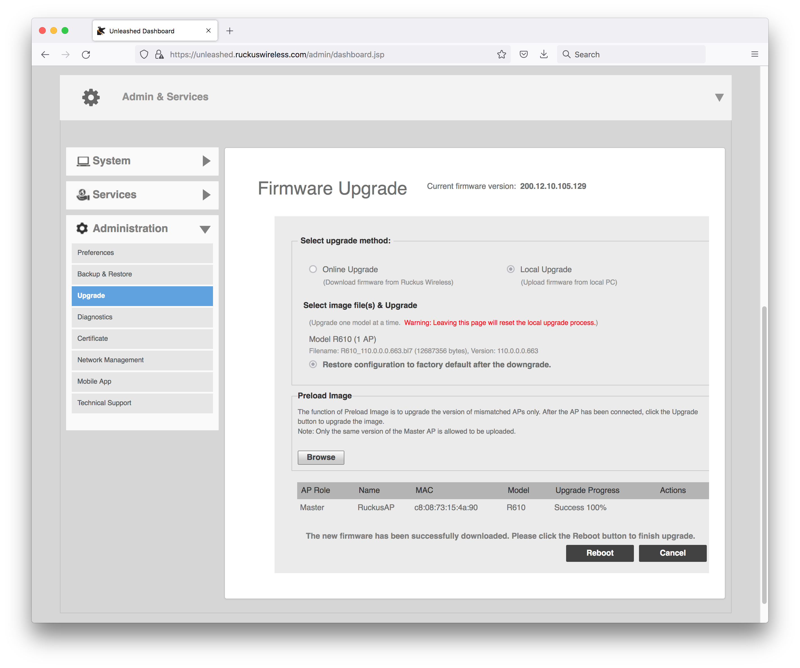
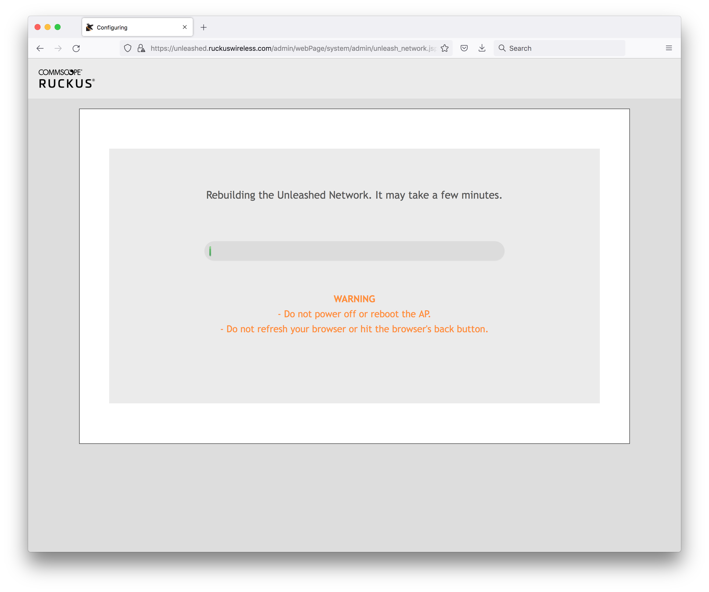
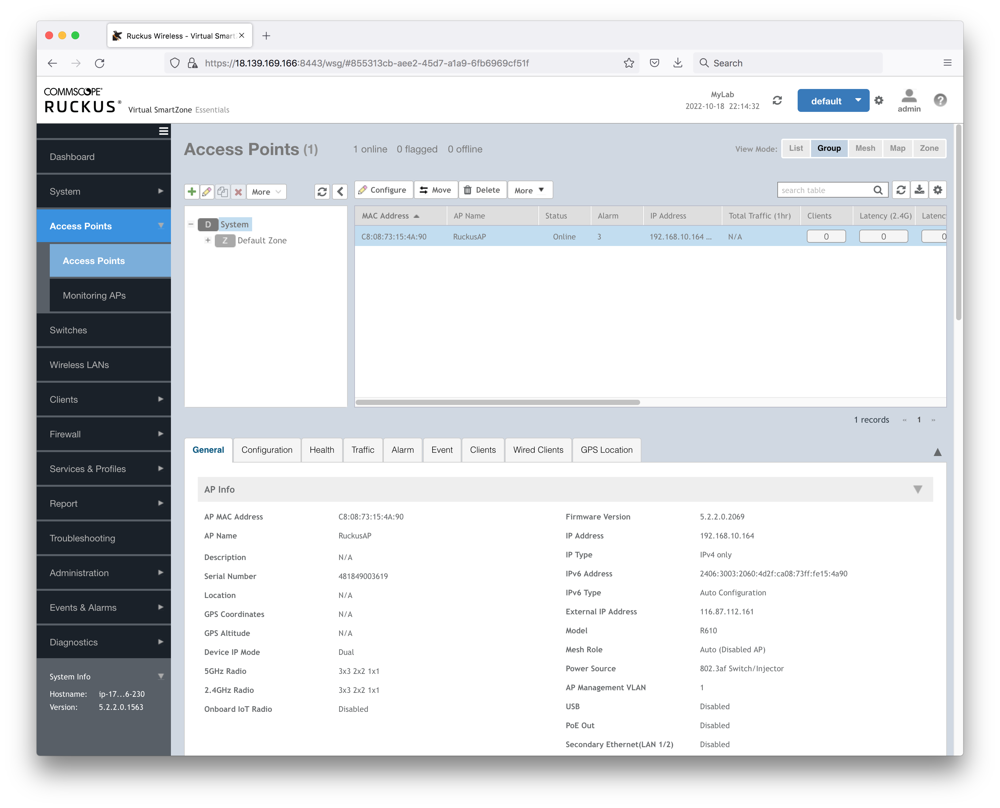

# #233 Adding APs to vSZ

Configuring a Ruckus R610 access point to be managed by a Ruckus Virtual SmartZone controller.

## Notes

These notes show the exact procedure used to successfully configure a Ruckus R610 indoor AP
to be managed by a Ruckus Virtual SmartZone controller.
For the test I am using a fresh Ruckus vSZ running on AWS, [see my earlier notes](../vsz_on_aws/)

### R610 Unleashed - Initial State

The R610 will initially be running as a standalone "unleashed" AP.

Login to the AP management console either directly or connecting to an SSID managed by the AP
and browsing to `unleashed.ruckuswireless.com`:

It confirms the AP is running Ruckus Unleashed Version: 200.12.10.105.129

### Downgrade R610 to Solo

The AP needs to be converted to solo mode before it can be added to a SmartZone controller.

Latest software major versions available as of now:

* <https://support.ruckuswireless.com/software/2787-ruckus-solo-access-point-114-0-0-0-6565-ga-software-release-r610>
    * Ruckus Solo Access Point 114.0.0.0.6565 (GA) Software Release (R610)
    * Availability: Premium Support Users
* <https://support.ruckuswireless.com/software/1727-zoneflex-solo-access-point-110-0-0-0-663-ga-software-release-r610>
    * ZoneFlex Solo Access Point 110.0.0.0.663 (GA) Software Release (R610)
    * Availability: all users
* <https://support.ruckuswireless.com/software/1101-zoneflex-r610-indoor-ap-104-1-0-0-298-ga-software-release>
    * ZoneFlex R610 Indoor AP 104.1.0.0.298 (GA) Software Release
    * Availability: all users

I'll upgrade to 110.0.0.0.663 upgrade as its the latest generally available,
so I downloaded the firmware file to my local disk: `R610_110.0.0.0.663.bl7`.

### Installing ZoneFlex Solo Access Point 110.0.0.0.663

Go to the `Administration > Upgrade` section of the management web UI:

* choose the Local Upgrade
* browse to select the firmware file `R610_110.0.0.0.663.bl7`

Start the upgrade (after optionally downloading/saving the current config):

Wait for the upgrade to finish:

When complete, it prompts for reboot:

### After the Reboot to 110.0.0.0.663

After the reboot, the AP will have its configuration reset and wil be broadcasting the
`Configure.Me-XXXXX` SSID.
With this version of the firmware, this is a WPA2-secured network and the password is the AP serial number.

### Add the AP to the Controller

PS: from my Mac, I don't have much success connecting to the secure `Configure.Me-XXXXX` SSID. After initially connecting,
it seems the Mac captive network assistant causes the connection to fail (may be an invalid certificate issue).
So I'll complete the configuration from the ssh command line.

After upgrade, ssh to the AP access with `super/sp-admin`.
Set the SCG IP to the management IP of the vSZ and reboot:

    $ ssh 192.168.10.164

    Please login: super
    password :
    Copyright(C) 2016 Ruckus Wireless, Inc. All Rights Reserved.

    ** Ruckus R610 Multimedia Hotzone Wireless AP: 481849003619

    rkscli: get version
    Ruckus R610 Multimedia Hotzone Wireless AP
    Version: 110.0.0.0.663
    OK
    rkscli: set scg ip 18.139.169.166
    OK
    rkscli: reboot
    OK
    rkscli: Connection to 192.168.10.164 closed by remote host.
    Connection to 192.168.10.164 closed.

After the reboot, the AP will show up in the default group

Once the vSZ has control, it will update the AP configuration, and also switch the firmware to
SmartZone AP firmware `5.2.2.0.2069`. This takes some time and a few automatic AP reboots,
but eventually the AP will reflect the controller-enforced settings and be broadcasting the configured SSIDs

### Checking the SCG Configuration

The sssh access to the controller will now required the username and password configured for the controller WLAN group.
After access, can check the AP's SCG configuration:

    $ ssh 192.168.10.164

    Please login: apadmin
    password :
    Copyright(C) 2022 Ruckus Wireless, Inc. All Rights Reserved.

    ** Ruckus R610 Multimedia Hotzone Wireless AP: 481849003619

    rkscli: get scg ip

    ------ SCG Information ------
    SCG Service is enabled.
    AP is managed by SCG.
    State: RUN_STATE
    Server List: 172.31.36.230,18.139.169.166
    SSH tunnel connected to 18.139.169.166
    Failover List: Not found
    Failover Max Retry: 2
    DHCP Opt43 Code: 6
    Server List from DHCP (Opt43/Opt52): Not found
    SCG default URL: RuckusController
    SCG config|heartbeat intervals: 30|30
    SCG gwloss|serverloss timeouts: 1800|7200
    Controller Cert Validation : disable
    -----------------------------
    OK

## Credits and References

* [R610 support and downloads](https://support.ruckuswireless.com/products/103-ruckus-r610#sort=relevancy&f:@commonproducts=[R610])
* [Ruckus Indoor Access Point Release 110.0 User Guide](https://docs.commscope.com/bundle/ap-110.0-indooruserguide/page/GUID-C65D79F8-FC51-4959-8CD6-E1036EA0C911.html)
* [YouTube: RUCKUS UNLEASHED SETUP IN 5 MINUTES](https://www.youtube.com/watch?v=j8I5aVwMNMg)
* [YouTube: CONVERT A RUCKUS AP FROM UNLEASHED TO SMARTZONE MANAGED](https://www.youtube.com/watch?v=6ktTNeTk-ZA)
* [Converting Ruckus Unleashed AP to VSZ](https://terminalpacket.net/converting-ruckus-unleashed-ap-to-vsz/) Jul 23, 2020
* [Convert R500 Unleashed to ZD managed?](https://community.ruckuswireless.com/t5/Access-Points-Indoor-and-Outdoor/Convert-R500-Unleashed-to-ZD-managed/td-p/7193?commentId=5f91c442135b77e2479f1ec3)
* [Pulling an AP out of Unleashed to SmartZone](https://community.ruckuswireless.com/t5/Unleashed/Pulling-an-AP-out-of-Unleashed-to-SmartZone/td-p/37400?commentId=61a09bd644983b1e740607bd)
