# #234 Ruckus vSZ on AWS

Complete and validated demonstration of installing Ruckus Virtual SmartZone on AWS.

## Notes

Ruckus offer a virtual (i.e. software-only) controller solution called Virtual SmartZone (vSZ).

The [Ruckus Virtual SmartZone Getting Started Guide - Installing vSZ on Amazon Web Services](https://docs.commscope.com/bundle/vsz-gettingstartedguide/page/GUID-80AE9A75-EA30-440D-A98F-5C40D1AE536B.html)
should be all one needs to get going, however it is not the easiest document to follow. For example, it:

* presents some steps out of sequence
* does not explain why certain steps are required

These notes show the exact procedure used to successfully setup vSZ on Amazon Web Services.
Is is current as of 2022-10 for vSZ 5.2.2.0.0.1563 running on AWS Asia Pacific Singapore (`ap-southeast-1`).

### Pre-requisites

* AWS account at <https://aws.amazon.com>
* AWS CLI installed - see <https://docs.aws.amazon.com/cli/latest/userguide/getting-started-install.html>

### Stage the vSZ Image in an S3 Bucket

vSZ images are available for download from [support.ruckuswireless.com](https://support.ruckuswireless.com/software/3480-vsz-5-2-2-lt-gd-mr-2-refresh-software-release-esxi-aws-ova-image).
The required image must be uploaded to an S3 bucket under our control, from where we will use it to create a vSZ Amazon Image (AMI)

#### Creating a Storage Bucket

S3 Bucket: `vsz.test.lck.com` (this is the name I am using in these notes. Substitute your own bucket name where it is referenced)

Settings:

* ACLs disabled (recommended)
* All objects in this bucket are owned by this account. Access to this bucket and its objects is specified using only policies.
* Block all public access
* Bucket Versioning - disabled
* Tags - none
* Default encryption - disabled

#### Uploading vSZ Image to a Storage

I downloaded the vSZ image `vscg-5.2.2.0.1563.ova` from [support.ruckuswireless.com](https://support.ruckuswireless.com/software/3480-vsz-5-2-2-lt-gd-mr-2-refresh-software-release-esxi-aws-ova-image)

Either browse the AWS S3 Web UI and upload the file manually,
or upload using the CLI:

    aws s3 cp vscg-5.2.2.0.1563.ova s3://vsz.test.lck.com

NB: I later removed the image to save storage space

    aws s3 rm s3://vsz.test.lck.com/vscg-5.2.2.0.1563.ova

#### Create the vSZ AMI

##### Preparing AWS User Account and Import Role

The AWS user account that will be used for AWS CLI commands to import and create the vSZ image must have the following:

* use AWS IAM to attach IAMFullAccess policy to the user

Create the import role `vmimport` with policy described in [trust-policy.json](./trust-policy.json)

    $ aws iam create-role --role-name vmimport --assume-role-policy-document file://trust-policy.json
    {
        "Role": {
            "Path": "/",
            "RoleName": "vmimport",
            "RoleId": "AROATOEIVZJVTFWFMPZ24",
            "Arn": "arn:aws:iam::236509842027:role/vmimport",
            "CreateDate": "2022-10-18T05:41:00+00:00",
            "AssumeRolePolicyDocument": {
                "Version": "2012-10-17",
                "Statement": [
                    {
                        "Sid": "",
                        "Effect": "Allow",
                        "Principal": {
                            "Service": "vmie.amazonaws.com"
                        },
                        "Action": "sts:AssumeRole",
                        "Condition": {
                            "StringEquals": {
                                "sts:ExternalId": "vmimport"
                            }
                        }
                    }
                ]
            }
        }
    }

Attach a policy to the role described in [role-policy.json](./role-policy.json) that adds EC2 and S3 permissions.
The JSON file needs to include the correct S3 bucket name.

    aws iam put-role-policy --role-name vmimport --policy-name vmimport --policy-document file://role-policy.json

The role will appear listed in the [AWS IAM Roles Console](https://us-east-1.console.aws.amazon.com/iamv2/home#/roles).

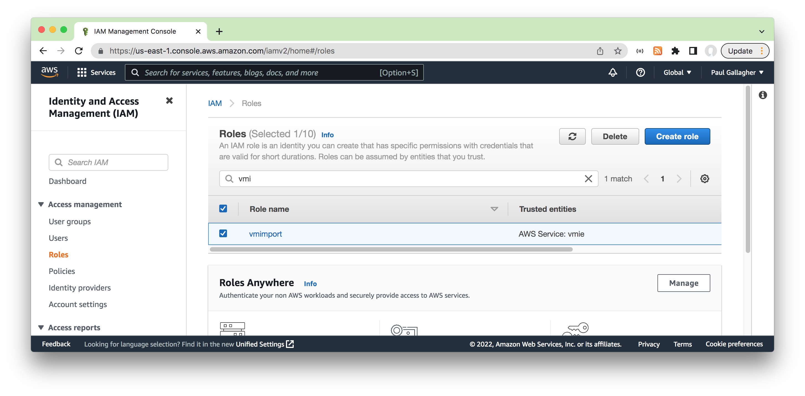

##### Importing the vSZ Image

Run the image import task described in [import.json](./import.json).
The JSON file needs to include the correct S3 bucket and image names.

    $ aws ec2 import-image --cli-input-json file://import.json
    {
        "Description": "Import vSZ",
        "ImportTaskId": "import-ami-02d282fcd81a2c0d8",
        "Progress": "1",
        "SnapshotDetails": [
            {
                "Description": "vSZ 5.2.2.0.0.1563",
                "DiskImageSize": 0.0,
                "Format": "",
                "UserBucket": {
                    "S3Bucket": "vsz.test.lck.com",
                    "S3Key": "vscg-5.2.2.0.1563.ova"
                }
            }
        ],
        "Status": "active",
        "StatusMessage": "pending"
    }

Use the `ImportTaskId` to check the status of the task by running the following command. The estimated time for conversion is 30 minutes:

    $ aws ec2 describe-import-image-tasks --import-task-ids "import-ami-02d282fcd81a2c0d8"
    {
        "ImportImageTasks": [
            {
                "Architecture": "x86_64",
                "Description": "Import vSZ",
                "ImageId": "ami-0461b0e7db69aed1a",
                "ImportTaskId": "import-ami-02d282fcd81a2c0d8",
                "LicenseType": "BYOL",
                "Platform": "Linux",
                "SnapshotDetails": [
                    {
                        "DeviceName": "/dev/sda1",
                        "DiskImageSize": 1787515392.0,
                        "Format": "VMDK",
                        "SnapshotId": "snap-03ef6add587da5b6e",
                        "Status": "completed",
                        "UserBucket": {
                            "S3Bucket": "vsz.test.lck.com",
                            "S3Key": "vscg-5.2.2.0.1563.ova"
                        }
                    }
                ],
                "Status": "completed",
                "Tags": []
            }
        ]
    }

The imported image will appear in the AMIs listing in the [AWS EC2 Console](https://ap-southeast-1.console.aws.amazon.com/ec2/home)

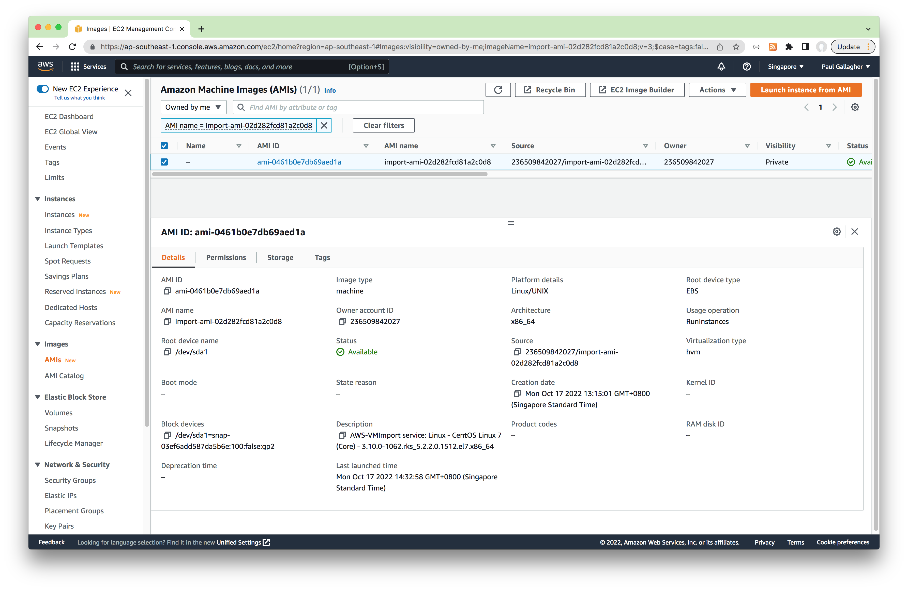

#### Create Security Group for vSZ Instance

The vSZ instance will need to allow inbound communication from APs.

It is recommended to create a dedicated group from the
[AWS EC2 Security Group console](https://ap-southeast-1.console.aws.amazon.com/ec2/home?region=ap-southeast-1#SecurityGroups:).

* Outbound rules: unrestricted
* Inbound Rules:
    * per the table below
    * If this is a test/demo installation and all APs are behind the same NAT, a possible shortcut: all UDP from MyIP, All TCP from MyIP

| Inbound Port and Protocol | Description |
|---------------------------|-------------|
| UDP 161                   | SNMP |
| UDP 12223                 | ZD AP forward update using FTP (control connection) |
| TCP 21                    | ZD AP forward update using FTP (control connection) |
| TCP 22                    | AP SSH |
| TCP 91                    | AP forward update using HTTP |
| TCP 443                   | Allows AP get SSH private key and do AP FW update via HTTPs |
| TCP 7443                  | Public API |
| TCP 8022                  | SSH for management (mgmt-acl is enabled on 1 nic vSZ) |
| TCP 8080                  | vSZ setup wizard using the web user interface (User will be redirected to the port 8443) |
| TCP 8443                  | vSZ web user interface |
| TCP 8090, 8099            | WISPr for non-web-proxy user equipment |
| TCP 8100                  | WISPr for web-proxy user equipment |
| TCP 9998                  | Tomcat for WISPr (internal WISPr portal uses the port 9998) |
| TCP 9080, 9443            | Northbound API (NBI) |
| TCP 16384-65000           | ZD AP forward update using FTP (data connection) |

#### Creating the vSZ Instance

From the [AWS EC2 Instances](https://ap-southeast-1.console.aws.amazon.com/ec2/home?region=ap-southeast-1#LaunchInstances:)
console select "Launch an instance"

Create Instance:

* Name: any desired e.g. `vSZTest1`
* Application and OS Images: select the AMI imported earlier e.g. `import-ami-02d282fcd81a2c0d8`
* Instance Type: r5.large (2 vCPU/16 GB RAM) - minimum recommended
* Key pair: no key pair (important!)
* Network settings: select security group created earlier
* Configure storage: 100Gb (min allowed based on AMI)
* Advanced Settings: none required

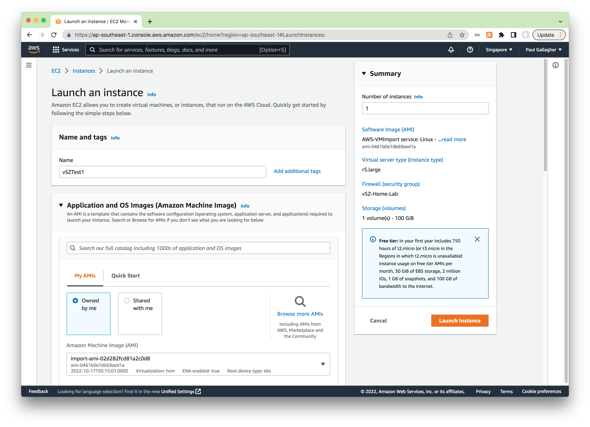

#### Assign Elastic IP

Allocating and assigning an Elastic IP address to the vSZ instance will ensure
it has a stable IP allocation that will survives restarts etc.

If you are just setting up a test instance, it is not necessary to assign an Elastic IP - the automatically assigned public IP can be used instead but note: if the vSZ management IP changes, each AP would need to the controller IP to be reconfigured so they can find the controller again.

Procedure:

* from the [AWS EC2 Elastic IPs Console](https://ap-southeast-1.console.aws.amazon.com/ec2/home?region=ap-southeast-1#Addresses:)
* "Allocate" and Elastic IP e.g. `18.139.169.166` in my case
* select allocated IP and "Associate IP Address" with the vSZ Instance

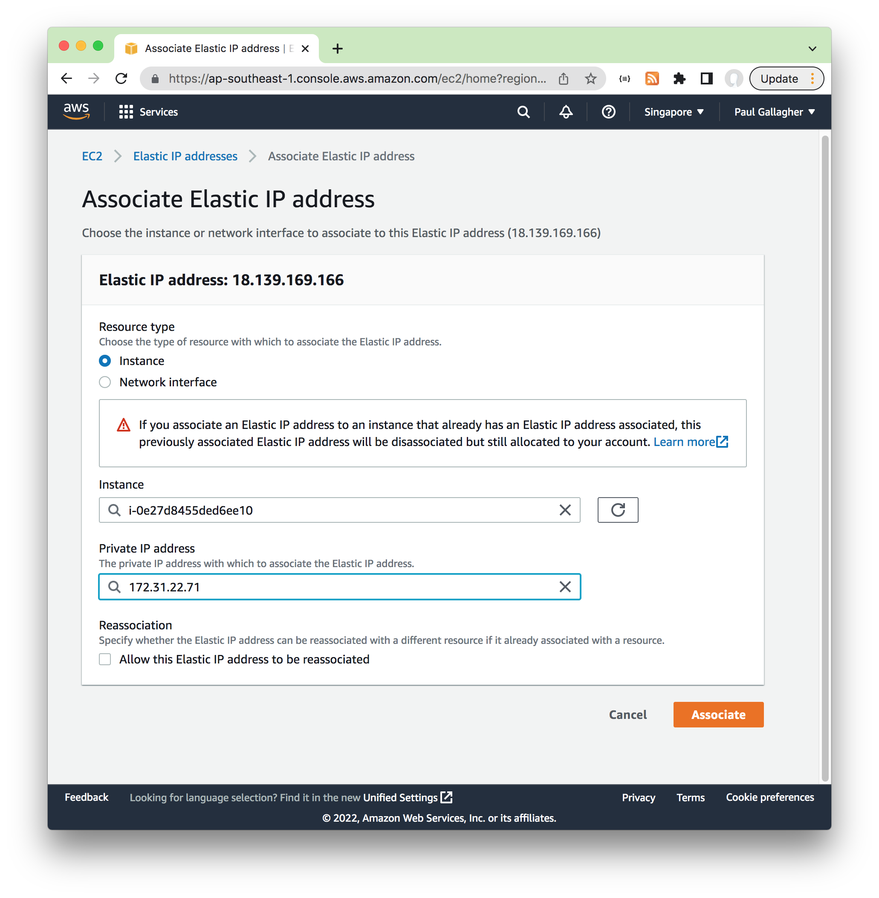

#### Configuring the vSZ

Use ssh to the new vSZ instance to check the network details.
There is an option to run setup from the CLI, but I'll use the web-based setup wizerd instead.

Can ssh by public IP (e.g. `18.139.169.166`) or the Public IPv4 DNS assigned to the instance (e.g. `ec2-18-139-169-166.ap-southeast-1.compute.amazonaws.com`)

The default username and password is `admin/admin`:

    ssh admin@18.139.169.166
    ################################
    #       Welcome to vSZ         #
    ################################
    admin@18.139.169.166's password:
    Please wait. CLI initializing...

    Welcome to the Ruckus Virtual SmartZone Command Line Interface
    Version: 5.2.2.0.1563

    ip-172-31-22-71> show version
       Model                           : vSZ
       Serial #                        : 98PJNH2HUU5DBM8VH1604KSB717K
       vSZ Version                     : 5.2.2.0.1563
       AP Firmware Version             : 5.2.2.0.2069

    ip-172-31-22-71> enable
    Password: *****

    ip-172-31-22-71# show interface
       Interfaces
       ----------------------------------------------------------------
       Interface    : Control
       IP Mode      : DHCP
       IP Address   : 172.31.36.230
       Subnet Mask  : 255.255.240.0
       Gateway      : 172.31.32.1

       Default Gateway Interface : Control
       Primary DNS Server        : 172.31.0.2
       Secondary DNS Server      :

    ip-172-31-36-230#

### Using the Setup Wizard to Install vSZ

Launch the web UI at port 8443 of the public IP assigned to the system
e.g. <https://18.139.169.166:8443/adminweb/>
The basic flow is as follows.

Language:

* selected: English

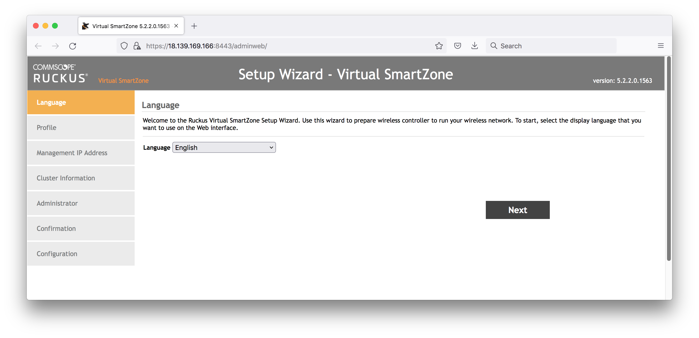

Profile:

* Select the profile: Essentials
* The profile tool can help with sizing recommendations.

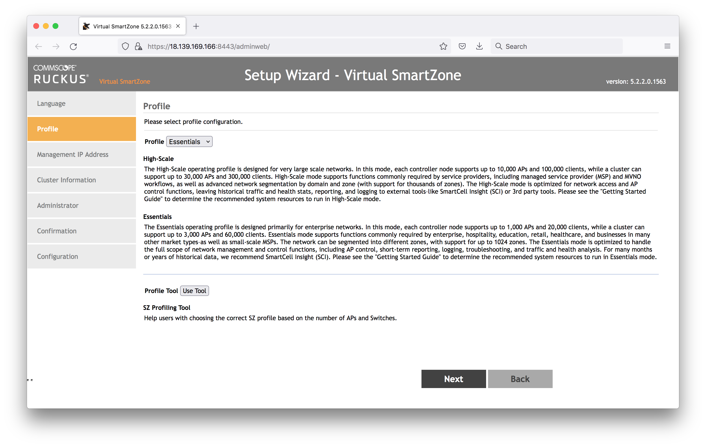

Management IP:

* I've selected DHCP, which will get the AWS EC2 private IP details. Later on I'm going to add the public Elastic IP as the NAT'd IP
* Default Gateway: Control(AP)/Cluster/Management
* Primary DNS Server  : 172.31.0.2 (as assigned by AWS and see in the CLI interface details)
* Secondary DNS Server: 8.8.8.8 (added Google as a backup)
* Note that after this step, the wizard will attempt to reload the web UI on the private IP (which won't work) Change it back to the public IP <https://18.139.169.166:8443/adminweb/> to continue the wizard

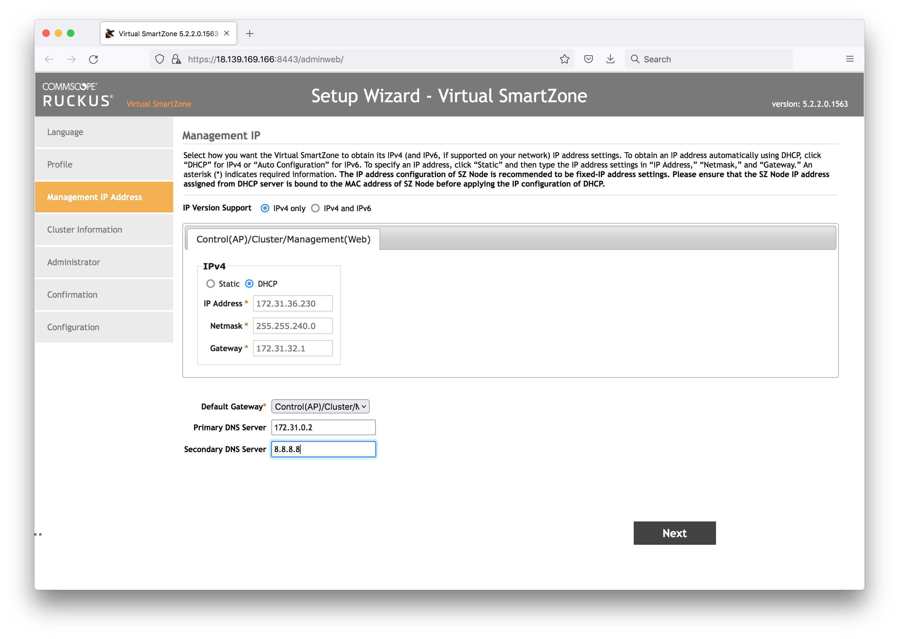

Cluster Information:

* New cluster name: MyLab
* Controller Description: MyLab Controller
* Default Country Code: SG
* NTP: ntp.ruckuswireless.com
* AP Conversion: no
* Is this controller behind NAT? Yes. Add the public Elastic IP here

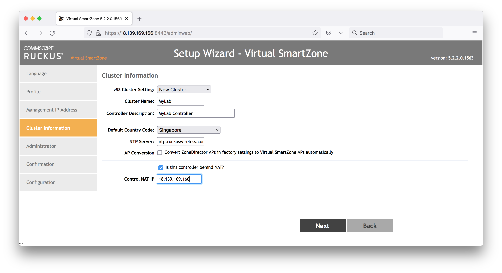

Administrator:

* set the admin and CLI passwords (can be the same)

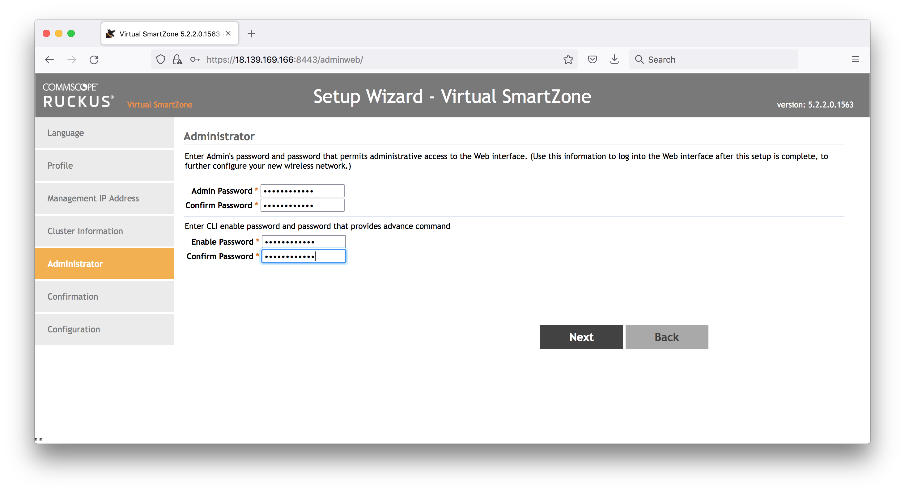

Confirmation:

* looks good!

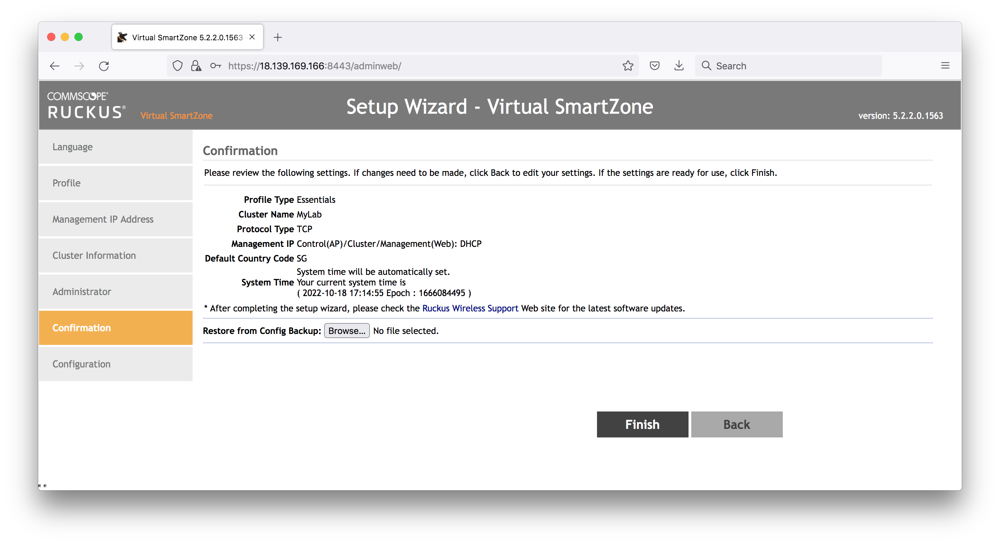

Configuration:

* will start working away, and take some time

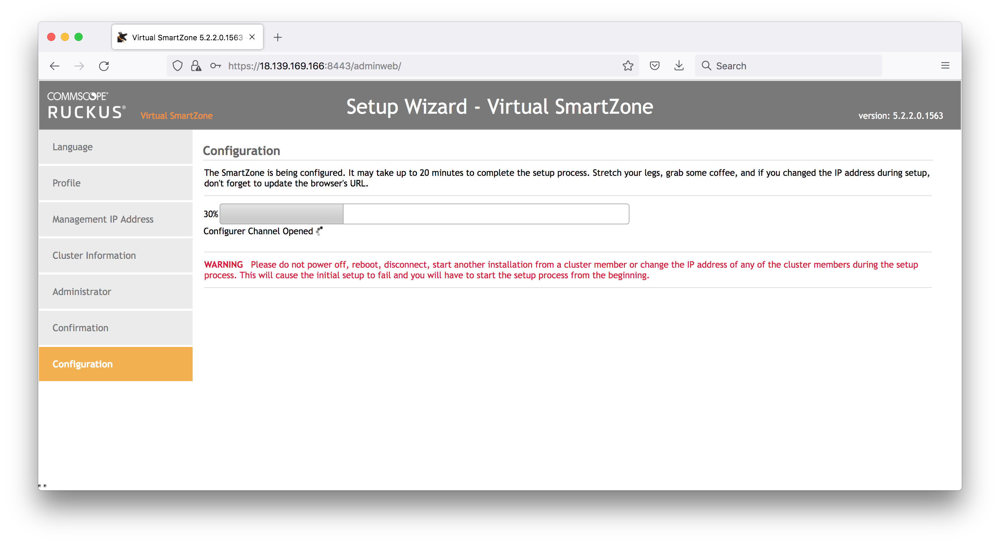

At the end of the process, the page will invite you to reload the UI on the private IP (not correct)

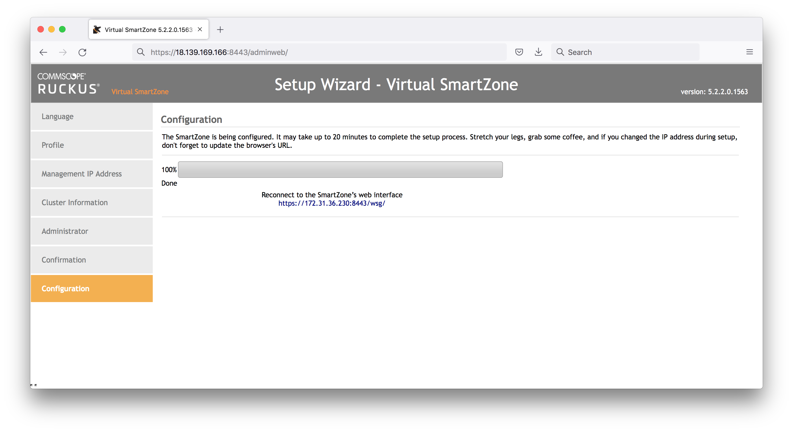

Load the public IP instead <https://18.139.169.166:8443/wsg/> and we finally have a login:

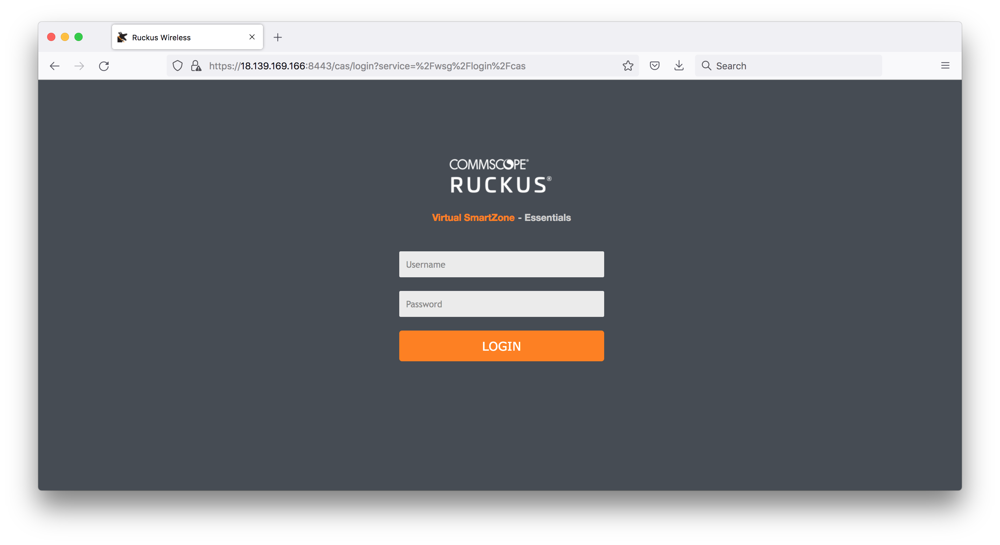

After sign-in, we have a new vSZ cluster ready to go:

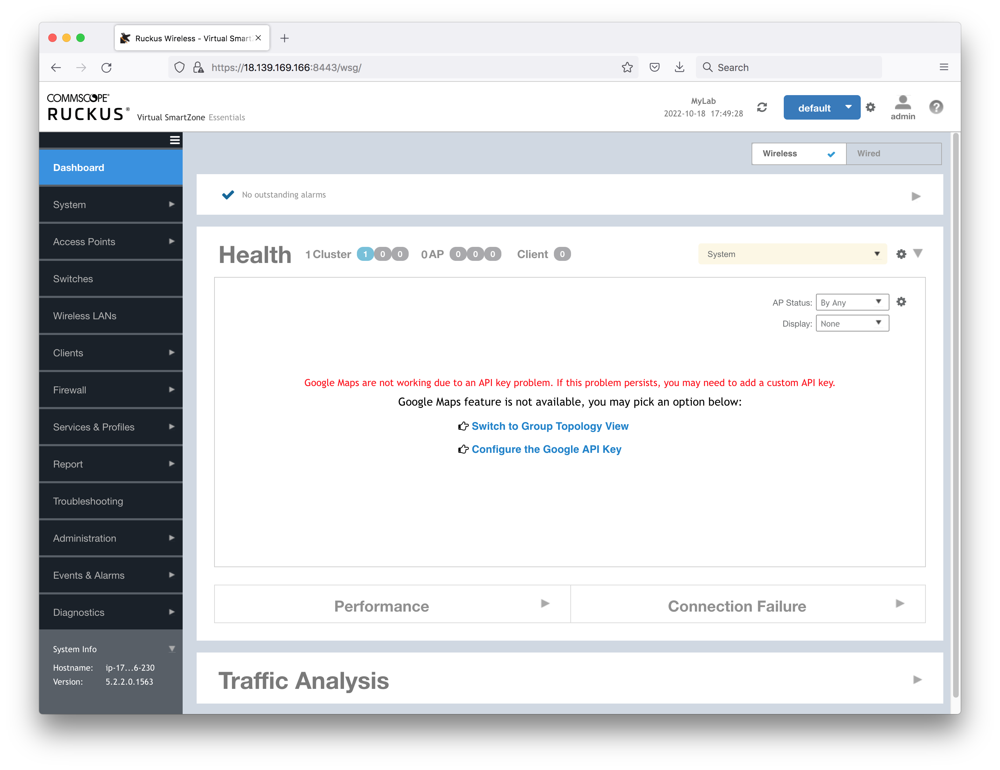

### Configuring the AP Admin Login

All APs that are added to the controller will take the default AP Admin Login from the wireless LAN group.

Select the Wireless LAN Group (click on the pencil):

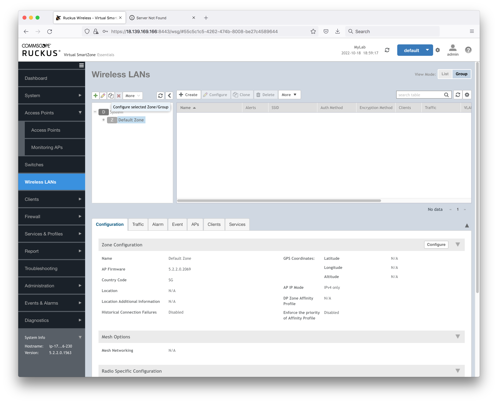

The AP Admin Login is one of the settings:

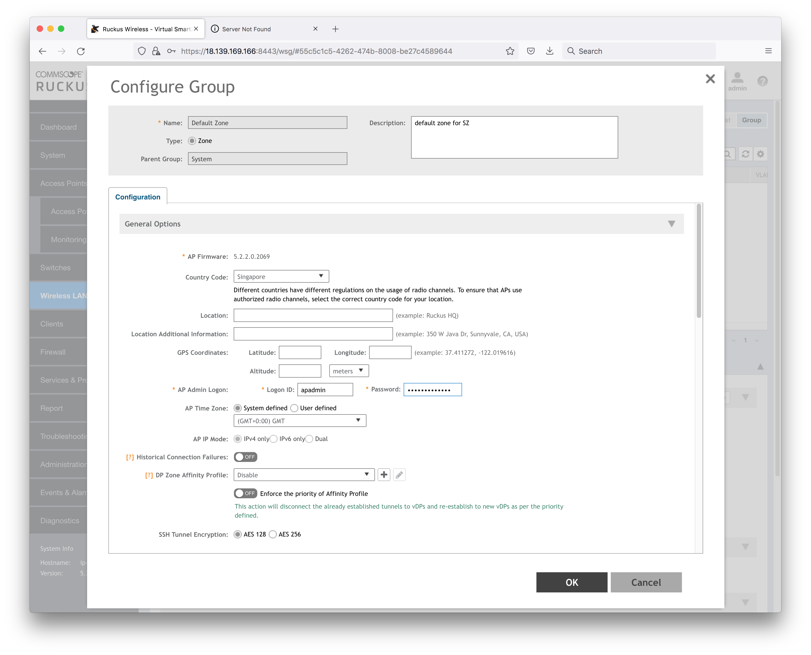

### Adding APs to the Cluster

See notes on [Adding APs to vSZ](../vsz_add_ap/)

## Credits and References

* [Installing or updating the latest version of the AWS CLI](https://docs.aws.amazon.com/cli/latest/userguide/getting-started-install.html)
* [Ruckus Virtual SmartZone Getting Started Guide - Installing vSZ on Amazon Web Services](https://docs.commscope.com/bundle/vsz-gettingstartedguide/page/GUID-80AE9A75-EA30-440D-A98F-5C40D1AE536B.html)
* [vSZ 5.2.2 (LT-GD MR 2 Refresh) Software Release (ESXi / AWS .ova image)](https://support.ruckuswireless.com/software/3480-vsz-5-2-2-lt-gd-mr-2-refresh-software-release-esxi-aws-ova-image)
