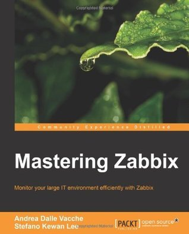

# #113 Mastering Zabbix

Book notes - Mastering Zabbix by Andrea Dalle Vacche, Stefano Kewan Lee, published by PacktPub.

## Notes

I reviewed [Mastering Zabbix](https://amzn.to/480jdvj) many years ago - see my notes below. There has since been a [Second Edition](https://amzn.to/42rpQDl) that I have not read yet.

## Table of Contents - Highlights

* Deploying Zabbix - out of date by now
* Distributed Monitoring - proxies and nodes
* High Availability and Failover
* Collecting Data
    * Gathering items as raw data
    * Understanding the data flow for Zabbix items
    * Database monitoring with Zabbix
    * Zabbix JMX monitoring
    * Zabbix SNMP monitoring
    * Web pages monitoring
    * Aggregated and calculated items
* Visualizing Data
* Managing Alerts
* Managing Templates
* Handling External Scripts
* Extending Zabbix
    * Exploring the Zabbix API
    * Synchronizing templates across different nodes
    * Mass operations
    * Exporting data
* Integrating Zabbix - Request Tracker

### Getting the Source

First edition sources are available via the [packtpub portal](https://account.packtpub.com/getfile/9781783283491/code).
I don't have the second edition, and it seems one might need to have subscribed or purchased the book to download
the examples.

## Credits and References

* Mastering Zabbix
    * [amazon](https://amzn.to/480jdvj)
    * [PacktPub](https://subscription.packtpub.com/book/networking_and_servers/9781783283491)
    * [goodreads](https://www.goodreads.com/book/show/20370258-mastering-zabbix)
    * [example code source](https://account.packtpub.com/getfile/9781783283491/code)
* Mastering Zabbix - Second Edition
    * [amazon](https://amzn.to/42rpQDl)
    * [PacktPub](https://subscription.packtpub.com/book/networking-and-servers/9781785289262)
