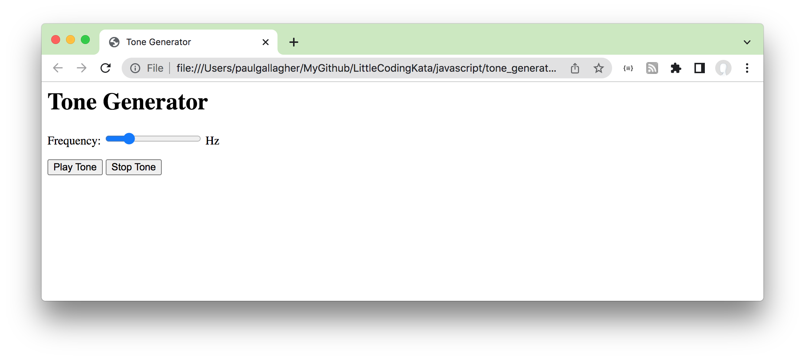
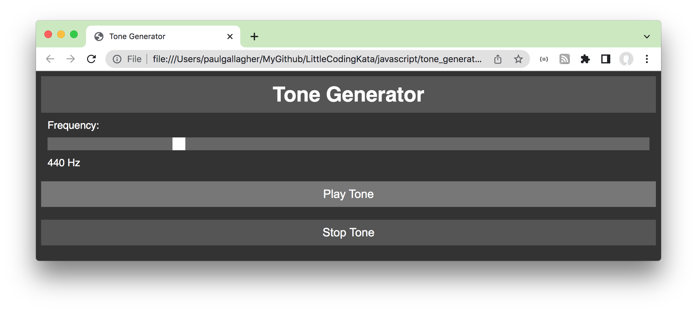
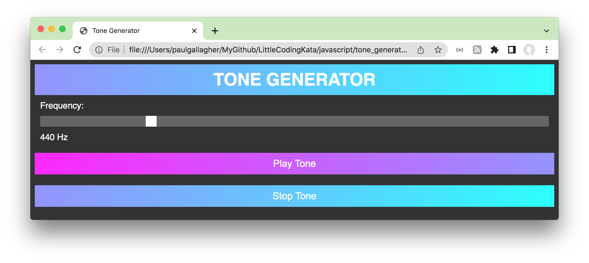

# #247 Tone Generator

I used ChatGPT to show me how to make an audio tone generation tool in Javascript and it taught me how to use the new(ish) AudioContext API

## Notes

For some experiments I'm doing I needed a simple audio tone generator.

My first thought was - instead of building that in hardware, why don't I just do it with Javascript?

My next thought was - why don't I see if [ChatGPT](https://chat.openai.com/) can help me do that?

And after 10 minutes or so, it's clear that AI as already an impressive tool for navigating a learning path and exploring initial ideas.
Sure, some caveats:

* a fully polished product or service requires much more work that I don't think ChatGPT or other AI experiments are even close to being able to generate yet.
* this only works because the questions I am asking of the AI are already knowledge domains for which a rich body of information (including examples) is already available on the internet. ChatGPT just saved me the effort of finding and cobbling it together.

Here's the tone generator: [tone_generator.html](./tone_generator.html)

## The Chat Transcript

Here are the exact questions I put to ChatGPT

> can you show me how to write an audio tone generator in javascript on a web page?

ChatGPT provided an initial code example with full explanation

> can you add a button to stop the sound?

The tone could be started but not stopped. A little annoying;-) ChatGPT fixed that.

> can you add a slide to control the frequency of the tone?

the first examples had the frequency 440Hz hard-coded in the source. This made it a slider input

> can you add event handling so that changing the frequency slider changes the oscillator frequency

but the slider would only set the initial frequency. This step added the event handler to allow the frequency to be changed while the tone is playing.

> can you also add a text display of the current frequency in hz that is set by the frequency slider?

This is what it is looking like at this point:

> that is great. can you now style the web page as if it is designed like an audio pre-amplifier?

ok looking a little better:

> can you make the design more funky?

NB: ChatGPT "broke" half way through generating the code for this step, but I was abe to just manually stitched the remaining code from the previous step

OK, ChatGPT is not really a UI Design wizard. I gather there might be other AI engine examples better trained for that.

But not bad. Here's the result at this point:

And there it is - a fully functional tone generator that at least looks kinda nice.
I should emphasise that I have not fiddled the ChatGPT-generated code at all, it is literally just copy-pasted from ChatGPT.
Obviously one problem with that is that I have no idea of the source licensing of the code I got from ChatGPT.
I suspect it has heavily lifted form publicly available material on the internet, but is it in strict compliance for however that may have been licensed?

And what is the license that can/should apply to this example now? I really don't know!

## The AudioContext API

I was going to make notes on the [AudioContext API](https://developer.mozilla.org/en-US/docs/Web/API/AudioContext)
but then thought why don't I just ask ChatGPT that also?

> can you give me a brief explanation of the javascript AudioContext API used in the tone generator?

Sure! The AudioContext API is a JavaScript API for creating and manipulating audio in web applications. It is part of the Web Audio API, which provides a way to interact with audio elements in web pages.

The AudioContext object is the primary object used to create and manipulate audio in a web page. It represents an audio-processing graph that is built from audio nodes, which perform various audio operations.

To create an AudioContext, you can use the following code:

    var audioCtx = new (window.AudioContext || window.webkitAudioContext)();

This code creates a new AudioContext object and stores it in a variable named audioCtx. The AudioContext constructor is available in modern browsers, but it is prefixed with webkit in some older browsers. The code above uses the window.AudioContext constructor if it is available, or the window.webkitAudioContext constructor if it is not.

Once you have an AudioContext, you can create audio nodes and connect them to form an audio-processing graph. For example, to create an oscillator node that generates a sine wave, you can use the following code:

    var oscillator = audioCtx.createOscillator();

To connect the oscillator node to the audio output of the AudioContext, you can use the connect() method:

    oscillator.connect(audioCtx.destination);

To...

> ... and at that point ChatGPT "broke" again and stopped responding. So I asked it to regenerate the answer and got a full but different response:

The `AudioContext` interface represents an audio-processing graph built from audio modules linked together, each represented by an `AudioNode`. An audio context controls both the creation of the nodes it contains and the execution of the audio processing, or decoding. You can create an `AudioContext` object using the new `AudioContext()` constructor.

In the tone generator code, the AudioContext object is used to create an oscillator and a gain node, and to establish connections between these nodes and the destination for the audio output.

The oscillator is an audio source that generates a periodic waveform, and is created using the `createOscillator()` method of the `AudioContext` object. The oscillator has a frequency attribute that can be set to control the pitch of the tone.

The gain node is an audio node that controls the volume of an audio signal. It is created using the `createGain()` method of the `AudioContext` object.

Finally, the oscillator and gain node are connected to the audio destination using the `connect()` method. The audio destination is the device or system audio hardware that plays the audio.

I hope this helps! Let me know if you have any questions.

## Credits and References

* [AudioContext API](https://developer.mozilla.org/en-US/docs/Web/API/AudioContext)
* [ChatGPT](https://chat.openai.com/)
