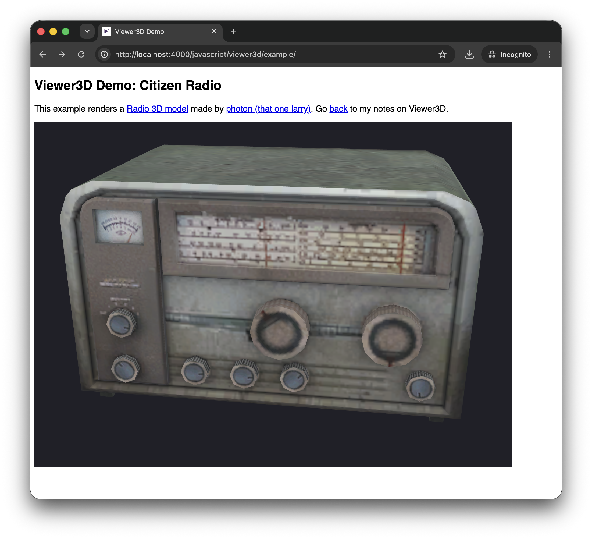

# #474 Viewer3D

Viewer3D is a Javascript library for rendering interactive 3D models in GLTF or GLB format on a web page, such as PCB models generated by KiCad.

## Notes

I first came across [Viewer3D](https://github.com/joembedded/viewer3d)
in the article
["3D Viewer for HTML pages - Simple, and Almost Without Code"](https://www.elektormagazine.com/magazine/elektor-497/64878)
published in Elektor Magazine 8/2026.

## What is Viewer3D?

[Viewer3D](https://github.com/joembedded/viewer3d)
is a simple viewer for 3D models in GLTF or GLB format.
Most of the hard work is done by the <https://threejs.org/> library.

The main source file `jo3dview.js` implements the main public `view3d` method.
Default styling is included in `jo3dview.css`.

## Adding Viewer3D Support to a Web Page

We just need to add three resources in the page head:

* `jo3dview.js` source file
* `jo3dview.css` source file
* import map for the three library, either from CDN (shown below), or loaded locally.

```html
<link rel="stylesheet" href="./jo3dview.css">
<script type="importmap">
    {
        "imports": {
            "three": "https://unpkg.com/three@latest/build/three.module.js",
            "three/addons/": "https://unpkg.com/three@latest/examples/jsm/"
        }
    }
</script>
<script type="module" defer src="./jo3dview.js"></script>
```

## Rendering a Model

To render the image we just need to declare a div for the viewer, and optionally a div for the loader.
The `view3d` call loads the desired 3D model, and takes up to six parameters:

* `'mviewer'` — The id of the container `<div>` where the 3D scene is to be rendered.
* `'./citizen_radio.glb'` — The path to the 3D model file (GLB or glTF format).
* `1.1` — The target display size (scale factor). The viewer measures the model’s bounding box and scales it so that its largest dimension equals this value in scene units. Increase it to make the model appear larger, decrease it for smaller. 1.0 is a neutral default.
* `'mloader'` (optional) — The id of the loading indicator element. It is shown while the model loads and is hidden automatically once loading is complete.
* `backimg` (optional, default undefined) — A custom background image for the scene. If omitted, a built-in white-to-dark gradient is used.
* `shift2org` (optional, default true) — When true, the model is automatically re-centered to the scene origin so it always appears centered in the viewer.

```html
<div id="mviewer" class="jo3dviewer" style="width: 90vW; height: 80vH;">
    <div id="mloader" class="jo3dloader"></div>
</div>
<script type="module">
    import { view3d } from './jo3dview.js';
    view3d('mviewer', './citizen_radio.glb', 1.1, 'mloader');
</script>
```

## Example

For a demonstration, I've borrowed a [3D model of a radio](https://sketchfab.com/3d-models/citizen-radio-8e9e404258a9420a9eb99134aec082ec)
made by [photon (that one larry)](https://sketchfab.com/Professor_E12).
It is downloaded locally as

The example comprises 4 files:

* [example/index.html](example/) - main HTML page
* [example/jo3dview.js](example/jo3dview.js) - Viewer3D source
* [example/jo3dview.css](example/jo3dview.css) - default styling
* [example/citizen_radio.glb](example/citizen_radio.glb) - the model to render

Click through for a live demo:

[](./example/)

## Credits and References

* ["3D Viewer for HTML pages - Simple, and Almost Without Code" Elektor Magazine 8/2026](https://www.elektormagazine.com/magazine/elektor-497/64878)
* <https://github.com/joembedded/viewer3d>
* <https://threejs.org/>
