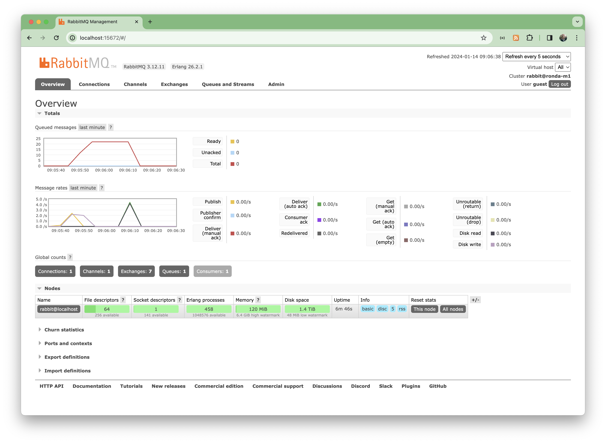

# #273 RabbitMQ

All about RabbitMQ message broker

## Notes

[RabbitMQ](https://www.rabbitmq.com/) is the most widely deployed open source message broker.
Sources are available on [GitHub](https://github.com/rabbitmq).

It runs on many operating systems and cloud environments including:

* Kubernetes
* Docker
* Windows, Linux, macOS

Development support is available for wide range of toolchains including:

* Java and Spring and other JVM languages
* .NET
* Ruby
* Python
* PHP
* Javascript and Node
* Go
* iOS and Android
* Objective-C and Swift
* Rust
* Crystal
* Julia
* C and C++
* Unity 3D
* Erlang
* Haskell
* OCaml

### macOS installation with HomeBrew

See [The Homebrew RabbitMQ Formula](https://www.rabbitmq.com/install-homebrew.html) for installation guide.

Installing the formula will not start the service:

	brew install rabbitmq

On Apple Silicon Macs, RabbitMQ configuration file located at /opt/homebrew/etc/rabbitmq/rabbitmq.conf. 
The file does not exist by default and must be created by the user. It does not need to be created in order to start a node with default configuration.
NB: default credentials are guest/guest

Starting a Node In the Foreground

	$ CONF_ENV_FILE="/opt/homebrew/etc/rabbitmq/rabbitmq-env.conf" /opt/homebrew/opt/rabbitmq/sbin/rabbitmq-server
	$ /opt/homebrew/sbin/rabbitmqctl enable_feature_flag all

Management Plugin enabled by default at <http://localhost:15672>

### Using with Docker

Docker Images are piublished on [Docker Hub](https://hub.docker.com/_/rabbitmq)

The latest v3 image is available tagged as `rabbitmq:3`.
A version of the image with the management plugin enabled is available tagged as `rabbitmq:3-management`.

See a basic [docker-compose.yml](./docker-compose.yml) configuration. Startup:

    $ docker-compose up
    ...
    db-1  | 2024-01-14 04:08:53.003426+00:00 [info] <0.230.0> 
    db-1  | 2024-01-14 04:08:53.003426+00:00 [info] <0.230.0>  Starting RabbitMQ 3.12.12 on Erlang 25.3.2.8 [jit]
    db-1  | 2024-01-14 04:08:53.003426+00:00 [info] <0.230.0>  Copyright (c) 2007-2023 Broadcom Inc and/or its subsidiaries
    db-1  | 2024-01-14 04:08:53.003426+00:00 [info] <0.230.0>  Licensed under the MPL 2.0. Website: https://rabbitmq.com
    db-1  | 
    db-1  |   ##  ##      RabbitMQ 3.12.12
    db-1  |   ##  ##
    db-1  |   ##########  Copyright (c) 2007-2023 Broadcom Inc and/or its subsidiaries
    db-1  |   ######  ##
    db-1  |   ##########  Licensed under the MPL 2.0. Website: https://rabbitmq.com
    db-1  | 
    db-1  |   Erlang:      25.3.2.8 [jit]
    db-1  |   TLS Library: OpenSSL - OpenSSL 3.1.4 24 Oct 2023
    db-1  |   Release series support status: supported
    db-1  | 
    db-1  |   Doc guides:  https://rabbitmq.com/documentation.html
    db-1  |   Support:     https://rabbitmq.com/contact.html
    db-1  |   Tutorials:   https://rabbitmq.com/getstarted.html
    db-1  |   Monitoring:  https://rabbitmq.com/monitoring.html
    db-1  | 
    db-1  |   Logs: <stdout>
    db-1  | 
    db-1  |   Config file(s): /etc/rabbitmq/conf.d/10-defaults.conf
    db-1  | 
    db-1  |   Starting broker...2024-01-14 04:08:53.006760+00:00 [info] <0.230.0> 
    db-1  | 2024-01-14 04:08:53.006760+00:00 [info] <0.230.0>  node           : rabbit@4e69e7e0a1e8
    db-1  | 2024-01-14 04:08:53.006760+00:00 [info] <0.230.0>  home dir       : /var/lib/rabbitmq
    db-1  | 2024-01-14 04:08:53.006760+00:00 [info] <0.230.0>  config file(s) : /etc/rabbitmq/conf.d/10-defaults.conf
    db-1  | 2024-01-14 04:08:53.006760+00:00 [info] <0.230.0>  cookie hash    : 5d3MZStA2V7DYSBdxf9Z+g==
    db-1  | 2024-01-14 04:08:53.006760+00:00 [info] <0.230.0>  log(s)         : <stdout>
    db-1  | 2024-01-14 04:08:53.006760+00:00 [info] <0.230.0>  data dir       : /var/lib/rabbitmq/mnesia/rabbit@4e69e7e0a1e8
    ...

### Simple Ruby Example

Using the [Bunny gem](https://rubygems.org/gems/bunny) for a simple sender/receiver example.
The [rabbitmq-tutorials](https://github.com/rabbitmq/rabbitmq-tutorials) contain examples like this in many languages.

[examples/ruby/send.rb](./examples/ruby/send.rb)

    $ cd examples/ruby 
    $ ./send.rb 
     [√] Sent message:'Hello World! 2024-01-14 09:03:04 +0800' on queue:hello
    $ ./send.rb 
     [√] Sent message:'Hello World! 2024-01-14 09:03:05 +0800' on queue:hello
    $ ./send.rb 
     [√] Sent message:'Hello World! 2024-01-14 09:03:05 +0800' on queue:hello
    $ ./send.rb 
     [√] Sent message:'Hello World! 2024-01-14 09:03:05 +0800' on queue:hello

[examples/ruby/receive.rb](./examples/ruby/receive.rb)

    $ cd examples/ruby
    $ ./receive.rb 
     [*] Waiting for messages. To exit press CTRL+C
     [√] Received Hello World! 2024-01-14 09:03:04 +0800
     [√] Received Hello World! 2024-01-14 09:03:05 +0800
     [√] Received Hello World! 2024-01-14 09:03:05 +0800
     [√] Received Hello World! 2024-01-14 09:03:05 +0800

## Credits and References

* [RabbitMQ](https://www.rabbitmq.com/)
* [RabbitMQ - GitHub](https://github.com/rabbitmq)
* [Bunny gem](https://rubygems.org/gems/bunny)
* [rabbitmq-tutorials](https://github.com/rabbitmq/rabbitmq-tutorials)
* [RabbitMQ - Docker Images](https://hub.docker.com/_/rabbitmq)
