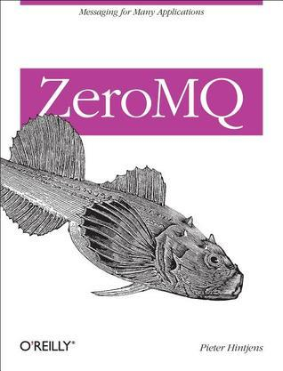

# #109 ZeroMQ (book)

Book notes - ZeroMQ by Pieter Hintjens, published by O'Reilly.

## Notes

[](https://amzn.to/3VYimUu)

## Table of Contents - Highlights

### I. Learning to Work with ØMQ

* 1. Basics
* 2. Sockets and Patterns
    * The Socket API
    * Messaging Patterns
    * Handling Errors and Interrupts
* 3. Advanced Request-Reply Patterns
    * The Request-Reply Mechanisms
    * Request-Reply Combinations
    * Exploring ROUTER Sockets
    * The Load-Balancing Pattern
    * A High-Level API for ØMQ
    * The Asynchronous Client/Server Pattern
    * Worked Example: Inter-Broker Routing
* 4. Reliable Request-Reply Patterns
* 5. Advanced Publish-Subscribe Patterns

### II. Software Engineering Using ØMQ

6. The ØMQ Community
7. Advanced Architecture Using ØMQ
8. A Framework for Distributed Computing

### Getting the Source

Example sources are maintained on [GitHub](https://github.com/booksbyus/zguide/tree/master/examples)

```sh
git clone <https://github.com/booksbyus/zguide>
```

## Credits and References

* ZeroMQ
    * [amazon](https://amzn.to/3VYimUu)
    * [goodreads](https://www.goodreads.com/book/show/15812621-zeromq)
    * [O'Reilly](https://learning.oreilly.com/library/view/zeromq/9781449334437/)
* [example code source](https://github.com/booksbyus/zguide/tree/master/examples)
