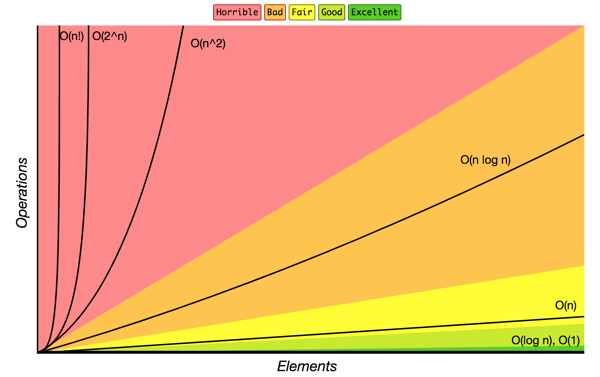

# Big O Notation

About Big O Notation

## Notes

Big O notation describes the limits of a function when the argument tends towards a particular value or infinity.

O? `Ordnung`.. the order of approximation.

### Big-O Complexity Chart

## Credits and References

* [Big O notation](https://en.wikipedia.org/wiki/Big_O_notation)
* [Big-O Cheat Sheet](https://www.bigocheatsheet.com/)
