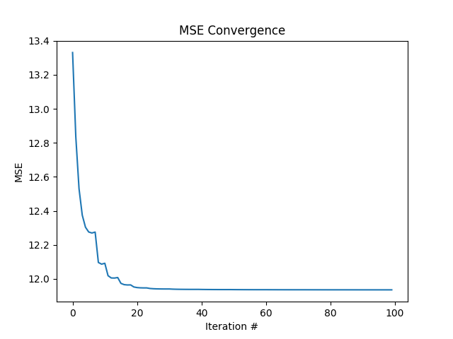
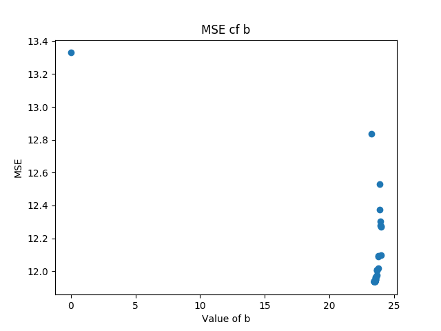
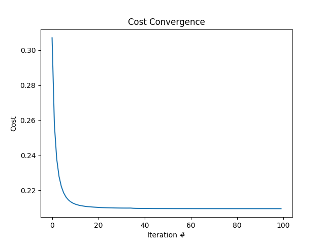
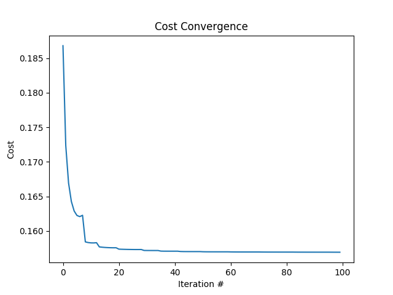
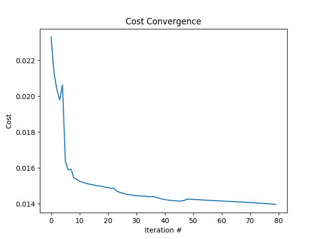

# #056 regression

Implementing linear regression, logistic regression and multi-nominal logistic regression with tensorflow-js and node.

## Notes

### Library Installation/Setup

Uses the following npm modules:

* [lodash](https://www.npmjs.com/package/lodash)
* [shuffle-seed](https://www.npmjs.com/package/shuffle-seed)
* [tfjs-node](https://www.npmjs.com/package/@tensorflow/tfjs-node)
* [memoize](https://www.npmjs.com/package/memoize)
* [mnist-data](https://www.npmjs.com/package/mnist-data)
* [node-remote-plot](https://www.npmjs.com/package/node-remote-plot)

install with:

```sh
npm install
```

### Data and Common Code

* [cars.csv](./data/cars.csv)
* [load-csv.js](./data/load-csv.js)

### Linear Regression

Sources:

* [index.js](./linear-regression/index.js)
* [linear-regression.js](./linear-regression/linear-regression.js)

Run:

```sh
$ cd linear-regression
$ node index.js

r2: 0.8059265340599994
Tensor
     [[18.0580692],]
```

Results:





### Logistic Regression

Sources:

* [index.js](./logistic-regression/index.js)
* [linear-regression.js](./logistic-regression/logistic-regression.js)

Run:

```sh
$ cd logistic-regression
$ node index.js

0.88
```

Results:



### Multi-nominal Logistic Regression

Sources:

* [efficiency-prediction.js](./multinominal-logistic-regression/efficiency-prediction.js)
* [image-recognition.js](./multinominal-logistic-regression/image-recognition.js)
* [logistic-regression.js](./multinominal-logistic-regression/logistic-regression.js)
* [memory.js](./multinominal-logistic-regression/memory.js)

Run:

```sh
$ cd multinominal-logistic-regression
$ node efficiency-prediction.js

0.78
```

Results:




## Credits and References

* [Machine Learning with Javascript](https://www.udemy.com/machine-learning-with-javascript/learn/v4/overview)
