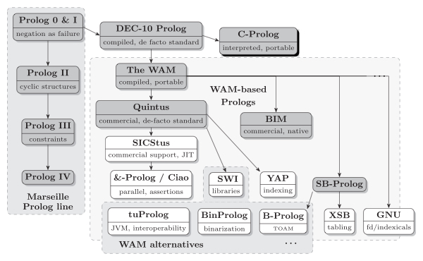

# #384 About Prolog

A quick introduction to Prolog and a test drive with GNU Prolog on macOS.

## Notes

Prolog is a logic programming language that has was created around 1972 by Alain Colmerauer with Philippe Roussel, from the Artificial Intelligence Group of the Faculty of Sciences of Luminy of Aix-Marseille II University of France.

It perhaps garnered some fresh attentino when it earned a chapter in
Bruce Tate's [Seven Languages in Seven Weeks](../../books/seven-languages-in-seven-weeks/).

## Prolog In a Nutshell

Prolog is...

* one of the first logic programming languages
* a declarative programming language

Prolog has..

* a single data type: the term.
    * Terms are either atoms, numbers, variables or compound terms (lists, strings)
* clauses: Prolog programs describe relations, defined by means of clauses
    * Pure Prolog is restricted to Horn clauses
    * Two types of Horn clauses are used to define Prolog programs: rules and facts
* A rule is of the form: `Head :- Body.`
    * Negation can be used in the rule
* A fact is a clauses with an empty body.
* Predicates and programs
    * A predicate (or procedure definition) is a collection of clauses whose heads have the same name and arity.
    * A logic program is a set of predicates
* Loops and recursion
* Execution
    * Execution of a Prolog program is initiated by the user's posting of a single goal, called the query.

Prolog applications..

* mainly:
    * theorem proving
    * expert systems
    * term rewriting
    * type systems
    * automated planning
    * question answering
    * natural language processing (its original intended use)
* most applications are small by industrial standards
* widely used in research and education, though more common in Europe (Americans favor Lisp).
* however, Prolog and other logic programming languages have not had a significant impact on the computer industry in general.

Prolog is governed by..

* The International Organization for Standardization (ISO) Prolog technical standard

[](https://en.wikipedia.org/wiki/Prolog#/media/File:Prolog_systems.svg)

Prolog implementations include..

* [Amzi! Prolog](https://github.com/AmziLS) - now open source as the maintainer is retiring
* [B-Prolog](https://en.wikipedia.org/wiki/B-Prolog) - commercial, no longer maintained
* [Ciao](https://en.wikipedia.org/wiki/Ciao_(programming_language))
    * <https://ciao-lang.org/>
    * Ciao is a modern Prolog implementation that builds up from a logic-based simple kernel designed to be portable, extensible, and modular.
    * Ciao can install natively in your operating system or run in the browser without installation.
* [ECLiPSe](https://en.wikipedia.org/wiki/ECLiPSe)
    * <https://sourceforge.net/projects/eclipse-clp/>
    * open source, still maintained
* [GNU Prolog](http://www.gprolog.org/)
* [Poplog](https://en.wikipedia.org/wiki/Poplog)
    * now open sourced <https://getpoplog.github.io/>
* [P#](https://homepages.inf.ed.ac.uk/stg/research/Psharp/)
    * P# compiles a linear logic extension of Prolog to C# source code
* [Quintus Prolog](https://en.wikipedia.org/wiki/Quintus_Prolog)
    * proprietary
    * final release in 2003 but still [maintained by SICS](https://quintus.sics.se/)
* [Scryer Prolog](https://www.scryer.pl/)
* [SICStus](https://sicstus.sics.se/)
    * state-of-the-art, ISO standard compliant, Prolog
    * commercial
    * appears to supersede Quintus Prolog also maintained by SICS
* [Strawberry](https://dobrev.com/) - Windows, free "light" version
* [SWI-Prolog](https://en.wikipedia.org/wiki/SWI-Prolog) - free implementation, commonly used for teaching and semantic web applications.
* [Tau Prolog](http://tau-prolog.org/) - An open source Prolog interpreter in JavaScript
* [tuProlog](https://pika-lab.gitlab.io/tuprolog/2p-in-kotlin/)
    * <https://github.com/tuProlog/2p-kt>
* [WIN-PROLOG 8.1](https://www.lpai.uk/win.htm)
    * [LPA Prolog](https://en.wikipedia.org/wiki/Logic_Programming_Associates)
* [XSB](https://en.wikipedia.org/wiki/XSB)
* [YAP](https://en.wikipedia.org/wiki/YAP_(Prolog))
    * <https://github.com/vscosta/yap>

## Test drive: GNU Prolog on macOS

As I'm on macOS right now, I'll use the [Homebrew Formulae for gnu-prolog](https://formulae.brew.sh/formula/gnu-prolog) to install:

```sh
brew install gnu-prolog
```

Let's test it with an example from [Seven Languages in Seven Weeks](../../books/seven-languages-in-seven-weeks/).
See [friend.pl](./friend.pl):

```prolog
likes(wallace, cheese).
likes(grommit, cheese).
likes(wendolene, sheep).

friend(X, Y) :- \+(X = Y), likes(X, Z), likes(Y, Z).
```

We have three facts about who likes cheese.
The `friend` rule with three clauses:

* `\+(X = Y)` means you can't friend yourself (`\+` indicates negation)
* `likes(X, Z), likes(Y, Z)` means X and Y both have to share a like for the same thing

Testing it out, querying for `likes` and `friend` conditions:

```sh
$ gprolog --consult-file friend.pl
GNU Prolog 1.5.0 (64 bits)
Compiled Jul  8 2021, 09:35:47 with clang
Copyright (C) 1999-2024 Daniel Diaz

compiling ./friend.pl for byte code...
./friend.pl compiled, 5 lines read - 1029 bytes written, 6 ms
| ?- likes(wallace, cheese).

yes
| ?- likes(grommit, cheese).

yes
| ?- likes(wendolene, cheese).

no
| ?- friend(wallace, grommit).

yes
| ?- friend(grommit, wallace).

yes
| ?- friend(wallace, wendolene).

no
| ?- likes(wallace, wallace).

no
```

## Credits and References

* <https://en.wikipedia.org/wiki/Prolog>
* [GNU Prolog](http://www.gprolog.org/)
* [Seven Languages in Seven Weeks](../../books/seven-languages-in-seven-weeks/)
