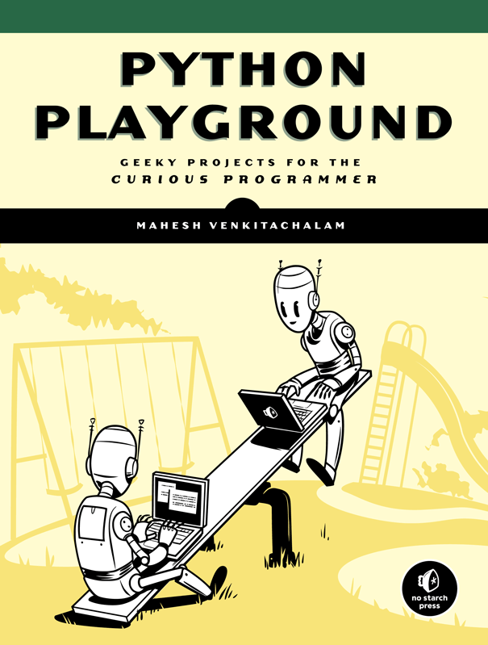

# #239 Python Playground

Book notes - Python Playground, by Mahesh Venkitachalam, published by No Starch Press

## Notes

## Table of Contents - Highlights

### Part 1: Warming Up

* Chapter 1: Parsing iTunes Playlists
* Chapter 2: Spirographs

### Part 2: Simulating Life

* Chapter 3: Conway’s Game of Life
* Chapter 4: Generating Musical Overtones with the Karplus-Strong Algorithm
* Chapter 5: Boids: Simulating a Flock

### Part 3: Fun with Images

* Chapter 6: ASCII Art
* Chapter 7: Photomosaics
* Chapter 8: Autostereograms

### Part 4: Enter 3D

* Chapter 9: Understanding OpenGL
* Chapter 10: Particle Systems
* Chapter 11: Volume Rendering

### Part 5: Hardware Hacking

* Chapter 12: Introduction to Arduino
* Chapter 13: Laser Audio Display
* Chapter 14: A Raspberry Pi–based Weather Monitor

### Appendices

* Appendix A: Software Installation
* Appendix B: Basic Practical Electronics
* Appendix C: Raspberry Pi Tips & Tricks

## Credits and References

* [Python Playground](https://nostarch.com/pythonplayground) - nostarch
* [Python Playground - GitHub Sources](https://github.com/electronut/pp/)
