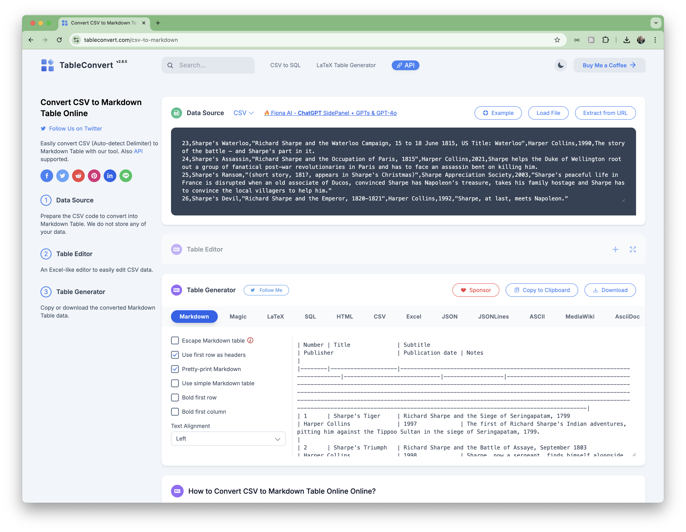

# #311 CSV to Markdown Tables

Options for converting comma-separated value data into markdown tables, including python scripts, command line utilities, online tools, and editor extensions.

## Notes

Converting CSV files to Markdown tables is a pretty common task I encounter, especially when generating documentation. The CSV data may come from a report, spreadsheet, or database extract, and I want to include it as a correctly formatted markdown table.

To investigate options for  automating the procedure, I'm using a listing of the Sharpe novels by Bernard Cornwell: [sharpe.csv](./sharpe.csv).

Below is a list of the best tools and methods, categorized by platform and use case.

### Using Python Libraries

#### pandas

Uses [tabulate](https://pypi.org/project/tabulate/) with [pandas](https://pypi.org/project/pandas/)
to read the csv and write markdown. See the [csv2md_pandas.py](./csv2md_pandas.py) script.
The essence of the conversion is in these few lines:

    def convert(infile, outfile):
        datafile = pd.read_csv(infile)
        markdown_table = datafile.to_markdown(index=False)
        with open(outfile, 'w') as f:
            f.write(markdown_table)

Install dependencies:

    pip install -r requirements.txt

Run the conversion

    mkdir -p output/pandas
    ./csv2md_pandas.py sharpe.csv output/pandas/README.md

See the [raw output here](./output/pandas/README.md)
and the [rendered markdown output here](./output/pandas/).

#### PrettyTable

Uses [csv](https://docs.python.org/3/library/csv.html) to read the input file
and [prettytable](https://pypi.org/project/prettytable/) to write markdown.
See the [csv2md_prettytable.py](./csv2md_prettytable.py) script.
The essence of the conversion is in these few lines:

    def convert(infile):
        with open(infile) as csv_file:
            csv_reader = csv.reader(csv_file)
            headers = next(csv_reader)
            table = PrettyTable(headers)
            table.set_style(TableStyle.MARKDOWN)
            for row in csv_reader:
                table.add_row(row)
        print(table.get_string(format=True))

Install dependencies:

    pip install -r requirements.txt

Run the conversion

    mkdir -p output/prettytable
    ./csv2md_prettytable.py sharpe.csv > output/prettytable/README.md

See the [raw output here](./output/prettytable/README.md)
and the [rendered markdown output here](./output/prettytable/).

### Online Tools

#### CSV to Markdown Table Generator

<https://www.convertcsv.com/csv-to-markdown.htm>

An online tool where you can upload or paste CSV data, and it instantly generates a Markdown table.
It works well, though the site is pretty overwhelmed by advertising. Many other output options available.

See the [raw output here](./output/convertcsv/README.md)
and the [rendered markdown output here](./output/convertcsv/).

#### TableConvert

<https://tableconvert.com/csv-to-markdown>

A feature-rich platform that supports multiple table formats, including Markdown, HTML, and LaTeX.
It works well, though the site is pretty overwhelmed by advertising.

See the [raw output here](./output/tableconvert/README.md)
and the [rendered markdown output here](./output/tableconvert/).

### Text Editors and IDEs

Many editors have features for converting CSV to Markdown:

* Visual Studio Code Extensions:
    * [CSV to Markdown Table](https://github.com/phoihos/vscode-csv-to-md-table)
        * tested, works fine
        * see the [raw output here](./output/csv_to_markdown_table/README.md) and the [rendered markdown output here](./output/csv_to_markdown_table/).
    * many others I haven't tried, search extensions for "CSV to Table"
* Sublime Text:
    * [Table Editor](https://packagecontrol.io/packages/Table%20Editor) package is no longer supported. May be others but I haven't tested yet.

### Command-Line Tools

#### csvtomd

[csvtomd](https://pypi.org/project/csvtomd/) is a Python-based CLI tool that converts CSV files to Markdown tables.

    $ pip install csvtomd
    $ which csvtomd
    /opt/homebrew/bin/csvtomd

Unfortunately, this fails on [newer python versions 3.11+](https://github.com/mplewis/csvtomd/issues/32), no fix yet.

#### pandoc

[pandoc](https://pypi.org/project/pandoc/) is a versatile document converter that supports converting CSV to Markdown.

    $ brew install pandoc
    $ which pandoc
    /opt/homebrew/bin/pandoc
    $ mkdir -p output/pandoc
    $ pandoc sharpe.csv --to markdown+pipe_tables -o output/pandoc/README.md

Umm, this also does not generate the expected table structure.

See the [raw output here](./output/pandoc/README.md)
and the [rendered markdown output here](./output/pandoc/).

It seems that using the [pandoc-csv2table](https://github.com/baig/pandoc-csv2table) filter may help, but I haven't tried that yet

### Sharpe novels by Bernard Cornwell

The markdown table as generated from [sharpe.csv](./sharpe.csv)

|Number|Title             |Subtitle                                                                        |Publisher                  |Publication date|Notes                                                                                                                                                                                                                                                                                                                                                                                                                                 |
|------|------------------|--------------------------------------------------------------------------------|---------------------------|----------------|--------------------------------------------------------------------------------------------------------------------------------------------------------------------------------------------------------------------------------------------------------------------------------------------------------------------------------------------------------------------------------------------------------------------------------------|
|1     |Sharpe's Tiger    |Richard Sharpe and the Siege of Seringapatam, 1799                              |Harper Collins             |1997            |The first of Richard Sharpe's Indian adventures, pitting him against the Tippoo Sultan in the siege of Seringapatam, 1799.                                                                                                                                                                                                                                                                                                            |
|2     |Sharpe's Triumph  |Richard Sharpe and the Battle of Assaye, September 1803                         |Harper Collins             |1998            |Sharpe, now a sergeant, finds himself alongside Sir Arthur Wellesley at the terrifying Battle of Assaye.                                                                                                                                                                                                                                                                                                                              |
|3     |Sharpe's Fortress |Richard Sharpe and the Siege of Gawilghur, December 1803                        |Harper Collins             |1998            |Sharpe's first story as an officer takes him to the daunting fort of Gawilghur. This is also the last of his Indian adventures.                                                                                                                                                                                                                                                                                                       |
|4     |Sharpe's Trafalgar|Richard Sharpe and the Battle of Trafalgar, 1805                                |Harper Collins             |2000            |Sharpe has to go home from India, and he would have left in 1805 and Cape Trafalgar lies on his way home, so why should he not be there at the right time?                                                                                                                                                                                                                                                                            |
|5     |Sharpe's Prey     |Richard Sharpe and the Expedition to Copenhagen, 1807                           |Harper Collins             |2001            |This tells the tale of one of the most obscure campaigns of the whole of the Napoleonic wars. The Danes had a huge merchant fleet, second only in size to Great Britain's, and to protect it they possessed a formidable navy. But Denmark was a very small country and when, in 1807, the French decide they will invade Denmark and take the fleet for themselves, Britain has to act swiftly. Swiftly, but not particularly justly.|
|6     |Sharpe's Rifles   |Richard Sharpe and the French Invasion of Galicia, January 1809                 |Harper Collins             |1988            |The beginning of the Peninsular War (the battles between 1808 and 1814 to expel the French from Portugal and Spain). The Peninsular Campaign occupies most of the Sharpe series and this book begins during the infamous retreat to Corunna. Sharpe and a group of the 95th Rifles become separated from the army and are forced to navigate french occupied territory.                                                               |
|7     |Sharpe's Havoc    |Richard Sharpe and the French Invasion of Portugal, Spring 1809                 |Harper Collins             |2003            |Sharpe's Havoc is set during the French invasion of Portugal in 1809 and Sir Arthur Wellesley's devastating counter-attack.                                                                                                                                                                                                                                                                                                           |
|8     |Sharpe's Eagle    |Richard Sharpe and the Talavera Campaign, July 1809                             |Harper Collins             |1981            |It tells the tale of the battle of Talavera.                                                                                                                                                                                                                                                                                                                                                                                          |
|9     |Sharpe's Gold     |Richard Sharpe and the Destruction of Almeida, August 1810                      |Harper Collins             |1981            |Sharpe is assigned to steal some Spanish gold needed to construct the Lines of Torres Vedras but falls foul of a corrupt Spanish partisan and ends up in the besieged fort of Almeida.                                                                                                                                                                                                                                                |
|10    |Sharpe's Escape   |Richard Sharpe and the Bussaco Campaign 1811                                    |Harper Collins             |2004            |It is the late summer of 1810 and the French mount their third and most threatening invasion of Portugal. Captain Richard Sharpe, with his company of redcoats and riflemen, meets the invaders on the gaunt ridge of Bussaco where, despite a stunning victory, the French are not stopped.                                                                                                                                          |
|11    |Sharpe's Fury     |Richard Sharpe and the Battle of Barrosa, March 1811                            |Harper Collins             |2006            |Sharpe's Fury is based on the real events of the winter of 1811 that led to the extraordinary victory of Barossa.                                                                                                                                                                                                                                                                                                                     |
|12    |Sharpe's Battle   |Richard Sharpe and the Battle of Fuentes de Onoro, May 1811                     |Harper Collins             |1995            |The ghastly tale of the battle of Fuentes d'Onoro, a bloody struggle on the Portuguese frontier which deteriorated into a gutter fight in the narrow alleys of a small village.                                                                                                                                                                                                                                                       |
|13    |Sharpe's Company  |Richard Sharpe and the Siege of Badajoz, January to April 1812                  |Harper Collins             |1982            |Tells the story of the horrifying assault on Badajoz in 1812. The British were in a foul mood, they had been given a hard time by the garrison and suspected that the city's Spanish inhabitants were French sympathisers, so when they got inside they went berserk.                                                                                                                                                                 |
|14    |Sharpe's Command  |Richard Sharpe and the Bridge at Almaraz, May 1812                              |Harper Collins             |2023            |Spain, 1812. Richard Sharpe, the most brilliant – but the most wayward – soldier in the British army, finds himself faced with an impossible task. Two French armies march towards each other. If they meet, the British are lost. And only Sharpe – with just his cunning, his courage and a small band of rogues to rely on – stands in their way...'.                                                                              |
|15    |Sharpe's Sword    |Richard Sharpe and the Salamanca Campaign, June and July 1812                   |Harper Collins             |1983            |In which Sharpe carries his sword (a 1796 pattern Heavy Cavalry sword, an ill-balanced butcher's blade) to the extraordinary battle outside Salamanca where, to quote an enemy General, Wellington 'destroyed forty thousand Frenchmen in forty minutes'.                                                                                                                                                                             |
|16    |Sharpe's Skirmish |Richard Sharpe and the defence of the Tormes, August 1812                       |Sharpe Appreciation Society|2002            |(Short Story) It is the summer of 1812 and Richard Sharpe, newly recovered from the wound he received in the fighting at Salamanca, is given an easy duty; to guard a Commissary Officer posted to an obscure Spanish fort where there are some captured French muskets to repair. But unknown to the British, the French are planning a raid and Sharpe is in for a fight!                                                           |
|17    |Sharpe's Enemy    |Richard Sharpe and the Defense of Portugal, Christmas 1812                      |Harper Collins             |1984            |By 1812 a lot of men had deserted from the British, French, Spanish and Portuguese armies and some of them, too many of them, had banded together in the border mountains where they were led by a renegade Frenchman nicknamed Pot-au-Feu. They formed a semi-military group of bandits and their enemies all agreed on one thing – they had to be crushed. Send for Sharpe.                                                         |
|18    |Sharpe's Honour   |Richard Sharpe and the Vitoria Campaign, February to June 1813                  |Harper Collins             |1985            |Pierre Ducos, the French super-agent, tries to end Sharpe's life and the series.                                                                                                                                                                                                                                                                                                                                                      |
|19    |Sharpe's Regiment |Richard Sharpe and the Invasion of France, June to November 1813                |Harper Collins             |1986            |Sharpe is sent home to raise soldiers for his regiment, the South Essex, and once in England he runs into an old enemy – Sir Henry Simmerson, once a Colonel of the South Essex and now, what else, a taxman.                                                                                                                                                                                                                         |
|20    |Sharpe's Christmas|Two short stories, 1813                                                         |Sharpe Appreciation Society|2003            |Sharpe's Christmas contains two short stories, 'Sharpe's Christmas' and 'Sharpe's Ransom'. 'Sharpe's Christmas' is set in 1813, towards the end of the Peninsular War and falls after Sharpe's Regiment. 'Sharpe's Ransom' comes after Sharpe's Waterloo and is set in peacetime.                                                                                                                                                     |
|21    |Sharpe's Siege    |Richard Sharpe and the Winter Campaign, 1814                                    |Harper Collins             |1987            |Sharpe finds himself stranded, surrounded and with only one very unlikely ally – Captain Cornelius Killick from Marblehead, Massachusetts.                                                                                                                                                                                                                                                                                            |
|22    |Sharpe's Revenge  |Richard Sharpe and the Peace of 1814                                            |Harper Collins             |1989            |This takes place between the end of the Peninsular War and the Waterloo Campaign – and Sharpe pursues Ducos to Italy, though not before he's fought in the climactic battle at Toulouse which is Wellington's last victory in the Peninsular War.                                                                                                                                                                                     |
|23    |Sharpe's Waterloo |Richard Sharpe and the Waterloo Campaign, 15 to 18 June 1815, US Title: Waterloo|Harper Collins             |1990            |The story of the battle – and Sharpe's part in it.                                                                                                                                                                                                                                                                                                                                                                                    |
|24    |Sharpe's Assassin |Richard Sharpe and the Occupation of Paris, 1815                                |Harper Collins             |2021            |Sharpe helps the Duke of Wellington root out a group of fanatical post-war revolutionaries in Paris and has to face an assassin bent on killing him.                                                                                                                                                                                                                                                                                  |
|25    |Sharpe's Ransom   |(short story, 181?, appears in Sharpe's Christmas)                              |Sharpe Appreciation Society|2003            |Sharpe's peaceful life in France is disrupted when an old associate of Ducos, convinced Sharpe has Napoleon's treasure, takes his family hostage and Sharpe has to convince the local villagers to help him.                                                                                                                                                                                                                          |
|26    |Sharpe's Devil    |Richard Sharpe and the Emperor, 1820–1821                                       |Harper Collins             |1992            |Sharpe, at last, meets Napoleon.                                                                                                                                                                                                                                                                                                                                                                                                      |

## Credits and References

* [The Sharpe stories](https://en.wikipedia.org/wiki/Bernard_Cornwell_bibliography#The_Sharpe_stories) - wikipedia
* <https://www.convertcsv.com/csv-to-markdown.htm>
* <https://tableconvert.com/csv-to-markdown>
* <https://pypi.org/project/csvtomd/>
* <https://pypi.org/project/pandoc/>
* [ruby/csv2md](../../ruby/csv2md/) - using ruby to do the same thing
