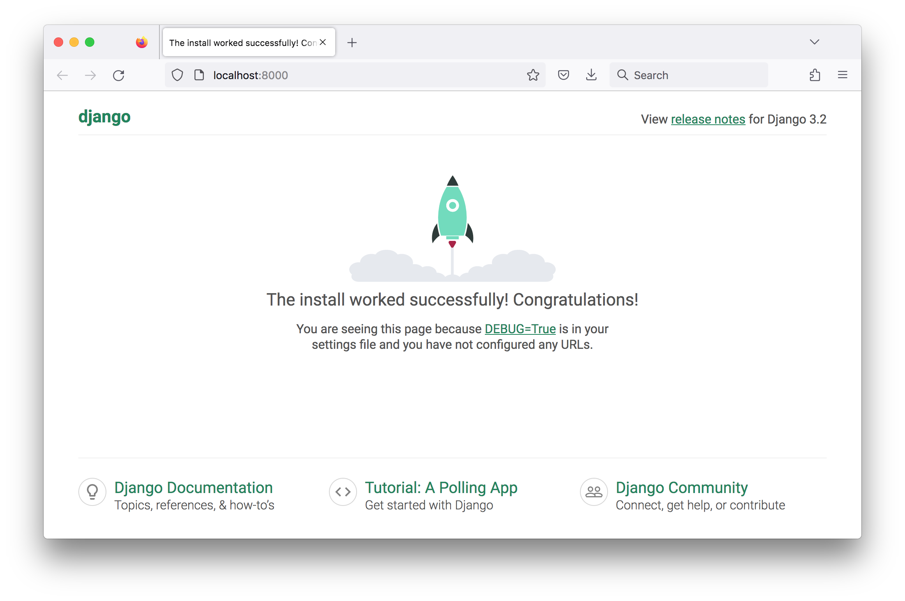

# Minimal Django Starter Project

The basic Django app framework

## Notes

### Install Dependencies

Using Python 3.7.3 to create and setup a virtual environment with the
requirepements as specified in [requirements.txt](./requirements.txt):

    $ python -V
    Python 3.7.3
    $ python -m venv venv
    $ source venv/bin/activate
    $ pip install --upgrade pip
    $ pip install -r requirements.txt

### Using startproject

Use [startproject](https://docs.djangoproject.com/en/4.2/ref/django-admin/#startproject) to create an app called "minime":

    $ django-admin startproject minime

Starting the project:

    $ cd minime
    $ python manage.py migrate
    $ python manage.py runserver
    Watching for file changes with StatReloader
    Performing system checks...

    System check identified no issues (0 silenced).
    May 16, 2023 - 15:01:47
    Django version 3.2.18, using settings 'minime.settings'
    Starting development server at http://127.0.0.1:8000/
    Quit the server with CONTROL-C.
    [16/May/2023 15:02:15] "GET / HTTP/1.1" 200 10697
    [16/May/2023 15:02:15] "GET /static/admin/css/fonts.css HTTP/1.1" 200 423
    [16/May/2023 15:02:15] "GET /static/admin/fonts/Roboto-Bold-webfont.woff HTTP/1.1" 200 86184
    [16/May/2023 15:02:15] "GET /static/admin/fonts/Roboto-Regular-webfont.woff HTTP/1.1" 200 85876
    [16/May/2023 15:02:15] "GET /static/admin/fonts/Roboto-Light-webfont.woff HTTP/1.1" 200 85692

Loading <http://127.0.0.1:8000/>:

## Credits and References

* [doc: startproject](https://docs.djangoproject.com/en/4.2/ref/django-admin/#startproject)
* [Writing your first Django app](https://docs.djangoproject.com/en/4.2/intro/tutorial01/)
* [Your First Steps With Django: Set Up a Django Project](https://realpython.com/django-setup/)
* [Django Create Project](https://www.w3schools.com/django/django_create_project.php)
