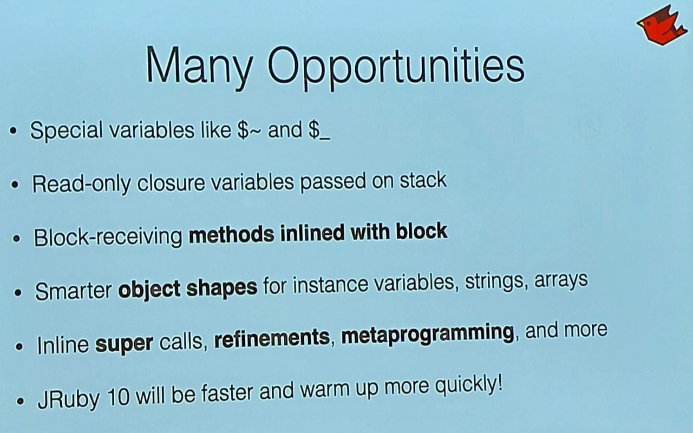
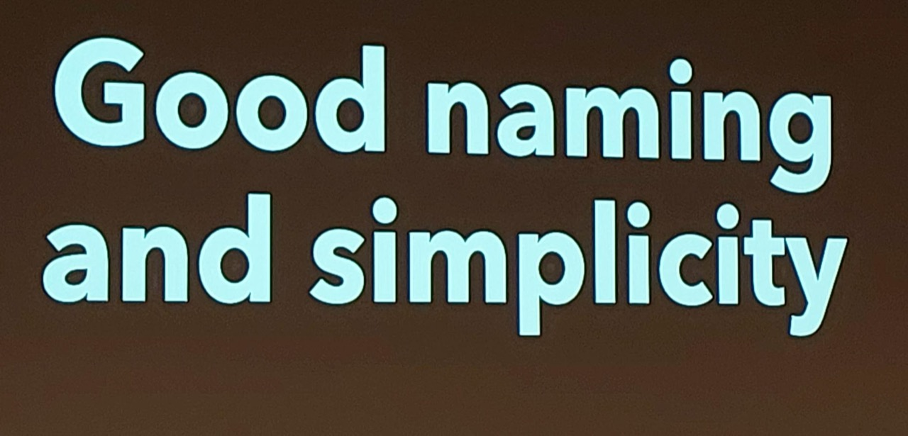
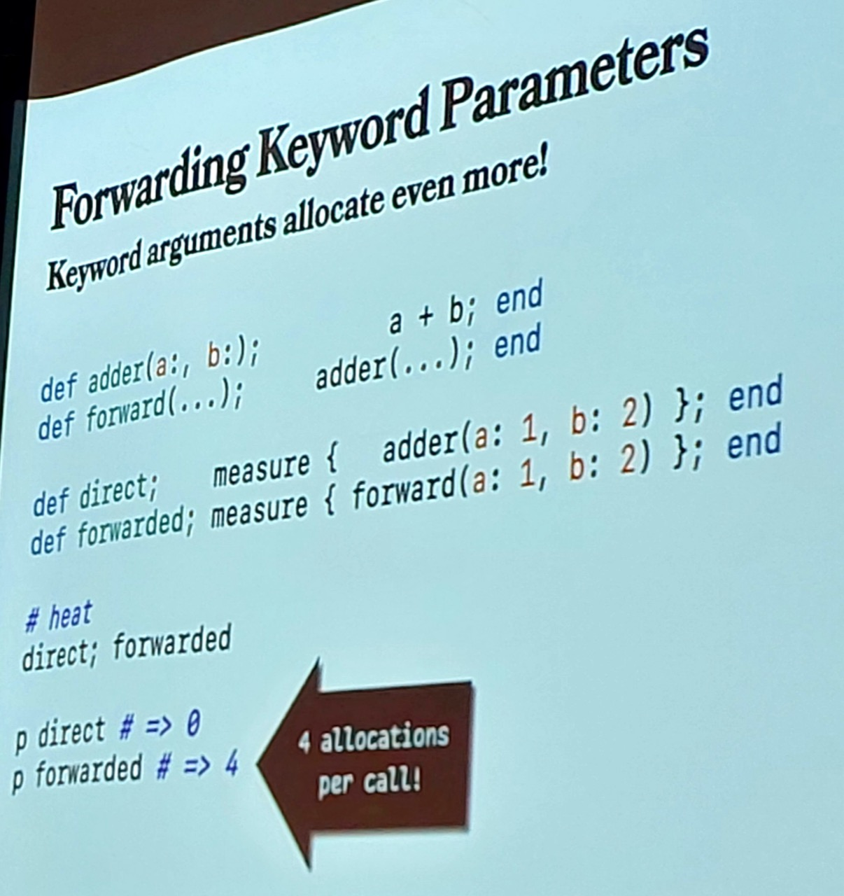

# Red Dot Ruby Conference 2024

Conference summary and notes

## Notes

[Red Dot Ruby Conference 2024](https://reddotrubyconf.com/)
was held at SingPost Centre, Level 5 Auditorium, 25-26 July 2024.

Organisers

* <rdrc-organisers@googlegroups.com>
* Kang Sheng Sponsorships <https://www.taykangsheng.com/>
* Onur Ozer Marketing <https://onurozer.me/>
* Sam Hon Organisation <https://github.com/coffeesam>
* Ted Johansson Lead <https://github.com/Drenmi>
* Yabing Logistics <https://github.com/peanutyabing>
* Zong Han Intern <https://www.zonghan.dev/>

Sponsors

* <https://www.coingecko.com/>
* [STACK Community by GovTech](https://www.meetup.com/stack-by-govtech-singapore/)
    * <https://www.tech.gov.sg/>
* <https://www.appsignal.com/>
* <https://www.ascenda.com/>

## Day 1 Outline and Highlights

### 9:45 AM Opening address

### 10:00 AM Matz' keynote

Yukihiro "Matz" Matsumoto
<https://github.com/matz>

* No types!
* New Prism parser
* Ractors and fibres
* Rubocop, steep, sorbet
* Support supporting tools!
* <https://toprubycompanies.info/>

### 10:50 AM 2,000 Engineers, 2 Millions Lines of Code: The History of a Rails Monolith

Cristian Planas Zendesk

### 11:50 AM Introduction to Cybersecurity with Ruby

Hiroshi Shibata ANDPAD

* <https://github.com/hsbt>
* <Https://hsbt.org>

### 1:30 PM Connecting Dots: Rails Girls & RubyKaigi

Eriko Sugiyama
MoneyForward

### 2:10 PM Leveling Up Developer Tooling For The Modern Rails & Hotwire Era

Marco Roth

* Toolsday
* <https://github.com/marcoroth>
* <https://hotwireweekly.com/>

### 3:20 PM 1 Engineer, 300 Thousand Users

[Adrian Goh](https://github.com/adriangohjw) - NodeFlair

* Crunchy bridge no egress fees
* gems that worked well for us:
    * Split - ab testing
    * Scenic - dB view
    * PgHero - performance dashboard for Postgres
    * Rails performance apm

### 4:00 PM Rack From Scratch

[Hieu Nguyen](https://github.com/hieuk09)

### 4:40 PM Livin' La Vida Hanami

[Tim Riley](https://github.com/timriley) - Buildkite

* Hanami 2
* <https://github.com/hanami/hanami>
* <https://github.com/dry-rb/dry-operation>

## Day 2 Outline and Highlights

### 9:30 AM Ruby on the Modern JVM with JRuby

[Charles Oliver Nutter](https://github.com/headius) - Headius Enterprises

<https://www.jruby.org/>

Ruby flip flops
<https://nithinbekal.com/posts/ruby-flip-flop/>

### 11:10 AM Revisiting Patterns of Error Handling in Ruby

Giovanni Sakti - RelayCommerce

### 11:50 AM How Not to Make Your DSL Terrible

[Okura Musafami](https://github.com/okuramasafumi)

* <https://github.com/okuramasafumi/alba>

### 1:30 PM Writing an Interpreter in Ruby

Mario Arias - Carbon Management Solutions

### 2:20 PM Scaling RubyGems.org to 1 Trillion downloads

[Colby Swandale](https://github.com/colby-swandale) - RubyCentral

* Aws
* Fastly

### 3:20 PM Ruby & Party Politics: How to Quickly Refactor a Political Party's Election System

Mu-Fan Teng - 5xRuby

* Aasm
* <https://coscup.org/2024/en/>

### 10:10 AM Tight Genes: Intro to Genetic Algorithms

Dave Aronson - Codosaurus

Over 30 Ruby gems
Usage quite “hidden”
<https://github.com/CodosaurusLLC/tight-genes>

<https://www.jpl.nasa.gov/nmp/st5/TECHNOLOGY/antenna.html>

### 4:00 PM Speeding Up Delegate Methods

[Aaron Patterson](https://github.com/tenderlove)

* Proxy
* Decorate initialize
* Forwarding adds overhead
* Every forward allocates objects
* Stack layout
* Yarv stack based vm

### 5:00 PM Closing address

[Survey](https://docs.google.com/forms/d/e/1FAIpQLSfhQynZnyJLkXCnlYs07ZMhxzvYIJvtxwzuxBpktxy5lwYFJw/viewform)

## Credits and References

* [Red Dot Ruby Conference](https://reddotrubyconf.com/)
