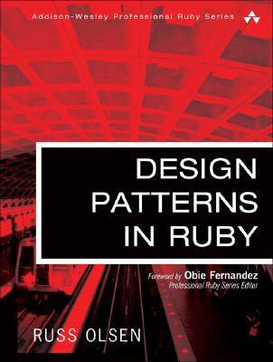

# #375 Design Patterns in Ruby

Book notes - Design Patterns in Ruby by Russ Olsen

## Notes

[Design Patterns in Ruby](https://www.goodreads.com/book/show/2278064.Design_Patterns_in_Ruby)
was first published December 10, 2007.
It presents and discusses how the classic "Gang of Four" work of Gamma et al - [Design Patterns: Elements of Reusable Object-Oriented Software](../../design/design-patterns/) - may be applied in a ruby context, taking best advantage of the language.

## Summary

* GoF Patterns
    * Adapter: helps two incompatible interfaces to work together
    * Builder: create complex objects that are hard to configure
    * Command: performs some specific task without having any information about the receiver of the request
    * Composite: builds a hierarchy of tree objects and interacts with all them the same way
    * Decorator: vary the responsibilities of an object adding some features
    * Factory: create objects without having to specify the exact class of the object that will be created
    * Interpreter: provides a specialized language to solve a well defined problem of know domain
    * Iterator: provides a way to access a collection of sub-objects without exposing the underlying representation
    * Observer: helps building a highly integrated system, maintainable and avoids coupling between classes
    * Proxy: allows us having more control over how and when we access to a certain object
    * Singleton: have a single instance of certain class across the application
    * Strategy: varies part of an algorithm at runtime
    * Template Method: redefines certain steps of an algorithm without changing the algorithm's structure
* Non-GoF Patterns: Patterns For Ruby
    * Convention Over Configuration: build an extensible system and not carrying the configuration burden.
    * Domain-Specific Language: build a convenient syntax for solving problems of a specific domain.
    * Meta-Programming: gain more flexibility when defining new classes and create custom tailored objects on the fly.

## Contents

* PART I: Patterns and Ruby 1
    * Chapter 1: Building Better Programs with Patterns 3
        * The Gang of Four 4
        * Patterns for Patterns 4
        * Separate Out the Things That Change from Those That Stay the Same 5
        * Program to an Interface, Not an Implementation 5
        * Prefer Composition over Inheritance 7
        * Delegate, Delegate, Delegate 12
        * You Ain't Gonna Need It 13
        * Fourteen Out of Twenty-Three 15
        * Patterns in Ruby? 17
    * Chapter 2: Getting Started with Ruby 19
        * Interactive Ruby 20
        * Saying Hello World 20
        * Variables 23
        * Fixnums and Bignums 24
        * Floats 26
        * There Are No Primitives Here 26
        * But Sometimes There Is No Object 27
        * Truth, Lies, and nil 28
        * Decisions, Decisions 30
        * Loops 32
        * More about Strings 34
        * Symbols 37
        * Arrays 38
        * Hashes 40
        * Regular Expressions 40
        * A Class of Your Own 41
        * Getting at the Instance Variables 43
        * An Object Asks: Who Am I? 46
        * Inheritance, Subclasses, and Superclasses 46
        * Argument Options 47
        * Modules 49
        * Exceptions 52
        * Threads 53
        * Managing Separate Source Files 54
        * Wrapping Up 55
* PART II: Patterns in Ruby 57
    * Chapter 3: Varying the Algorithm with the Template Method 59
        * Keeping Up with What Life Throws at You 60
        * Separate the Things That Stay the Same 61
        * Discovering the Template Method Pattern 65
        * Hook Methods 66
        * But Where Are All the Declarations? 68
        * Types, Safety, and Flexibility 69
        * Unit Tests Are Not Optional 71
        * Using and Abusing the Template Method Pattern 73
        * Templates in the Wild 74
        * Wrapping Up 75
    * Chapter 4: Replacing the Algorithm with the Strategy 77
        * Delegate, Delegate, and Delegate Again 78
        * Sharing Data between the Context and the Strategy 80
        * Duck Typing Yet Again 82
        * Procs and Blocks 84
        * Quick-and-Dirty Strategies 88
        * Using and Abusing the Strategy Pattern 90
        * The Strategy Pattern in the Wild 90
        * Wrapping Up 92
    * Chapter 5: Keeping Up with the Times with the Observer 95
        * Staying Informed 95
        * A Better Way to Stay Informed 97
        * Factoring Out the Observable Support 100
        * Code Blocks as Observers 104
        * Variations on the Observer Pattern 105
        * Using and Abusing the Observer Pattern 106
        * Observers in the Wild 108
        * Wrapping Up 109
    * Chapter 6: Assembling the Whole from the Parts with the Composite 111
        * The Whole and the Parts 112
        * Creating Composites 114
        * Sprucing Up the Composite with Operators 118
        * An Array as a Composite? 119
        * An Inconvenient Difference 120
        * Pointers This Way and That 120
        * Using and Abusing the Composite Pattern 122
        * Composites in the Wild 123
        * Wrapping Up 125
    * Chapter 7: Reaching into a Collection with the Iterator 127
        * External Iterators 127
        * Internal Iterators 130
        * Internal Iterators versus External Iterators 131
        * The Inimitable Enumerable 133
        * Using and Abusing the Iterator Pattern 134
        * Iterators in the Wild 136
        * Wrapping Up 140
    * Chapter 8: Getting Things Done with Commands 143
        * An Explosion of Subclasses 144
        * An Easier Way 145
        * Code Blocks as Commands 147
        * Commands That Record 148
        * Being Undone by a Command 151
        * Queuing Up Commands 154
        * Using and Abusing the Command Pattern 154
        * The Command Pattern in the Wild 155
        * ActiveRecord Migrations 155
        * Madeleine 156
        * Wrapping Up 160
    * Chapter 9: Filling in the Gaps with the Adapter 163
        * Software Adapters 164
        * The Near Misses 167
        * An Adaptive Alternative? 168
        * Modifying a Single Instance 170
        * Adapt or Modify? 172
        * Using and Abusing the Adapter Pattern 173
        * Adapters in the Wild 173
        * Wrapping Up 174
    * Chapter 10: Getting in Front of Your Object with a Proxy 175
        * Proxies to the Rescue 176
        * The Protection Proxy 178
        * Remote Proxies 179
        * Virtual Proxies Make You Lazy 180
        * Eliminating That Proxy Drudgery 182
        * Message Passing and Methods 183
        * The method_missing Method 184
        * Sending Messages 185
        * Proxies without the Tears 185
        * Using and Abusing Proxies 189
        * Proxies in the Wild 190
        * Wrapping Up 192
    * Chapter 11: Improving Your Objects with a Decorator 193
        * Decorators: The Cure for Ugly Code 193
        * Formal Decoration 200
        * Easing the Delegation Blues 200
        * Dynamic Alternatives to the Decorator Pattern 201
        * Wrapping Methods 202
        * Decorating with Modules 202
        * Using and Abusing the Decorator Pattern 204
        * Decorators in the Wild 205
        * Wrapping Up 206
    * Chapter 12: Making Sure There Is Only One with the Singleton 207
        * One Object, Global Access 207
        * Class Variables and Methods 208
        * Class Variables 208
        * Class Methods 209
        * A First Try at a Ruby Singleton 211
        * Managing the Single Instance 212
        * Making Sure There Is Only One 213
        * The Singleton Module 214
        * Lazy and Eager Singletons 214
        * Alternatives to the Classic Singleton 215
        * Global Variables as Singletons 215
        * Classes as Singletons 216
        * Modules as Singletons 218
        * A Safety Harness or a Straitjacket? 219
        * Using and Abusing the Singleton Pattern 220
        * They Are Really Just Global Variables, Right? 220
        * Just How Many of These Singletons Do You Have? 221
        * Singletons on a Need-to-Know Basis 221
        * Curing the Testing Blues 223
        * Singletons in the Wild 224
        * Wrapping Up 225
    * Chapter 13: Picking the Right Class with a Factory 227
        * A Different Kind of Duck Typing 228
        * The Template Method Strikes Again 231
        * Parameterized Factory Methods 233
        * Classes Are Just Objects, Too 236
        * Bad News: Your Program Hits the Big Time 237
        * Bundles of Object Creation 239
        * Classes Are Just Objects (Again) 241
        * Leveraging the Name 242
        * Using and Abusing the Factory Patterns 244
        * Factory Patterns in the Wild 244
        * Wrapping Up 246
    * Chapter 14: Easier Object Construction with the Builder 249
        * Building Computers 250
        * Polymorphic Builders 253
        * Builders Can Ensure Sane Objects 256
        * Reusable Builders 257
        * Better Builders with Magic Methods 258
        * Using and Abusing the Builder Pattern 259
        * Builders in the Wild 259
        * Wrapping Up 260
    * Chapter 15: Assembling Your System with the Interpreter 263
        * The Right Language for the Job 264
        * Building an Interpreter 264
        * A File-Finding Interpreter 267
        * Finding All the Files 267
        * Finding Files by Name 268
        * Big Files and Writable Files 269
        * More Complex Searches with Not, And, and Or 270
        * Creating the AST 272
        * A Simple Parser 272
        * A Parser-less Interpreter? 274
        * Let XML or YAML Do the Parsing? 276
        * Racc for More Complex Parsers 277
        * Let Ruby Do the Parsing? 277
        * Using and Abusing the Interpreter Pattern 277
        * Interpreters in the Wild 278
        * Wrapping Up 279
* PART III: Patterns for Ruby 281
    * Chapter 16: Opening Up Your System with Domain-Specific Languages 283
    * The Domain of Specific Languages 283
    * A File Backup DSL 284
    * It's a Data File--No, It's a Program! 285
    * Building PackRat 287
    * Pulling Our DSL Together 288
    * Taking Stock of PackRat 289
    * Improving PackRat 290
    * Using and Abusing Internal DSLs 293
    * Internal DSLs in the Wild 294
    * Wrapping Up 295
    * Chapter 17: Creating Custom Objects with Meta-programming 297
    * Custom-Tailored Objects, Method by Method 298
    * Custom Objects, Module by Module 300
    * Conjuring Up Brand-New Methods 301
    * An Object's Gaze Turns Inward 306
    * Using and Abusing Meta-programming 306
    * Meta-programming in the Wild 308
    * Wrapping Up 311
    * Chapter 18: Convention Over Configuration 313
    * A Good User Interface--for Developers 315
    * Anticipate Needs 315
    * Let Them Say It Once 316
    * Provide a Template 316
    * A Message Gateway 317
    * Picking an Adapter 319
    * Loading the Classes 320
    * Adding Some Security 323
    * Getting the User Started 325
    * Taking Stock of the Message Gateway 326
    * Using and Abusing the Convention Over Configuration Pattern 327
    * Convention Over Configuration in the Wild 328
    * Wrapping Up 328
    * Chapter 19: Conclusion 331
* Appendix A: Getting Hold of Ruby 333
* Appendix B: Digging Deeper 335

## Credits and References

* Design Patterns in Ruby
    * [amazon](https://amzn.to/49hN2I5)
    * [goodreads](https://www.goodreads.com/book/show/2278064.Design_Patterns_in_Ruby)
    * <http://designpatternsinruby.com/>
* <https://refactoring.guru/design-patterns/ruby>
* <https://github.com/davidgf/design-patterns-in-ruby>
