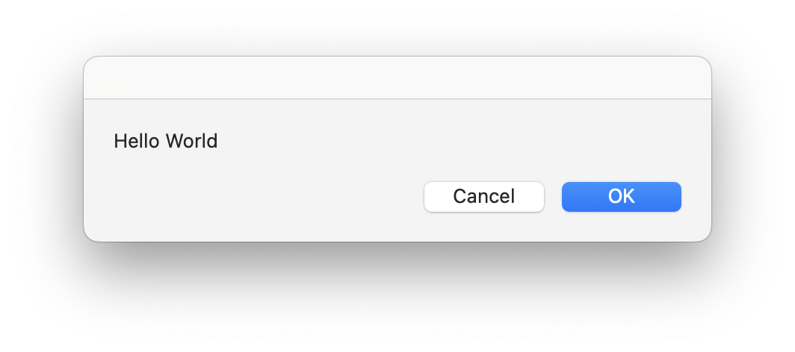
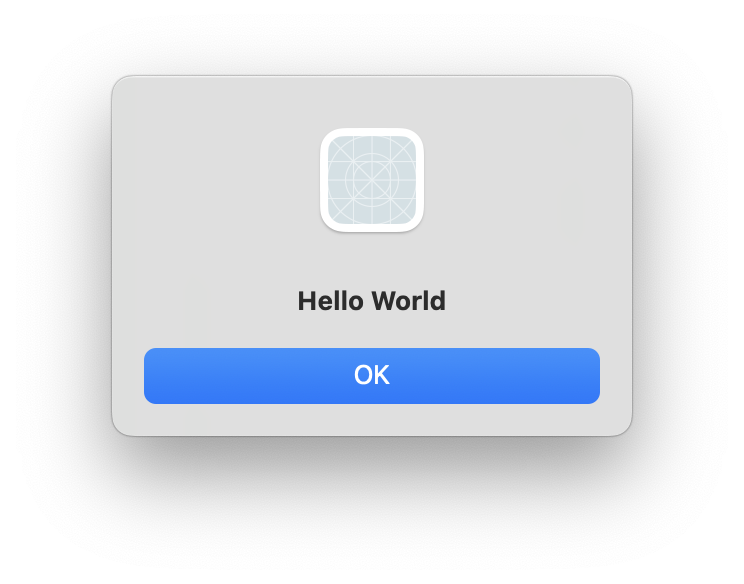
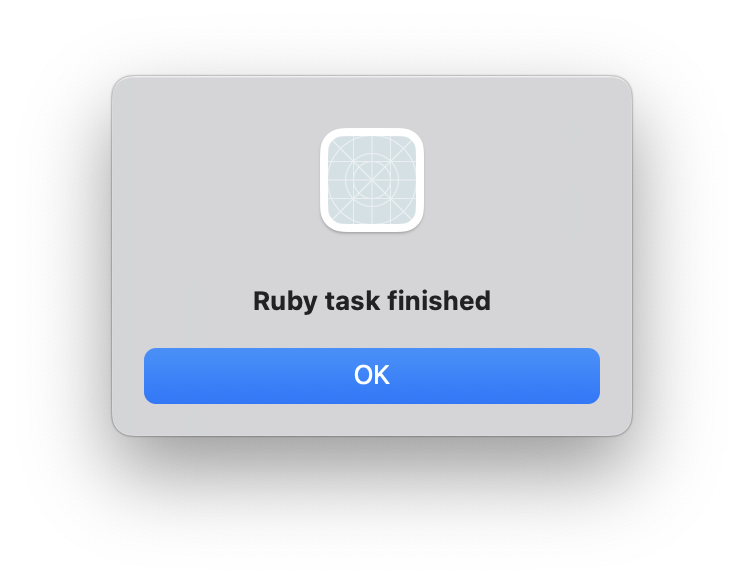
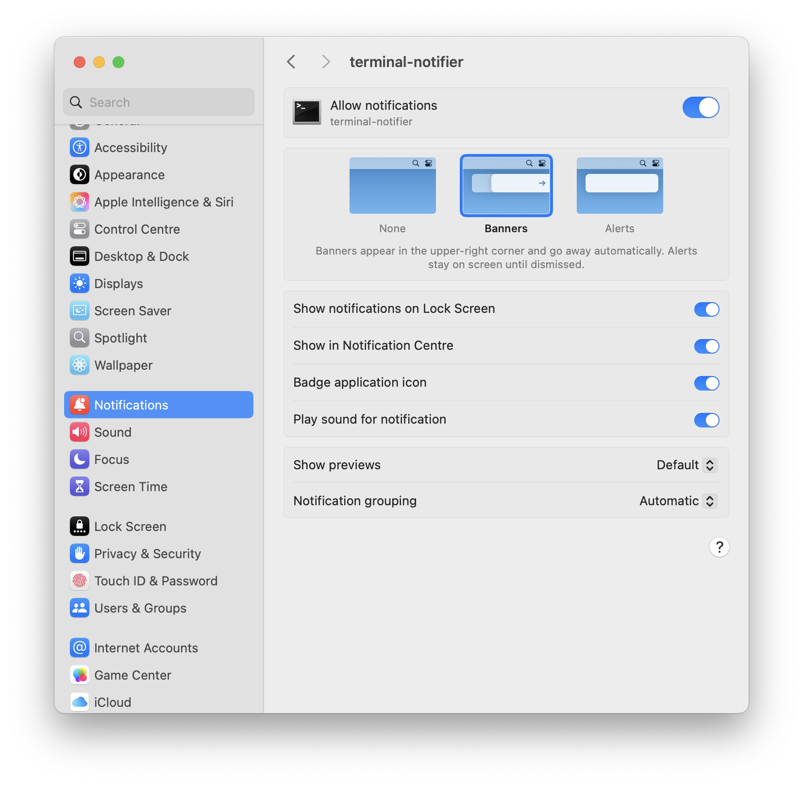
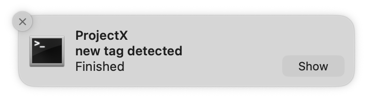
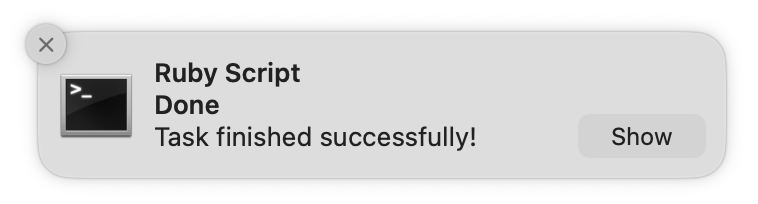

# #352 macOS Notifications with Ruby

Modern alternatives to the old growl notification system for ruby programming on macOS: osascript, terminal-notifier

## Notes

[Growl](https://en.wikipedia.org/wiki/Growl_(software)) was a notification system for macOS developed in 2004.
It was quite commonly used with ruby for desktop notifications, but has since become obsolete.

What are modern alternatives specifically for local/desktop messaging circa 2025?
The two main ones that come to mind:

* calling [AppleScript/oascript](https://en.wikipedia.org/wiki/AppleScript) - limited and poorly supported
* using the [terminal-notifier](https://rubygems.org/gems/terminal-notifier) gem - much better and actively maintained solution

### Using AppleScript/oascript

The `osascript` command can be used to execute AppleScript. Although poorly supported these days, some of the notification features still work.

For example, to always show a message in the foreground,
can tell the "System Events" application to
[display dialog](https://developer.apple.com/library/archive/documentation/AppleScript/Conceptual/AppleScriptLangGuide/reference/ASLR_cmds.html#//apple_ref/doc/uid/TP40000983-CH216-SW12)
or [display alert](https://developer.apple.com/library/archive/documentation/AppleScript/Conceptual/AppleScriptLangGuide/reference/ASLR_cmds.html#//apple_ref/doc/uid/TP40000983-CH216-SW11).
Note that the
[display notification](https://developer.apple.com/library/archive/documentation/AppleScript/Conceptual/AppleScriptLangGuide/reference/ASLR_cmds.html#//apple_ref/doc/uid/TP40000983-CH216-SW224)
command no longer seems to work.

A dialog is displayed with both an OK and Cancel button:

```sh
osascript -e 'tell app "System Events" to display dialog "Hello World"'
```



An alert only has an OK button:

```sh
osascript -e 'tell app "System Events" to display alert "Hello World"'
```



```sh
osascript -e 'tell app "System Events" to display notification "Hello World"'
```

From ruby, oascript can be invoked as a shell command.
See [oascript-example.rb](./oascript-example.rb):

```ruby
#! /usr/bin/env ruby
app = "System Events"
message = "Ruby task finished"
system("osascript -e 'tell app \"#{app}\" to display alert \"#{message}\"'")
```



### terminal-notifier gem

The [terminal-notifier](https://rubygems.org/gems/terminal-notifier) gem
is used to send user notifications on macOS 10.10 or higher.
It may be used from the command line or from ruby code.

Running from the command line:

```sh
terminal-notifier -title ProjectX -subtitle "new tag detected" -message "Finished"
```

On first use, the system will prompt for permissions:



Subsequent messages will be displayed as expected:



Notifications may also be invoked directly from ruby using the gem's API.
See [terminal-notifier-example.rb](./terminal-notifier-example.rb) for an example:

```ruby
#! /usr/bin/env ruby
require 'terminal-notifier'
TerminalNotifier.notify('Task finished successfully!', title: 'Ruby Script', subtitle: 'Done')
```

Execute the script:

```sh
ruby ./terminal-notifier-example.rb
```

The message is displayed as expected in the notification centre:



## Credits and References

* Growl (deprecated)
    * <https://en.wikipedia.org/wiki/Growl_(software)>
    * <https://growl.github.io/growl/>
    * <https://github.com/tj/growl/tree/master>
    * <https://formulae.brew.sh/cask/growlnotify>
* AppleScript/ oascript
    * <https://en.wikipedia.org/wiki/AppleScript>
    * <https://stackoverflow.com/questions/5588064/how-do-i-make-a-mac-terminal-pop-up-alert-applescript>
* terminal-notifier
    * <https://github.com/julienXX/terminal-notifier>
    * <https://rubygems.org/gems/terminal-notifier>
