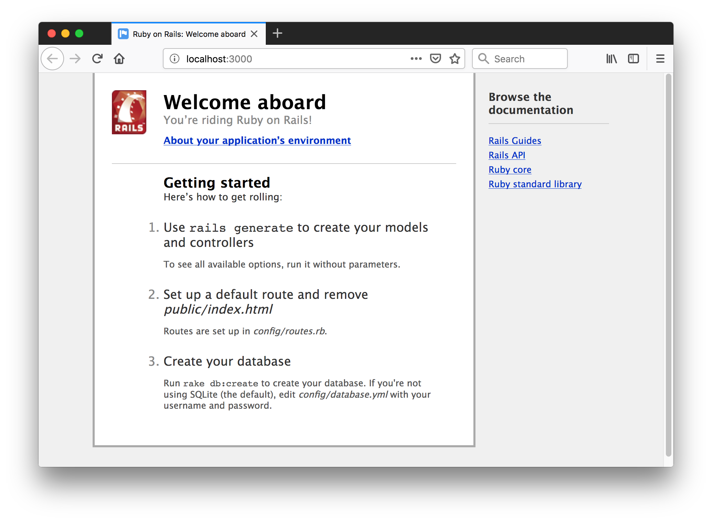
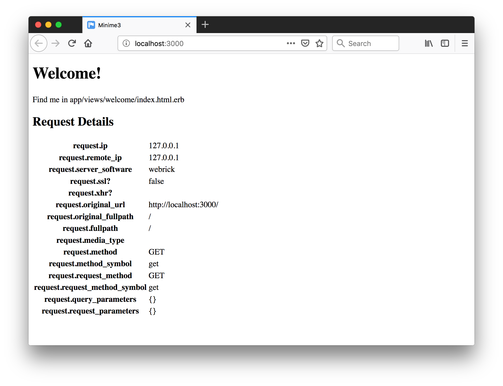

# Ruby on Rails 3

Features and demonstration of Rails 3.

## Notes

### Key Features of Rails 3

* Brand new router with an emphasis on RESTful declarations
* New Action Mailer API modeled after Action Controller (now without the agonizing pain of sending multipart messages!)
* New Active Record chainable query language built on top of relational algebra
* Unobtrusive JavaScript helpers with drivers for Prototype, jQuery, and more coming (end of inline JS)
* Explicit dependency management with Bundler


### Checking Pre-requisites and Installation

```
$ ruby -v
ruby 2.1.9p490 (2016-03-30 revision 54437) [x86_64-darwin14.0]
$ sqlite3 --version
3.19.3 2017-06-27 16:48:08 2b0954060fe10d6de6d479287dd88890f1bef6cc1beca11bc6cdb79f72e2377b
$ gem install rails -v 3.2.22.5
...
$ rails --version
Rails 3.2.22.5
```


### Creating a Simple App

```
$ rails new minime3
...
$ cd minime3
$ rake db:migrate
$ rails server
=> Booting WEBrick
=> Rails 3.2.22.5 application starting in development on http://0.0.0.0:3000
=> Call with -d to detach
=> Ctrl-C to shutdown server
[2019-02-25 15:01:01] INFO  WEBrick 1.3.1
[2019-02-25 15:01:01] INFO  ruby 2.1.9 (2016-03-30) [x86_64-darwin14.0]
[2019-02-25 15:01:01] INFO  WEBrick::HTTPServer#start: pid=97453 port=3000
```

Note, pegged some gems to avoid version issues:

* sqlite3
* rb-fsevent, rb-inotify

Hit `http://localhost:3000`..




#### Adding a Welcome Page

Using controller generator:

```
rails generate controller Welcome index
```

Adjust routes to use this as the main page.



#### Testing

```
$ rake test
... lots of: warning: File.exists? is a deprecated name, use File.exist? instead
Run options:

# Running tests:

Finished tests in 0.141508s, 7.0667 tests/s, 7.0667 assertions/s.
1 tests, 1 assertions, 0 failures, 0 errors, 0 skips

ruby -v: ruby 2.1.9p490 (2016-03-30 revision 54437) [x86_64-darwin14.0]
```

#### Adding The Blog App

The getting started guide has always outlined a simple [blog application](https://guides.rubyonrails.org/getting_started.html#creating-the-blog-application).
Adding the basic features to `minime3`:

```
rails generate controller Articles
rails generate model Article title:string text:text
rake db:migrate
```

## Credits and References
* [Ruby Versions for Rails](https://guides.rubyonrails.org/upgrading_ruby_on_rails.html#ruby-versions)
* [Rails 3 Release Notes](https://edgeguides.rubyonrails.org/3_0_release_notes.html)
* [Rails API - 3.2.22](https://api.rubyonrails.org/v3.2.22/)
