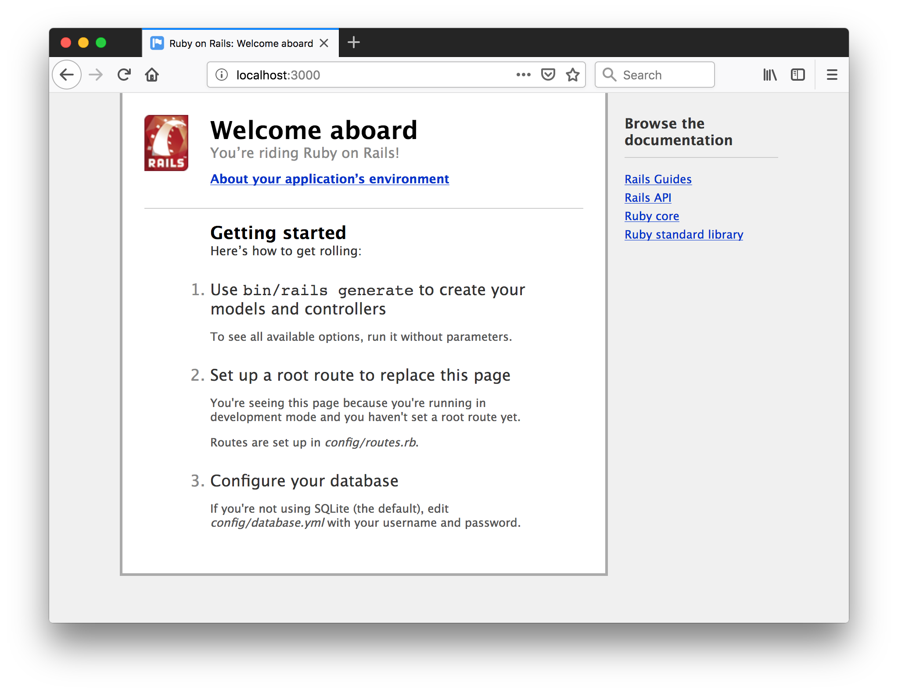
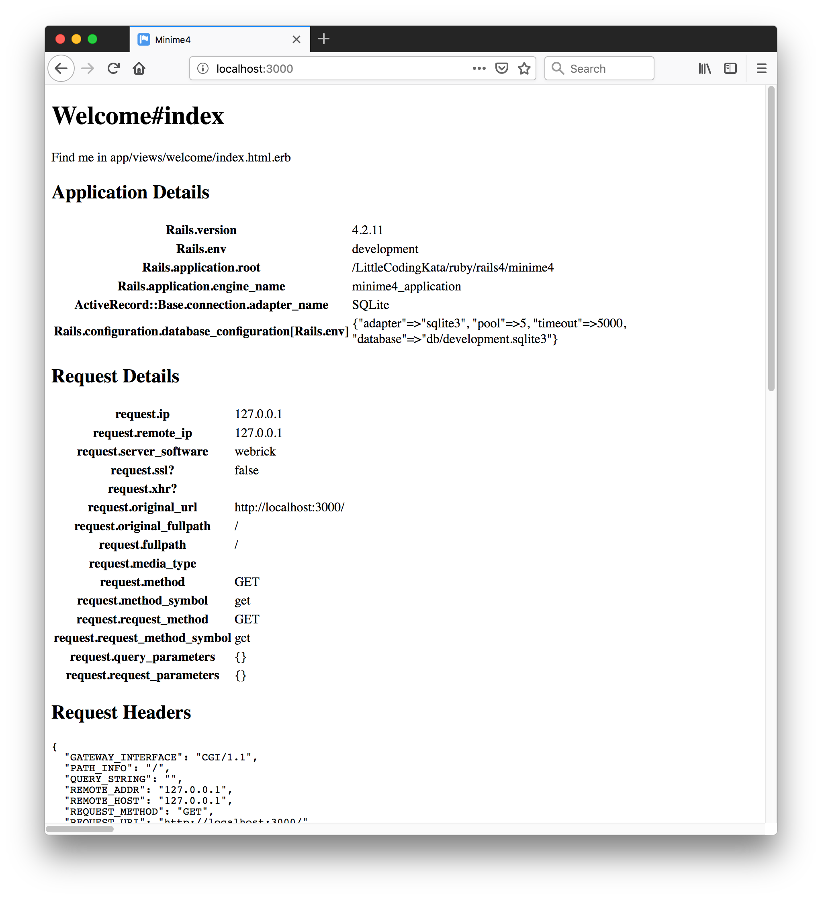

# Ruby on Rails 4

Features and demonstration of Rails 4.

[:arrow_forward: return to the Catalog](https://codingkata.tardate.com)

## Notes

### Key Features of Rails 4

* Ruby 2.0 preferred; 1.9.3+ required
* Strong Parameters
* Turbolinks
* Russian Doll Caching

### Checking Pre-requisites and Installation

```
$ ruby -v
ruby 2.4.3p205 (2017-12-14 revision 61247) [x86_64-darwin17]
$ sqlite3 --version
3.19.3 2017-06-27 16:48:08 2b0954060fe10d6de6d479287dd88890f1bef6cc1beca11bc6cdb79f72e2377b
$ gem install rails -v 4.2.11
...
$ rails --version
Rails 4.2.11
```


Note

* [Tests cause ThreadError: already initialized with Ruby 2.6.0](https://github.com/rails/rails/issues/34790)
* `warning: BigDecimal.new is deprecated; use BigDecimal() method instead.` - with 2.6.0


### Creating a Simple App

```
$ rails new minime4
...
$ cd minime4
$ rake db:migrate
$ rails server
=> Booting WEBrick
=> Rails 4.2.11 application starting in development on http://localhost:3000
=> Run `rails server -h` for more startup options
=> Ctrl-C to shutdown server
[2019-02-26 11:35:32] INFO  WEBrick 1.3.1
[2019-02-26 11:35:32] INFO  ruby 2.4.3 (2017-12-14) [x86_64-darwin17]
[2019-02-26 11:35:32] INFO  WEBrick::HTTPServer#start: pid=65375 port=3000
```

> Gem::LoadError: can't activate sqlite3 (~> 1.3.6), already activated sqlite3-1.4.0. Make sure all dependencies are added to Gemfile.

Update Gemfile to pin `gem 'sqlite3', '~> 1.3.6'` and re-run `bundle`

Hit `http://localhost:3000`..




#### Adding a Welcome Page

Using controller generator:

```
rails generate controller Welcome index
```

Adjust routes to use this as the main page.




#### Testing

```
$ rake test
Running via Spring preloader in process 65406
Run options: --seed 60891

# Running:

.

Finished in 0.340621s, 2.9358 runs/s, 2.9358 assertions/s.

1 runs, 1 assertions, 0 failures, 0 errors, 0 skips
```

#### Adding The Blog App

The getting started guide has always outlined a simple [blog application](https://guides.rubyonrails.org/getting_started.html#creating-the-blog-application).
Adding the basic features to `minime5`:

```
rails generate controller Articles
rails generate model Article title:string text:text
rake db:migrate
```

## Credits and References
* [Ruby Versions for Rails](https://guides.rubyonrails.org/upgrading_ruby_on_rails.html#ruby-versions)
* [Rails 4 Release Notes](https://edgeguides.rubyonrails.org/4_0_release_notes.html)
* [Rails API - 4.2.11](https://api.rubyonrails.org/v4.2.11/)
