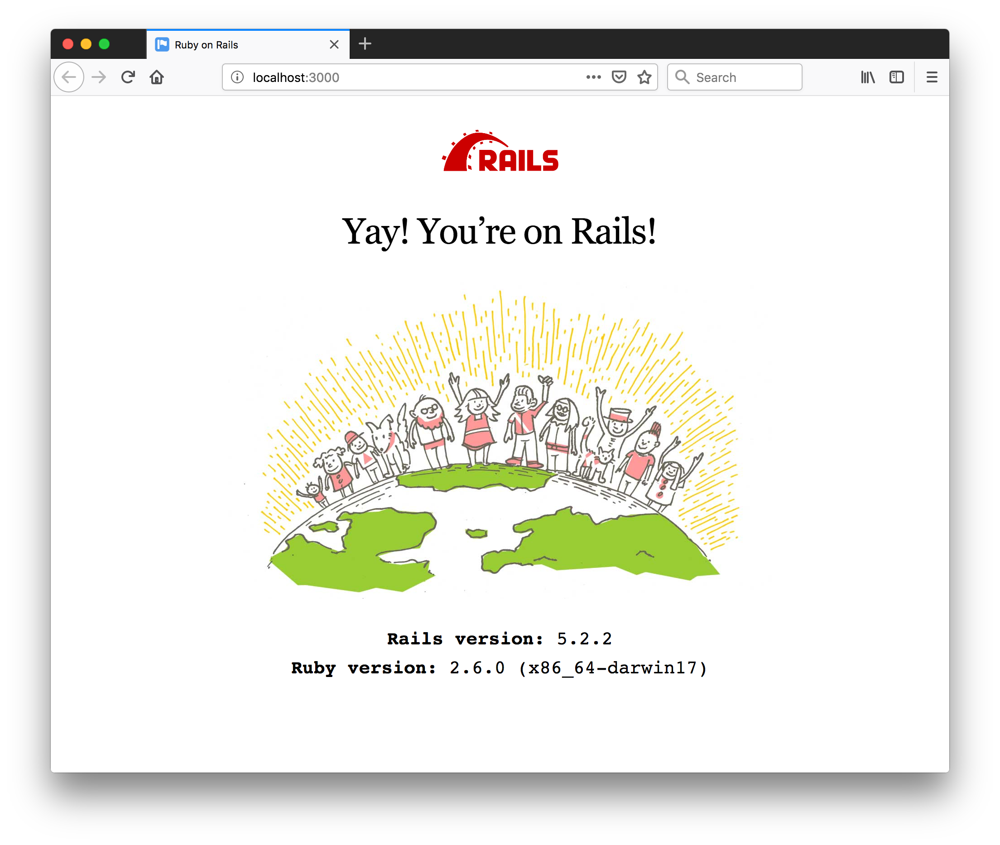
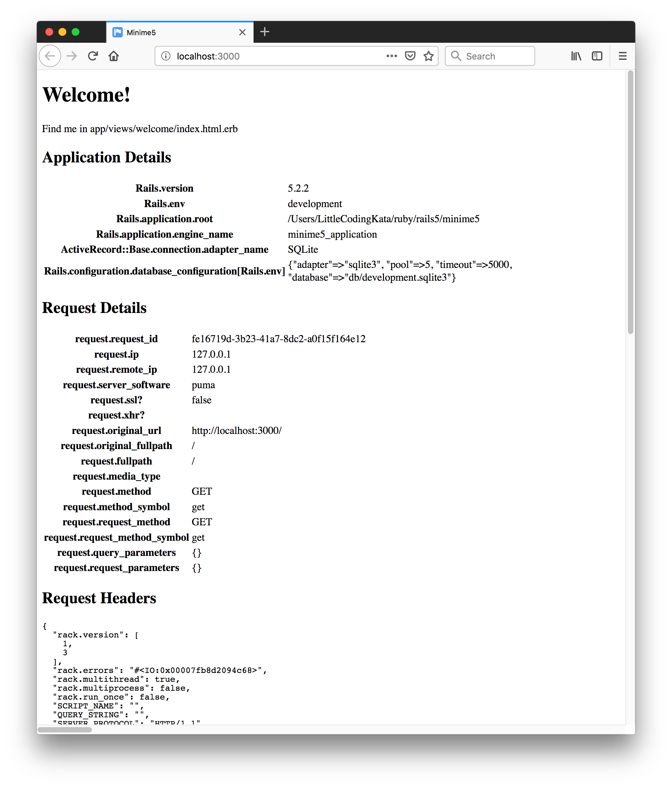

# Ruby on Rails 5

Features and demonstration of Rails 5.

[:arrow_forward: return to the Catalog](https://codingkata.tardate.com)

## Notes

### Key Features of Rails 5

* Action Cable
* Rails API
* Active Record Attributes API
* Test Runner
* Exclusive use of rails CLI over Rake
* Sprockets 3
* Turbolinks 5
* Ruby 2.2.2+ required

### Checking Pre-requisites and Installation

```
$ ruby -v
ruby 2.6.0p0 (2018-12-25 revision 66547) [x86_64-darwin17]
$ sqlite3 --version
3.19.3 2017-06-27 16:48:08 2b0954060fe10d6de6d479287dd88890f1bef6cc1beca11bc6cdb79f72e2377b
$ gem install rails -v 5.2.2
...
$ rails --version
Rails 5.2.2
```


### Creating a Simple App

```
$ rails new minime5
...
$ cd minime5
$ rails db:migrate
$ rails server
=> Booting Puma
=> Rails 5.2.2 application starting in development
=> Run `rails server -h` for more startup options
Puma starting in single mode...
* Version 3.12.0 (ruby 2.6.0-p0), codename: Llamas in Pajamas
* Min threads: 5, max threads: 5
* Environment: development
* Listening on tcp://0.0.0.0:3000
Use Ctrl-C to stop
```

> Gem::LoadError: can't activate sqlite3 (~> 1.3.6), already activated sqlite3-1.4.0. Make sure all dependencies are added to Gemfile.

Update Gemfile to pin `gem 'sqlite3', '~> 1.3.6'` and re-run `bundle`

Hit `http://localhost:3000`..




#### Adding a Welcome Page

Using controller generator:

```
bin/rails generate controller Welcome index
```

Adjust routes to use this as the main page.




#### Testing

```
$ rake test
Run options: --seed 30795

# Running:

.

Finished in 0.575177s, 1.7386 runs/s, 1.7386 assertions/s.
1 runs, 1 assertions, 0 failures, 0 errors, 0 skips
```

#### Adding The Blog App

The getting started guide has always outlined a simple [blog application](https://guides.rubyonrails.org/getting_started.html#creating-the-blog-application).
Adding the basic features to `minime5`:

```
rails generate controller Articles
rails generate model Article title:string text:text
rails db:migrate
```

## Credits and References
* [Ruby Versions for Rails](https://guides.rubyonrails.org/upgrading_ruby_on_rails.html#ruby-versions)
* [Rails 5 Release Notes](https://edgeguides.rubyonrails.org/5_0_release_notes.html)
* [Rails API - 5.2.2](https://api.rubyonrails.org/v5.2.2/)
