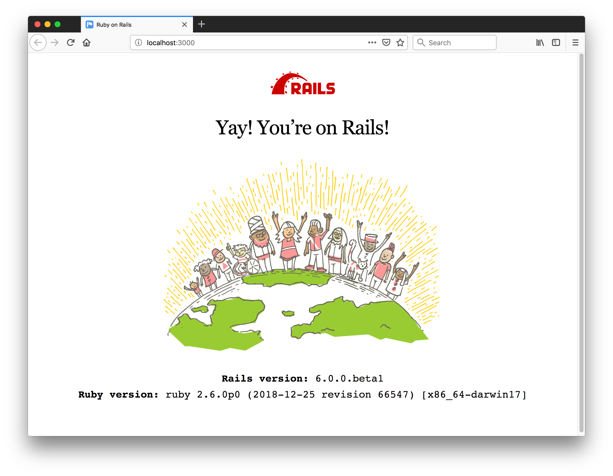

# rails6

Testing out Rails 6 (beta1) and learning about changes and new features.

[:arrow_forward: return to the Catalog](https://codingkata.tardate.com)

## Notes

Rails 6 is slated for delivery on April 30, 2019 at RailsConf 2019.

Major features in Rails 6:

* [Action Mailbox](https://github.com/rails/rails/tree/6-0-stable/actionmailbox) allows you to route incoming emails to controller-like mailboxes.
* [Action Text](https://github.com/rails/rails/tree/6-0-stable/actiontext) brings rich text content and editing to Rails.
* [Parallel Testing](https://edgeguides.rubyonrails.org/testing.html#parallel-testing) allows you to parallelize your test suite
* [Action Cable testing tools](https://edgeguides.rubyonrails.org/testing.html#testing-action-cable) allow you to test your Action Cable functionality at any level: connections, channels, broadcasts.

### Upgrading to Rails 6.0

Recommended approach for upgrading an existing application:

* ensure there is good test coverage
* first upgrade to Rails 5.2
* check advice in the [Upgrading Ruby on Rails](https://edgeguides.rubyonrails.org/upgrading_ruby_on_rails.html#upgrading-from-rails-5-2-to-rails-6-0) guide


### Checking Pre-requisites and Installation

```
$ node -v
v11.10.0
$ npm -v
6.7.0
$ ruby -v
ruby 2.6.0p0 (2018-12-25 revision 66547) [x86_64-darwin17]
$ sqlite3 --version
3.19.3 2017-06-27 16:48:08 2b0954060fe10d6de6d479287dd88890f1bef6cc1beca11bc6cdb79f72e2377b
$ gem install rails -v 6.0.0.beta1
...
$ rails --version
Rails 6.0.0.beta1
```


#### Fixing missing dependencies

> Node.js not installed. Please download and install Node.js https://nodejs.org/en/download/

`brew install node`


> Yarn not installed. Please download and install Yarn from https://yarnpkg.com/lang/en/docs/install/

`brew install yarn`


### Creating a Simple App

```
$ rails new minime6
...
$ cd minime6
$ bin/rails server
```

> Puma caught this error: Error loading the 'sqlite3' Active Record adapter. Missing a gem it depends on? can't activate sqlite3 (~> 1.3.6), already activated sqlite3-1.4.0. Make sure all dependencies are added to Gemfile. (LoadError)

Update Gemfile to pin `gem 'sqlite3', '~> 1.3.6'` and re-run `bundle`

Hit `http://localhost:3000`..



#### Adding a Welcome Page

Using controller generator:

```
bin/rails generate controller Welcome index
```

Adjust routes to use this as the main page.

#### Testing

```
$ rails db:migrate
$ rake test
Run options: --seed 13985

# Running:

.

Finished in 4.183906s, 0.2390 runs/s, 0.2390 assertions/s.
1 runs, 1 assertions, 0 failures, 0 errors, 0 skips
```

## Credits and References
* [Rails Getting Started](https://guides.rubyonrails.org/getting_started.html)
* [Rails 6 Timeline](https://weblog.rubyonrails.org/2018/12/20/timeline-for-the-release-of-Rails-6-0/)
* [Rails 6 Release Notes](https://edgeguides.rubyonrails.org/6_0_release_notes.html)
* [..as mentioned on my blog](https://blog.tardate.com/)
