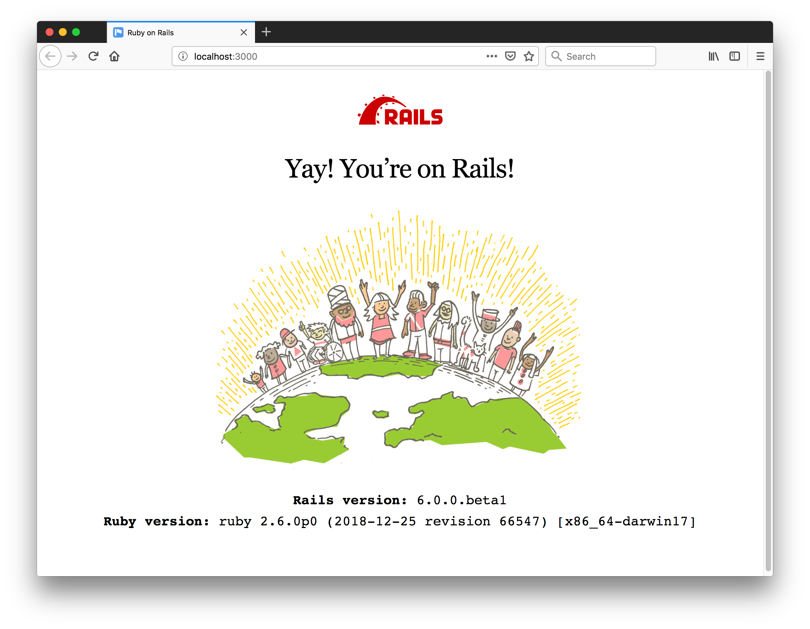
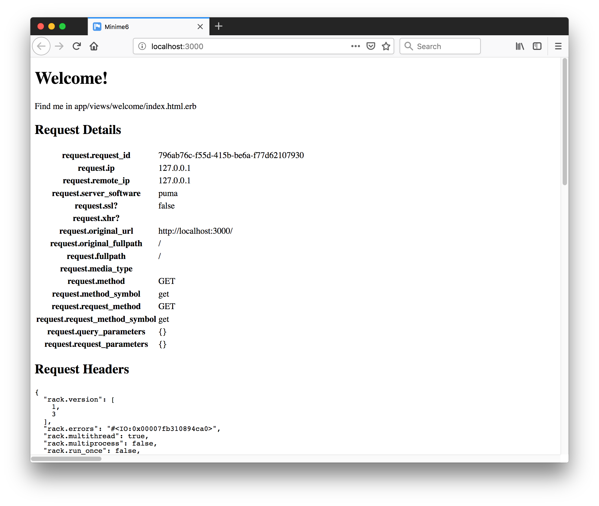

# Ruby on Rails 6

Running Rails 6, learning about changes and new features, and testing out my favourite gems including: HAML

[:arrow_forward: return to the Catalog](https://codingkata.tardate.com)

## Notes

Rails 6 was release August 16, 2019.

Major features in Rails 6:

* [Action Mailbox](https://github.com/rails/rails/tree/6-0-stable/actionmailbox) allows you to route incoming emails to controller-like mailboxes.
* [Action Text](https://github.com/rails/rails/tree/6-0-stable/actiontext) brings rich text content and editing to Rails.
* [Parallel Testing](https://edgeguides.rubyonrails.org/testing.html#parallel-testing) allows you to parallelize your test suite
* [Action Cable testing tools](https://edgeguides.rubyonrails.org/testing.html#testing-action-cable) allow you to test your Action Cable functionality at any level: connections, channels, broadcasts.

### Upgrading to Rails 6.0

Recommended approach for upgrading an existing application:

* ensure there is good test coverage
* first upgrade to Rails 5.2
* check advice in the [Upgrading Ruby on Rails](https://edgeguides.rubyonrails.org/upgrading_ruby_on_rails.html#upgrading-from-rails-5-2-to-rails-6-0) guide


### Checking Pre-requisites and Installation

```
$ node -v
v11.10.0
$ npm -v
6.7.0
$ ruby -v
ruby 2.6.0p0 (2018-12-25 revision 66547) [x86_64-darwin17]
$ sqlite3 --version
3.19.3 2017-06-27 16:48:08 2b0954060fe10d6de6d479287dd88890f1bef6cc1beca11bc6cdb79f72e2377b
$ gem install rails -v 6.0.0
...
$ rails --version
Rails 6.0.0
```


#### Fixing missing dependencies

> Node.js not installed. Please download and install Node.js https://nodejs.org/en/download/

`brew install node`


> Yarn not installed. Please download and install Yarn from https://yarnpkg.com/lang/en/docs/install/

`brew install yarn`

Could not get it to work with node v12.8.0; had to downgrade to 11.15.0

```
n 11.15.0
```

### Creating a Simple App

```
$ rails new minime6
...
$ cd minime6
$ rails db:migrate
$ rails server
=> Booting Puma
=> Rails 6.0.0 application starting in development
=> Run `rails server --help` for more startup options
Puma starting in single mode...
* Version 3.12.1 (ruby 2.6.0-p0), codename: Llamas in Pajamas
* Min threads: 5, max threads: 5
* Environment: development
* Listening on tcp://localhost:3000
Use Ctrl-C to stop
```

Hit `http://localhost:3000`..




#### Adding a Welcome Page

Using controller generator:

```
bin/rails generate controller Welcome index
```

Adjust routes to use this as the main page.




#### Testing

```
$ rake test
Run options: --seed 13985

# Running:

.

Finished in 4.183906s, 0.2390 runs/s, 0.2390 assertions/s.
1 runs, 1 assertions, 0 failures, 0 errors, 0 skips
```


#### Adding The Blog App

The getting started guide has always outlined a simple [blog application](https://guides.rubyonrails.org/getting_started.html#creating-the-blog-application).
Adding the basic features to `minime6`:

```
rails generate controller Articles
rails generate model Article title:string text:text
rails db:migrate
```

## Using HAML

I prefer [haml](http://haml.info/) for templating in Rails. Does it still work for Rails 6? Yes!

While one can just add the [haml](https://github.com/haml/haml) gem, I'm using
[haml-rails](https://github.com/haml/haml-rails) which adds a rake task for converting Erb files.
I ran thisk over all files in the app:

```
$ rails haml:erb2haml
--------------------------------------------------------------------------------
Generating HAML for app/views/articles/index.html.erb...
Generating HAML for app/views/articles/edit.html.erb...
Generating HAML for app/views/articles/show.html.erb...
Generating HAML for app/views/articles/_form.html.erb...
Generating HAML for app/views/articles/new.html.erb...
Generating HAML for app/views/welcome/index.html.erb...
Generating HAML for app/views/layouts/application.html.erb...
Generating HAML for app/views/layouts/mailer.html.erb...
Generating HAML for app/views/layouts/mailer.text.erb...
--------------------------------------------------------------------------------
HAML generated for the following files:
  app/views/articles/index.html.erb
  app/views/articles/edit.html.erb
  app/views/articles/show.html.erb
  app/views/articles/_form.html.erb
  app/views/articles/new.html.erb
  app/views/welcome/index.html.erb
  app/views/layouts/application.html.erb
  app/views/layouts/mailer.html.erb
  app/views/layouts/mailer.text.erb
--------------------------------------------------------------------------------
Would you like to delete the original .erb files? (This is not recommended unless you are under version control.) (y/n)
y
Deleting original .erb files.
--------------------------------------------------------------------------------
Task complete!
No .erb files found. Task will now exit.
```


## Rendering Multiple Formats

### Using respond_to

The default Rails mechanism, demonstrated with the `Time::NowController`.

```
  def show
    respond_to do |format|
      format.html
      format.json { render json: time_data }
      format.xml { render xml: time_data.to_xml(root: 'time') }
      format.text { render plain: @time }
    end
  end
```

Generating JSON:

```
$ curl -H "Accept: application/json" http://localhost:3000/time/now
{"iso8601":"2019-07-24T15:55:40Z"}
$ curl http://localhost:3000/time/now.json
{"iso8601":"2019-07-24T15:56:22Z"}
```

Generating XML:

```
$ curl -H "Accept: application/xml" http://localhost:3000/time/now
<?xml version="1.0" encoding="UTF-8"?>
<time>
  <iso8601>2019-07-24T15:56:58Z</iso8601>
</time>
$ curl http://localhost:3000/time/now.xml
<?xml version="1.0" encoding="UTF-8"?>
<time>
  <iso8601>2019-07-24T15:57:07Z</iso8601>
</time>
```

Generating plain text:

```
$ curl -H "Accept: text/plain" http://localhost:3000/time/now
2019-07-24T16:06:53Z
$ curl http://localhost:3000/time/now.txt
2019-07-24T16:07:29Z
```

## Rails Controller Testing

[rails-controller-testing](https://github.com/rails/rails-controller-testing) adds back
the `assigns` and `assert_template` methods for controller testing (these were removed from rails core in 5.0)

Working in Rails 6 - I've added an `assert_template 'welcome/index'` test.


## Credits and References

* [Rails Getting Started](https://guides.rubyonrails.org/getting_started.html)
* [Rails 6 Timeline](https://weblog.rubyonrails.org/2018/12/20/timeline-for-the-release-of-Rails-6-0/)
* [Rails 6 Release Notes](https://edgeguides.rubyonrails.org/6_0_release_notes.html)
* [Ruby Versions for Rails](https://guides.rubyonrails.org/upgrading_ruby_on_rails.html#ruby-versions)
* [Rails API 6.0.0](https://api.rubyonrails.org/v6.0.0/)
* HAML
  * [haml](http://haml.info/) - info
  * [haml](https://github.com/haml/haml) gem source
  * [haml-rails](https://github.com/haml/haml-rails) gem source
* Testing Gems
  * [rails-controller-testing](https://github.com/rails/rails-controller-testing)
