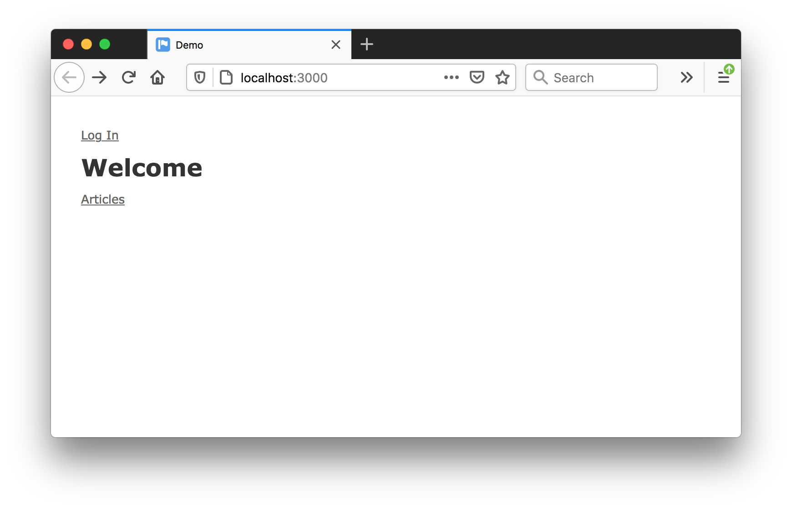
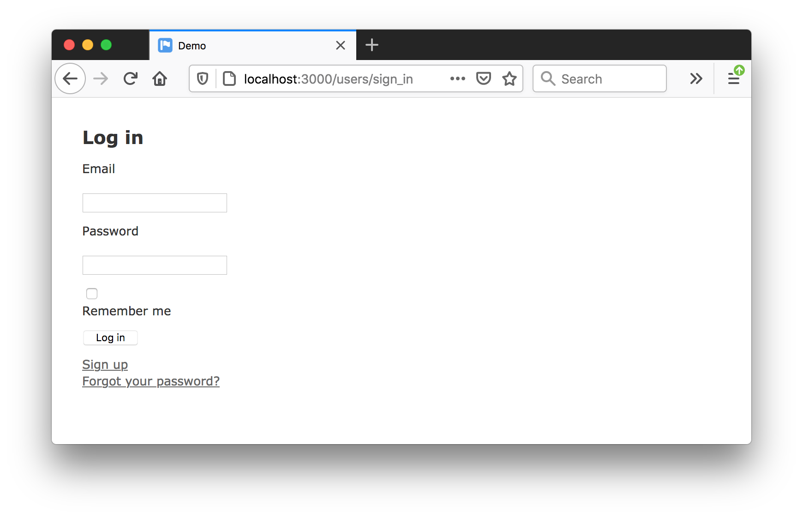
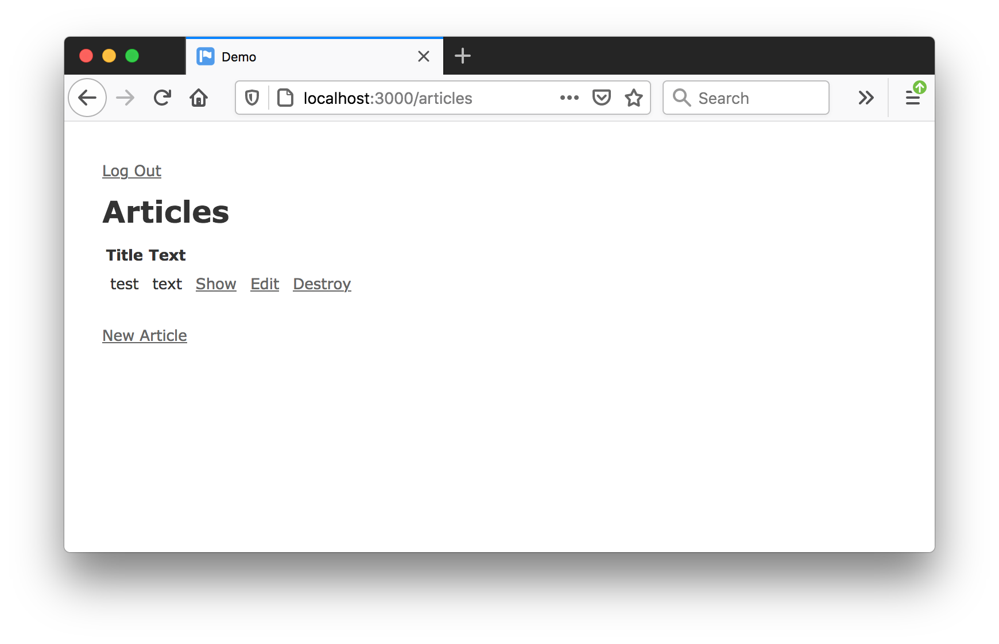

# Devise with Rails 6

Running devise with Rails 6

## Notes

### Checking Pre-requisites and Basic App Build

```
$ node -v
v12.8.0
$ npm -v
6.10.2
$ ruby -v
ruby 2.7.2p137 (2020-10-01 revision 5445e04352) [x86_64-darwin17]
$ sqlite3 --version
3.19.3 2017-06-27 16:48:08 2b0954060fe10d6de6d479287dd88890f1bef6cc1beca11bc6cdb79f72e2377b
$ gem install rails
...
$ bundle config --local disable_platform_warnings true # to make dependency tzinfo-data warning go away
$ rails --version
Rails 6.0.3.4
```

Build a simple app with an `Article` model and controller:

```
$ rails new demo
...
$ cd demo
$ rails generate controller Welcome index
$ rails generate scaffold Article title:string text:text
$ rails db:migrate
```

some tidy up

```
$ cd demo
$ rm -fR .git # --skip-git would do this, but also means no .gitignore generated
```

## Adding Devise

Add the [devise](https://rubygems.org/gems/devise) gem to the `Gemfile` and `bundle install`

```
$ rails generate devise:install
$ rails generate devise:views
$ rails generate devise User
```

## App Customization

Require authentication for the articles controller:

```
class ArticlesController < ApplicationController
  before_action :authenticate_user!
  ...
```

Add sign-in/out links in the application layout:

```
<%- unless controller.class.name.include? 'Devise' %>
  <%- if user_signed_in? %>
    <%= link_to 'Log Out', destroy_user_session_path, method: :delete %><br />
  <% else %>
    <%= link_to 'Log In', new_user_session_path %><br />
  <% end %>
<% end %>
```

## Devise Modules

Devise is a pluggable authentication system that uses [warden](https://github.com/wardencommunity/warden) under the cover for rack-based authentication.

Devise comes with 10 standard modules, 5 of which are enabled by default:

* Database Authenticatable: hashes and stores a password in the database to validate the authenticity of a user while signing in. The authentication can be done both through POST requests or HTTP Basic Authentication.
* Recoverable: resets the user password and sends reset instructions.
* Registerable: handles signing up users through a registration process, also allowing them to edit and destroy their account.
* Rememberable: manages generating and clearing a token for remembering the user from a saved cookie.
* Validatable: provides validations of email and password. It's optional and can be customized, so you're able to define your own validations.

The remaining 5 can be enabled as needed. Usually this just means updating the `devise` parameters in the user model, and checking module-specific items in the devise configuration file:

* Omniauthable: adds [OmniAuth](https://github.com/omniauth/omniauth) support.
* Confirmable: sends emails with confirmation instructions and verifies whether an account is already confirmed during sign in.
* Trackable: tracks sign in count, timestamps and IP address.
* Timeoutable: expires sessions that have not been active in a specified period of time.
* Lockable: locks an account after a specified number of failed sign-in attempts. Can unlock via email or after a specified time period.

Third-party modules are available for other authentication requirements such as
[devise_invitable](https://github.com/scambra/devise_invitable)
Devise modules are actually aquite easy to develop to suit specific requirements.

## Examples

Root page (before sign-in)



Attempt to access articles will redirect to sign-in:



Managing articles after sign-in:



## Credits and References

* [Devise Blog](http://blog.plataformatec.com.br/tag/devise/) - plataformatec
* [Devise](https://rubygems.org/gems/devise) - rubygems
* [Devise](https://github.com/heartcombo/devise) - github
* [warden](https://github.com/wardencommunity/warden)
