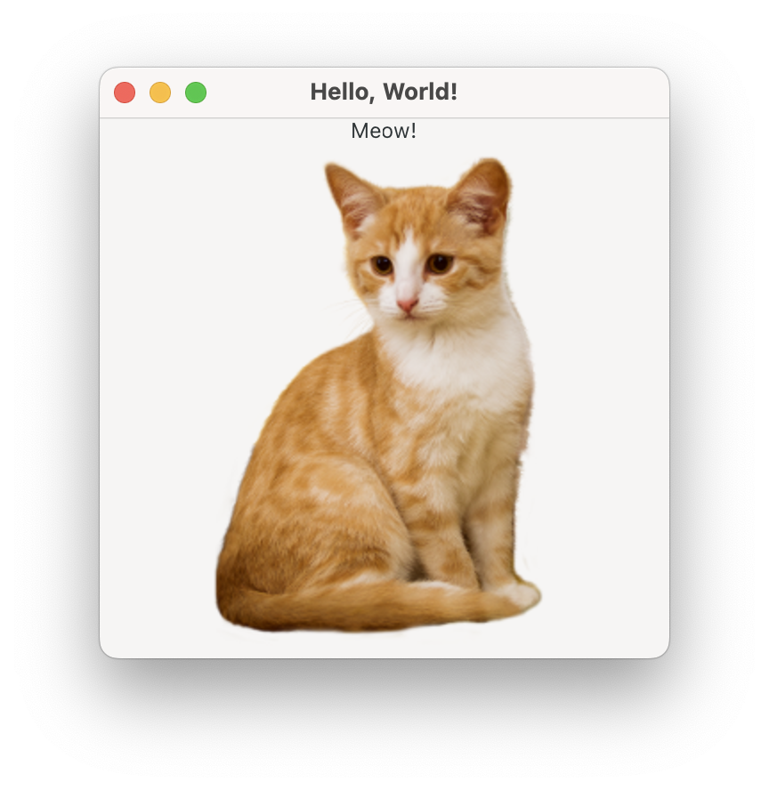
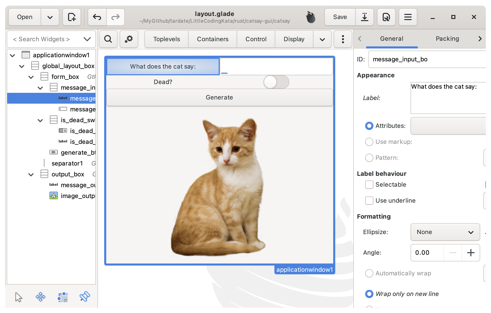
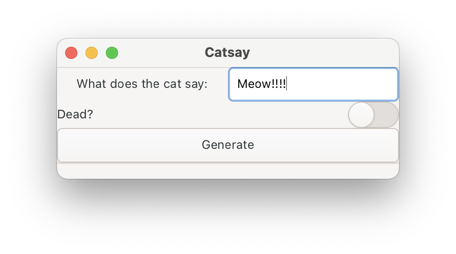
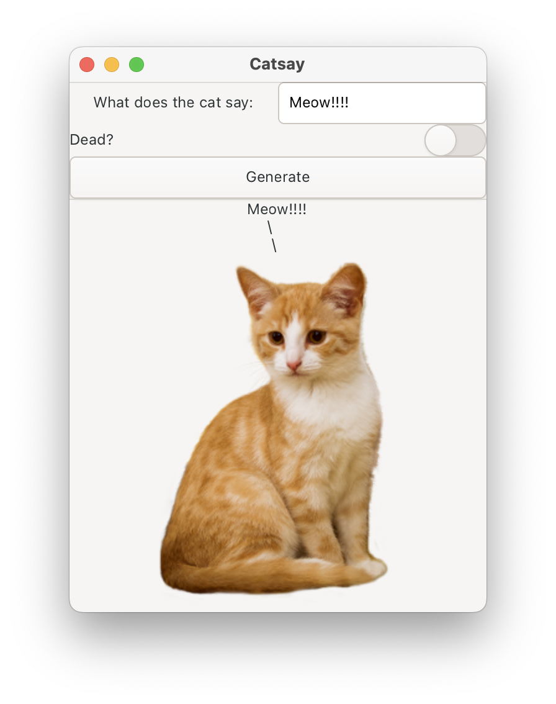

# #326 catsay GUI

Building the GUI catsay example from Practical Rust Projects, learning about making graphical interface programs with Rust.

## Notes

The graphical interface catsay example from [Practical Rust Projects](../practical-rust-projects/)
is used to demonstrate techniques for making GUI programs with Rust.

The book uses the [gtk-rs](https://crates.io/crates/gtk) crate - a popular and mature framework for rust.
The gtk3 version is used for the book examples, but I'm following the same pattern but with the succeeding
[gtk4](https://crates.io/crates/gtk4) project.

## Building catsay

Start a new project:

```sh
$ cargo new --bin catsay
    Creating binary (application) `catsay` package
note: see more `Cargo.toml` keys and their definitions at https://doc.rust-lang.org/cargo/reference/manifest.html
$ cd catsay/
$ cargo run
   Compiling catsay v0.1.0 (/Users/paulgallagher/MyGithub/tardate/LittleCodingKata/rust/catsay-gui/catsay)
    Finished `dev` profile [unoptimized + debuginfo] target(s) in 0.53s
     Running `target/debug/catsay`
Hello, world!
```

### Step 1: setup the app framework with GTK4

Add the GTK4 dependency with `cargo add gtk4`

The example uses the [gtk4](https://crates.io/crates/gtk4) crate.

I'm using macOS, so first [install GTK4 with homebrew](https://gtk-rs.org/gtk4-rs/stable/latest/book/installation_macos.html):
`brew install gtk4`.

Update the code to show a window:

```rust
use gtk4 as gtk;
use gtk::prelude::*;
use gtk::{glib, Application, ApplicationWindow};

fn main() -> glib::ExitCode {
    let app = Application::builder()
        .application_id("org.example.HelloWorld")
        .build();

    app.connect_activate(|app| {
        // We create the main window.
        let window = ApplicationWindow::builder()
            .application(app)
            .default_width(320)
            .default_height(200)
            .title("Hello, World!")
            .build();

        // Show the window.
        window.present();
    });

    app.run()
}
```

Starting with `cargo run`:


### Step 2: Add Text and Image

Use `cargo add gdk-pixbuf` to add [Rust bindings for the GdkPixbuf library](https://crates.io/crates/gdk-pixbuf).

Use a [Box](https://gtk-rs.org/gtk4-rs/stable/latest/docs/gtk4/struct.Box.html) to constrain the layout

* add a [Label](https://gtk-rs.org/gtk4-rs/stable/latest/docs/gtk4/struct.Label.html)
* Load an [Image](https://gtk-rs.org/gtk4-rs/stable/latest/docs/gtk4/struct.Image.html) and append to the Box

```rust
...
// Create a vertical box layout.
let vbox = Box::new(gtk::Orientation::Vertical, 0);

// Add a message label
let label = Label::new(Some("Meow!"));
vbox.append(&label);

// Load the image from the file and display it in the window.
if let Ok(pixbuf) = gdk_pixbuf::Pixbuf::from_file("./images/cat.png") {
    let image = Image::from_pixbuf(Some(&pixbuf));
    image.set_size_request(pixbuf.width(), pixbuf.height());
    vbox.append(&image);
} else {
    eprintln!("Failed to load image: ./images/cat.png");
}
...
```



### Step 3: Use Glage to Disign the Layout

I'm using macOS, so first [install glade with homebrew](https://gtk-rs.org/gtk4-rs/stable/latest/book/installation_macos.html):
`brew install glade`.

Build the [layout.gtk3.glade](./catsay/layout.gtk3.glade) with glade:



Now apparently glade has not/will not be [updated for gtk4](https://www.youtube.com/watch?v=ExkHy0p-hpE).
It produces layout for gtk3 only.

A conversion utility can be used to convert the layout

```sh
$ gtk4-builder-tool simplify --3to4 layout.gtk3.glade > layout.glade
layout.gtk3.glade:22: Property GtkBox::resize-mode not found
layout.gtk3.glade:58: Property GtkCenterBox::homogeneous not found
```

It doesn't fix the "not found" warnings however. I needed to manually remove them from [layout.glade](./catsay/layout.glade).

Update the code accordingly:

```rust
use gtk4 as gtk;
use gtk::prelude::*;
use gtk::Application;


fn build_ui(app: &gtk::Application) {
    let glade_src = include_str!("../layout.glade");
    let builder = gtk::Builder::from_string(glade_src);

    let window: gtk::Window = builder.object("applicationwindow1").unwrap();
    window.set_application(Some(app));

    // Inputs
    let message_input: gtk::Entry = builder.object("message_input").unwrap();
    let is_dead_switch: gtk::Switch = builder.object("is_dead_switch").unwrap();

    // Submit button
    let button: gtk::Button = builder.object("generate_btn").unwrap();

    // Outputs
    let message_output: gtk::Label = builder.object("message_output").unwrap();
    let image_output: gtk::Image = builder.object("image_output").unwrap();
    let image_output_clone = image_output.clone();

    button.connect_clicked(move |_| {
        message_output.set_text(&format!(
            "{}\n     \\\n      \\",
            message_input.text().as_str()
        ));

        let is_dead = is_dead_switch.is_active();
        if is_dead {
            image_output_clone.set_from_file(Some("./images/cat_dead.png"))
        } else {
            image_output_clone.set_from_file(Some("./images/cat.png"))
        }
        image_output_clone.set_size_request(200, 289);
        image_output_clone.show();
    });

    window.present();
    image_output.hide();
}

fn main() {
    let application = Application::builder()
        .application_id("lck.gui.catsay")
        .build();

    application.connect_activate(|app| {
        build_ui(app);
    });

    application.run();
}
```

Then it runs `cargo run`:





## Credits and References

* [Practical Rust Projects](../practical-rust-projects/)
