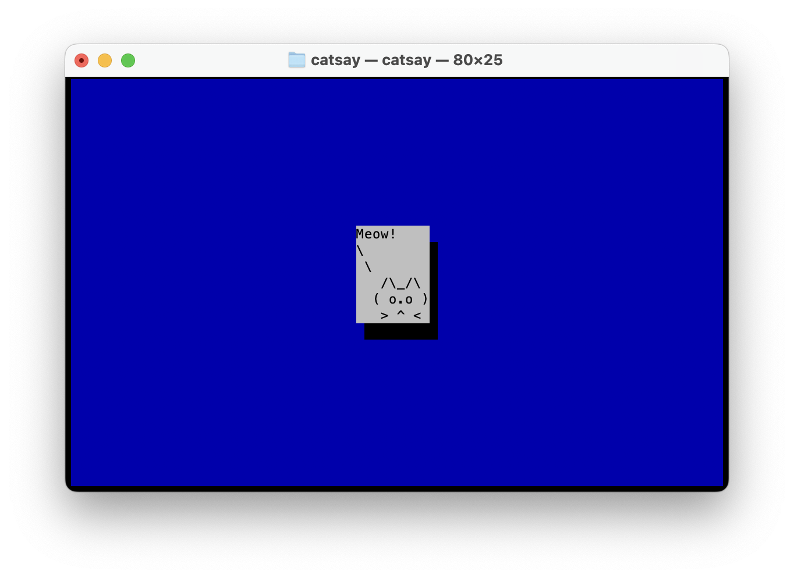
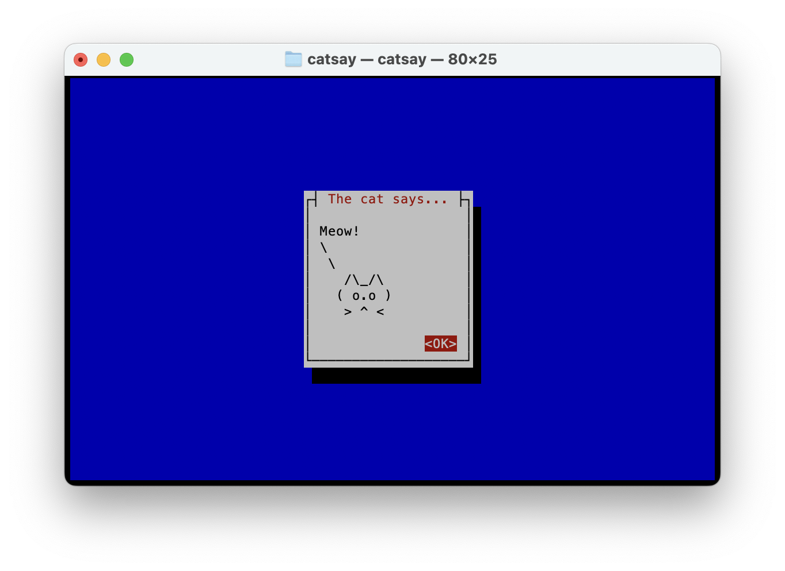

# #xxx catsay TUI

Building the text UI catsay example from Practical Rust Projects, learning about making command-line programs with Rust.

## Notes

The text-base user interface catsay example from [Practical Rust Projects](../practical-rust-projects/)
is used to demonstrate techniques for making text UI programs with Rust.

## Building catsay

Start a new project:

```sh
$ cargo new --bin catsay
    Creating binary (application) `catsay` package
note: see more `Cargo.toml` keys and their definitions at https://doc.rust-lang.org/cargo/reference/manifest.html
Mac:catsay-tui paulgallagher$ cd catsay
Mac:catsay paulgallagher$ cargo run
   Compiling catsay v0.1.0 (/Users/paulgallagher/MyGithub/tardate/LittleCodingKata/rust/catsay-tui/catsay)
    Finished `dev` profile [unoptimized + debuginfo] target(s) in 0.49s
     Running `target/debug/catsay`
Hello, world!
```

### Step 1: setup the app framework with cursive

The example uses the [Cursive](https://crates.io/crates/cursive) crate.
Cursive is a TUI (Text User Interface) library for rust. It uses the [crossterm](https://docs.rs/crossterm/latest/crossterm/) backend by default, but other backends are available.

Use the [Cursive](https://crates.io/crates/cursive) crate.
Add `cursive = "0.11.2"` to [Cargo.toml](./catsay/Cargo.toml), and update the code:

```rust
extern crate cursive;

use cursive::Cursive;

fn main() {
    let mut siv = Cursive::default();

    siv.run();
}
```

When invoked with `cargo run`, displays a simple blue screen.

### Step 2: showing a dialog box

Seems I need to explicitly enable the cross term backend to get cursive to display anything.
I want to use the multiplatform crossterm rather than ncurses used in the book (so I can easily run on macOS).

Update the cursive dependency and enable crossterm: `cursive = { version = "0.21", features = ["crossterm-backend"] }`.

```rust
extern crate cursive;

use cursive::views::TextView;

fn main() {
    let mut siv = cursive::crossterm();
    let cat_text = "{message}
\\
 \\
   /\\_/\\
  ( {eye}.{eye} )
   > ^ <";

    let cat_template = cat_text.replace("{message}", "Meow!");
    let cat_template = cat_template.replace("{eye}", "o");
    siv.add_layer(TextView::new(cat_template));

    siv.run();
}
```

Working nicely with `cargo run`:



### Step 3: handling simple keyboard inputs

Add a global callback to handle key events - in this case ESC key

```rust
use cursive::event::Key;
...
siv.add_global_callback(Key::Esc, |s| s.quit());
```

### Step 4: adding a dialog box

Wrap the TextView with a Dialog box

```rust
use cursive::views::{Dialog, TextView};
...
siv.add_layer(
    Dialog::around(TextView::new(cat_template))
        .title("The cat says...")
        .button("OK", |s| s.quit())
);
```



## Credits and References

* [Practical Rust Projects](../practical-rust-projects/)
* [Cursive](https://crates.io/crates/cursive)
* [crossterm](https://docs.rs/crossterm/latest/crossterm/)
