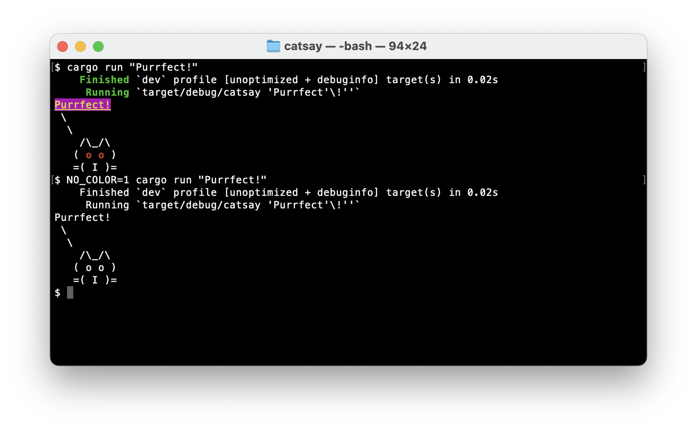

# #324 catsay

Building the catsay example from Practical Rust Projects, learning about making command-line programs with Rust.

## Notes

The catsay example from [Practical Rust Projects](../practical-rust-projects/)
is used to demonstrate techniques for making command-line programs with Rust.

* accepting command-line arguments

## Building catsay

```sh
cargo new --bin catsay
    Creating binary (application) `catsay` package
note: see more `Cargo.toml` keys and their definitions at https://doc.rust-lang.org/cargo/reference/manifest.html
$ cd catsay
$ cargo run
   Compiling catsay v0.1.0 (/Users/paulgallagher/MyGithub/tardate/LittleCodingKata/rust/catsay/catsay)
    Finished `dev` profile [unoptimized + debuginfo] target(s) in 0.28s
     Running `target/debug/catsay`
Hello, world!

```

### Step 1: reading command-line arguments

Doing the bare minimum to accept a message argument
with [args](https://doc.rust-lang.org/std/env/fn.args.html)
and print the cat saying it:

```rust
fn main() {
    let message = std::env::args().nth(1).expect("Please provide a message");
    println!("{}", message);
    println!(" \\");
    println!("  \\");
    println!("    /\\_/\\");
    println!("   ( o o )");
    println!("   =( I )=");
}
```

```sh
$ cargo run "Hi!"
    Finished `dev` profile [unoptimized + debuginfo] target(s) in 0.00s
     Running `target/debug/catsay 'Hi'\!''`
Hi!
 \
  \
    /\_/\
   ( o o )
   =( I )=
```

### Step 2: Handling Complex Arguments with StructOpt

The
[structopt](https://docs.rs/structopt/latest/structopt/)
library provides a simple system for handling complex argument.

Note: structopt is now in maintenance mode

Add `structopt = "0.3.5"` to [Cargo.toml](./catsay/Cargo.toml), and update the code:

```rust
extern crate structopt;

use structopt::StructOpt;

#[derive(StructOpt)]
struct Options {
    message: String,
}

fn main() {
    let options = Options::from_args();
    let message = options.message;
    println!("{}", message);
    // ... print the cat...
}

```

Handling arg errors:

```sh
$ cargo run
    Finished `dev` profile [unoptimized + debuginfo] target(s) in 0.01s
     Running `target/debug/catsay`
error: The following required arguments were not provided:
    <message>

USAGE:
    catsay <message>

For more information try --help
```

Getting help:

```sh
$ cargo run -- --help
    Finished `dev` profile [unoptimized + debuginfo] target(s) in 0.01s
     Running `target/debug/catsay --help`
catsay 0.1.0

USAGE:
    catsay <message>

FLAGS:
    -h, --help       Prints help information
    -V, --version    Prints version information

ARGS:
    <message>
```

Running successfully:

```sh
$ cargo run "Hi!"
   Compiling catsay v0.1.0 (/Users/paulgallagher/MyGithub/tardate/LittleCodingKata/rust/cli-catsay/catsay)
    Finished `dev` profile [unoptimized + debuginfo] target(s) in 0.12s
     Running `target/debug/catsay 'Hi'\!''`
Hi!
 \
  \
    /\_/\
   ( o o )
   =( I )=
```

### Step 3: Binary Flags

Adding a "dead cat" flag.

Add and use the new option:

```rust
    #[structopt(short = "d", long = "dead", help = "Make the cat appear dead")]
    dead: bool,
    ...
    let eye = if options.dead { "x" } else { "o" };
    ...
    println!("   ( {eye} {eye} )", eye=eye);
```

```sh
$ cargo run "Ouch!" -d
    Finished `dev` profile [unoptimized + debuginfo] target(s) in 0.01s
     Running `target/debug/catsay 'Ouch'\!'' -d`
Ouch!
 \
  \
    /\_/\
   ( x x )
   =( I )=
```

### Step 4: Printing Errors to STDERR

Use `eprintln!` to send messages to STDERR:

```rust
if message.to_lowercase() == "woof" {
    eprintln!("A cat shouldn't bark like a dog!");
}
```

```sh
$ cargo run "Woof" > stdout.txt 2> stderr.txt
$ cat stdout.txt
Woof
 \
  \
    /\_/\
   ( o o )
   =( I )=
$ cat stderr.txt
   Compiling catsay v0.1.0 (/Users/paulgallagher/MyGithub/tardate/LittleCodingKata/rust/cli-catsay/catsay)
    Finished `dev` profile [unoptimized + debuginfo] target(s) in 0.11s
     Running `target/debug/catsay Woof`
A cat shouldn't bark like a dog!
```

### Step 5: Printing With Colour

Use the [colored](https://docs.rs/colored/latest/colored/) crate.
Add `colored = "1.7.0"` to [Cargo.toml](./catsay/Cargo.toml), and update the code:

```rust
extern crate colored;
use colored::*;
...
println!("{}", message.bright_yellow().underline().on_purple());
...
println!("   ( {eye} {eye} )", eye=eye.red().bold());
```

Note: coloured output can be inhibited by setting the `NO_COLOR=1` environment variable.



### Step 6: Reading the Cat from a File

Adding an optional parameter to pass a custom cat image.

```rust
#[structopt(short = "f", long = "file", parse(from_os_str))]
catfile: Option<std::path::PathBuf>,
...
match &options.catfile {
    Some(path) => {
        let cat_template = std::fs::read_to_string(path)
            .expect(&format!("Could not read the file: {:?}", path));
        let cat_picture = cat_template.replace("{eye}", eye);
        println!("{}", &cat_picture);
    }
    None => {
        // ... print the cat as before...
    }
}
```

Running:

```sh
$ cargo run "Purrfect!"
    Finished `dev` profile [unoptimized + debuginfo] target(s) in 0.01s
     Running `target/debug/catsay 'Purrfect'\!''`
Purrfect!
 \
  \
    /\_/\
   ( o o )
   =( I )=
$ cargo run "Purrfect!" -f tabby.txt
    Finished `dev` profile [unoptimized + debuginfo] target(s) in 0.01s
     Running `target/debug/catsay 'Purrfect'\!'' -f tabby.txt`
Purrfect!
 \
  \                  / )
   \ (\__/)         ( (
     )o o (          ) )
   ={  Y   }=       / /
     )     `-------/ /
    (               /
     \              |
    ,'\       ,    ,'
    `-'\  ,---\   | \
       _) )    `. \ /
      (__/       ) )
                (_/

```

### Step 7: Better Error Handling

Use `?` operator to indicate an error may be returned, e.g. `std::fs::read_to_string(path)?;`

```sh
$ cargo run "Purrfect!" -f unfound.txt
    Finished `dev` profile [unoptimized + debuginfo] target(s) in 0.01s
     Running `target/debug/catsay 'Purrfect'\!'' -f unfound.txt`
Purrfect!
Error: Os { code: 2, kind: NotFound, message: "No such file or directory" }
```

### Step 8: Using Failure Crate

The [failure](https://docs.rs/failure/latest/failure/) crate allows more friendly error messages to be returned.
Add `failure = "0.1.5"` to [Cargo.toml](./catsay/Cargo.toml), and update the code:

```rust
// change the function error type
fn main() -> Result<(), failure::Error> {

/// and can now provide error context
let cat_template = std::fs::read_to_string(path)
    .with_context(|_| format!("Could not read the file: {:?}", path))?;
```

Test:

```sh
$ cargo run "Purrfect!" -f unfound.txt
    Finished `dev` profile [unoptimized + debuginfo] target(s) in 0.02s
     Running `target/debug/catsay 'Purrfect'\!'' -f unfound.txt`
Purrfect!
Error: Os { code: 2, kind: NotFound, message: "No such file or directory" }

Could not read the file: "unfound.txt"
```

### Step 9: Using ExitFailure Crate

The [exitfailure](https://crates.io/crates/exitfailure) crate allows more friendly error messages to be returned.
Add `exitfailure = "0.5.1"` to [Cargo.toml](./catsay/Cargo.toml), and update the code:

```rust
// now return ExitFailure
fn main() -> Result<(), ExitFailure> {
...
```

Test:

```sh
$ cargo run "Purrfect!" -f unfound.txt
    Finished `dev` profile [unoptimized + debuginfo] target(s) in 0.02s
     Running `target/debug/catsay 'Purrfect'\!'' -f unfound.txt`
Error: Could not read the file: "unfound.txt"
Info: caused by No such file or directory (os error 2)
$ cargo run "Purrfect!" -f tabby.txt
    Finished `dev` profile [unoptimized + debuginfo] target(s) in 0.02s
     Running `target/debug/catsay 'Purrfect'\!'' -f tabby.txt`
Purrfect!
 \
  \                  / )
   \ (\__/)         ( (
     )o o (          ) )
   ={  Y   }=       / /
     )     `-------/ /
    (               /
     \              |
    ,'\       ,    ,'
    `-'\  ,---\   | \
       _) )    `. \ /
      (__/       ) )
                (_/

$ cargo run "Purrfect!"
    Finished `dev` profile [unoptimized + debuginfo] target(s) in 0.02s
     Running `target/debug/catsay 'Purrfect'\!''`
Purrfect!
 \
  \
    /\_/\
   ( o o )
   =( I )=
```

### Step 10: Accepting STDIN

Add a new flag to indicate the message should be read from STDIN:

```rust
#[structopt(short = "i", long = "stdin", help = "Read message from stdin")]
stdin: bool,
...
let mut message = String::new();
if options.stdin {
    io::stdin().read_to_string(&mut message)
        .with_context(|_| "Failed to read from stdin")?;
    // chomp trailing lf/cr
    if message.ends_with('\n') {
        message.pop();
        if message.ends_with('\r') {
            message.pop();
        }
    }
} else {
    message = options.message;
}
```

Test:

```sh
$ echo "I'm here!" | cargo run -- -i
   Compiling catsay v0.1.0 (/Users/paulgallagher/MyGithub/tardate/LittleCodingKata/rust/cli-catsay/catsay)
    Finished `dev` profile [unoptimized + debuginfo] target(s) in 0.15s
     Running `target/debug/catsay -i`
I'm here!
 \
  \
    /\_/\
   ( o o )
   =( I )=
```

### Step 11: Integration Testing

Add [tests/integration_test.rs](./catsay/tests/integration_test.rs)

Test:

```sh
$ cargo test
    Finished `test` profile [unoptimized + debuginfo] target(s) in 0.03s
     Running unittests src/main.rs (target/debug/deps/catsay-c99874e4446d2f5b)

running 0 tests

test result: ok. 0 passed; 0 failed; 0 ignored; 0 measured; 0 filtered out; finished in 0.00s

     Running tests/integration_test.rs (target/debug/deps/integration_test-6a4d664de69efb53)

running 2 tests
test run_with_defaults ... ok
test fail_on_non_existing_file ... ok

test result: ok. 2 passed; 0 failed; 0 ignored; 0 measured; 0 filtered out; finished in 0.18s

```

### Step 12: Building Binaries for Distribution

```sh
cargo build --release
...
    Finished `release` profile [optimized] target(s) in 9.64s
```

This will build a release target for the current platform in the `target/release/` folder:

```sh
$ ls target/release/
build  catsay.d examples
catsay  deps  incremental
$ target/release/catsay
Meow!
 \
  \
    /\_/\
   ( o o )
   =( I )=
```

## Credits and References

* [Practical Rust Projects](../practical-rust-projects/)
* [OsString](https://doc.rust-lang.org/std/ffi/struct.OsString.html)
