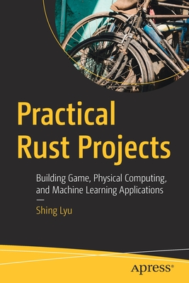

# #323 Practical Rust Projects

Book notes: Practical Rust Projects: Building Game, Physical Computing, and Machine Learning Applications, by Shing Lyu. Published February 28, 2020.

## Notes

See also:

* [amazon](https://amzn.to/44kUlMH)
* [goodreads](https://www.goodreads.com/book/show/48768037-practical-rust-projects)
* [github](https://github.com/Apress/practical-rust-projects)
* [github - 2nd Edition](https://github.com/Apress/Practical-Rust-Projects-2nd-ed.)
* <https://www.oreilly.com/library/view/practical-rust-projects/9781484255995/>

Go beyond the basics and build complete applications using the Rust programming language. The applications in this book include a high-performance web client, a microcontroller (for a robot, for example), a game, an app that runs on Android, and an application that incorporates AI and machine learning.

Each chapter will be organized in the following format: what this kind of application looks like; requirements and user stories of our example program; an introduction to the Rust libraries used; the actual implementation of the example program, including common pitfalls and their solutions; and a brief comparison of libraries for building each application, if there is no clear winner.

Practical Rust Projects will open your eyes to the world of practical applications of Rust. After reading the book, you will be able to apply your Rust knowledge to build your own projects.

## Contents

1. Welcome to the World of Rust
2. Building a Command-Line Program
    * see [#324 catsay CLI](../cli-catsay/)
3. Creating Graphical User Interfaces (GUIs)
    * see [#325 catsay TUI](../catsay-tui/)
    * see [#326 catsay GUI](../catsay-gui/)
4. Building a Game
5. Physical Computing in Rust
    * see [LEAP#773 Using rust on the RPi](https://leap.tardate.com/raspberrypi/rust/)
6. Artificial Intelligence and Machine Learning
7. What Else Can You Do with Rust?
