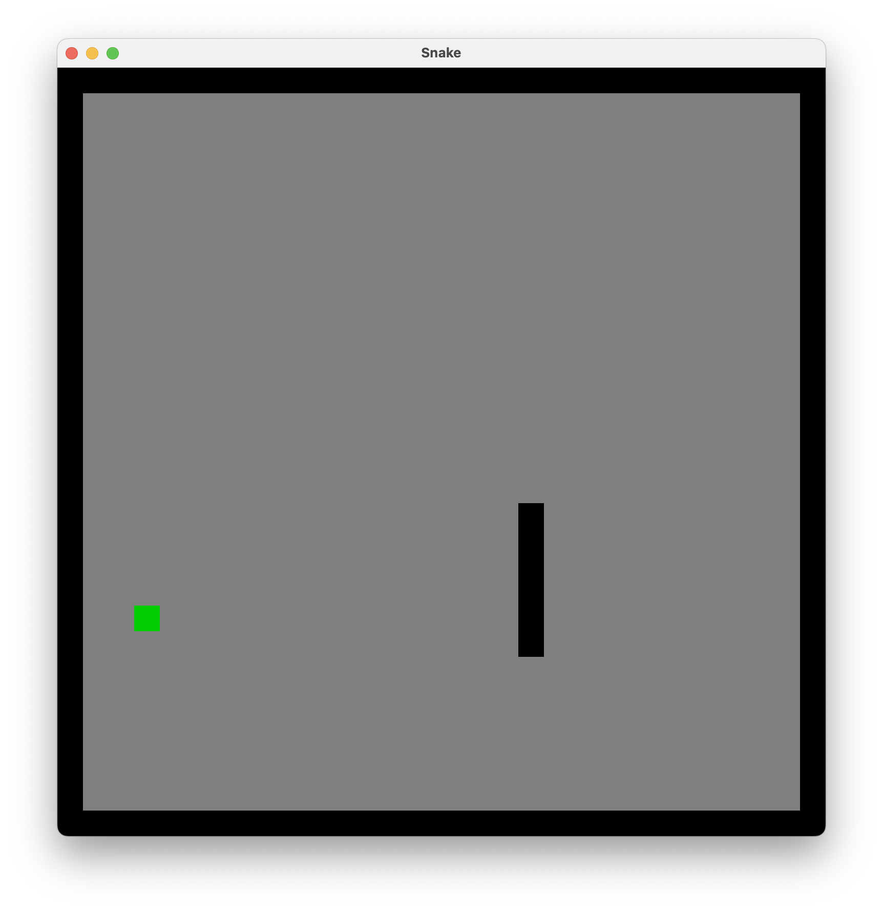
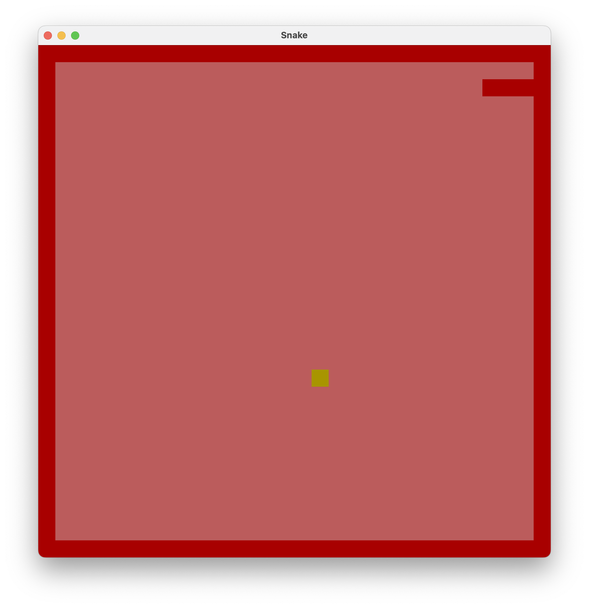

# #xxx Snake

Build and update the snake game example from Rust lang: The complete beginner's guide, learning about making GUI games with Piston and Rust.

## Notes

This project is adapted from an example given in the
[Rust lang: The complete beginner's guide](https://www.udemy.com/course/rustaceans/) course. Dependencies and code have been updated to work cleanly in 2025.

## Project Structure

### Main

See [snake/src/main.rs](snake/src/main.rs)

Creates the game window and handles hte main event loop.

### Game

See [snake/src/game.rs](snake/src/game.rs)

Implements game logic.

### Snake

See [snake/src/snake.rs](snake/src/snake.rs)

Manages position. movement and growth of the snake. Snake segments managed in a linked list.

### Draw

See [snake/src/draw.rs](snake/src/draw.rs)

Some higher-level drawing functions that translate from game to window coordinates.

## Running the Game

How the game works:

* arrow keys to change snake direction left or right, else it moves straight ahead
* snake dies if it hits the edge of the box
* snake dies if it runs over its own tail
* snake grows by 1 unit when it eats an apple
* a new apple appears at a random position on the screen when one is eaten
* when game is over, it restarts automatically after 1s

```sh
$ cargo run
    Finished `dev` profile [unoptimized + debuginfo] target(s) in 0.17s
    Running `target/debug/snake`
```

On startup:



Game over!



## Improvements?

Obviously, it's just a basic game structure at this point. Some features that could be added:

* scoreboard
* sound

## Credits and References

* [Rust lang: The complete beginner's guide](https://www.udemy.com/course/rustaceans/)
* [Piston - a modular open source game engine](https://www.piston.rs/)
