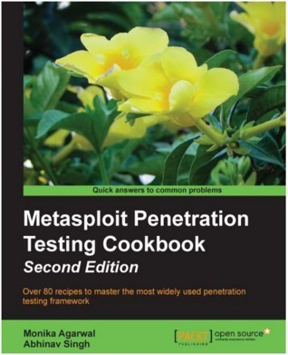

# #096 Metasploit Penetration Testing Cookbook

Book notes - Metasploit Penetration Testing Cookbook, Second Edition by Monika Agarwal, Abhinav Singh

## Notes

The
Metasploit Penetration Testing Cookbook
is a bit old now (published 2013).
It gives a good general overview, but actually commands and tools are a bit outdated. There is a [third edition](https://amzn.to/46yIIkO), published in 2018.

## Table of Contents - Highlights

### Metasploit Quick Tips for Security Professionals - Introduction

Covers installing and configuring on Windows, Ubuntu, BackTrack 5 R3 and VMware.
This is quite out of date now.

### Information Gathering and Scanning

* Passive information gathering - Nmap, DNmap
* Using keimpx – an SMB credentials scanner
* Detecting SSH versions with the SSH version scanner
* FTP scanning
* SNMP sweeping
* Vulnerability scanning with Nessus
* Scanning with NeXpose
* Working with OpenVAS – a vulnerability scanner

### Operating-System-based Vulnerability Assessment

* Penetration testing: Windows XP SP2, Windows 8, Linux (Ubuntu)
* Understanding the Windows DLL injection flaws

### Client-side Exploitation and Antivirus Bypass

* Exploiting Internet Explorer execCommand Use-After-Free vulnerability
* Understanding Adobe Flash Player "new function" invalid pointer use
* Understanding Microsoft Word RTF stack buffer overflow
* Working with Adobe Reader U3D Memory Corruption
* Generating binary and shell code from msfpayload
* Msfencoding schemes with the detection ratio
* Using the killav.rb script to disable the antivirus programs
* Killing the antiviruses' services from the command line
* Working with the syringe utility

### Working with Modules for Penetration Testing

* Working with scanner auxiliary modules
* Working with auxiliary admin modules
* SQL injection and DoS attack module
* Post-exploitation modules
* Understanding the basics of module building
* Analyzing an existing module
* Building your own post-exploitation module

### Exploring Exploits

* Exploiting the module structure
* Working with msfvenom
* Converting an exploit to a Metasploit module
* Porting and testing the new exploit module
* Fuzzing with Metasploit
* Writing a simple FileZilla FTP fuzzer

### VoIP Penetration Testing

* Scanning and enumeration phase
* Yielding passwords
* VLAN hopping
* VoIP MAC spoofing
* Impersonation attack
* DoS attack

### Wireless Network Penetration Testing

* Setting up and running Fern WiFi Cracker
* Sniffing interfaces with tcpdump
* Cracking WEP and WPA with Fern WiFi Cracker
* Session hijacking via a MAC address
* Locating a target's geolocation
* Understanding an evil twin attack
* Configuring Karmetasploit

### Social-Engineer Toolkit

* Getting started with the Social-Engineer Toolkit (SET)
* Working with the SET config file
* Working with the spear-phishing attack vector
* Website attack vectors
* Working with the multi-attack web method
* Infectious media generator

### Working with Meterpreter

* Understanding the Meterpreter system, filesystem, networking commands
* Privilege escalation and process migration
* Setting up multiple communication channels with the target
* Meterpreter anti-forensics – timestomp
* The getdesktop and keystroke sniffing
* Using a scraper Meterpreter script
* Passing the hash
* Setting up a persistent connection with backdoors
* Pivoting with Meterpreter
* Port forwarding with Meterpreter
* Meterpreter API and mixins
* Railgun – converting Ruby into a weapon
* Adding DLL and function definition to Railgun
* Building a "Windows Firewall De-activator" Meterpreter script
* Analyzing an existing Meterpreter script
* Injecting the VNC server remotely
* Exploiting a vulnerable PHP application
* Incognito attack with Meterpreter

### Pentesting in the Cloud

Running and targeting pentesting in the cloud. Some general ideas still valid, but particulars quite different now.

## Credits and References

* Metasploit Penetration Testing Cookbook
    * [amazon](https://amzn.to/4mp7UjB)
    * [goodreads](https://www.goodreads.com/book/show/15785653-metasploit-penetration-testing-cookbook)
    * [packtpub](https://www.packtpub.com/en-us/product/metasploit-penetration-testing-cookbook-9781849517430)
* Metasploit Penetration Testing Cookbook, Second Edition
    * [amazon](https://amzn.to/4pBhxOX)
    * [goodreads](https://www.goodreads.com/book/show/18752607-metasploit-penetration-testing-cookbook)
* Metasploit Penetration Testing Cookbook, Third Edition
    * [amazon](https://amzn.to/46yIIkO)
    * [goodreads](https://www.goodreads.com/book/show/41017734-metasploit-penetration-testing-cookbook---third-edition)
    * [packetpub](https://www.packtpub.com/en-us/product/metasploit-penetration-testing-cookbook-9781788629713)
* [Metasploit](https://www.metasploit.com) - homepage
* [metasploit-framework github sources](https://github.com/rapid7/metasploit-framework)
