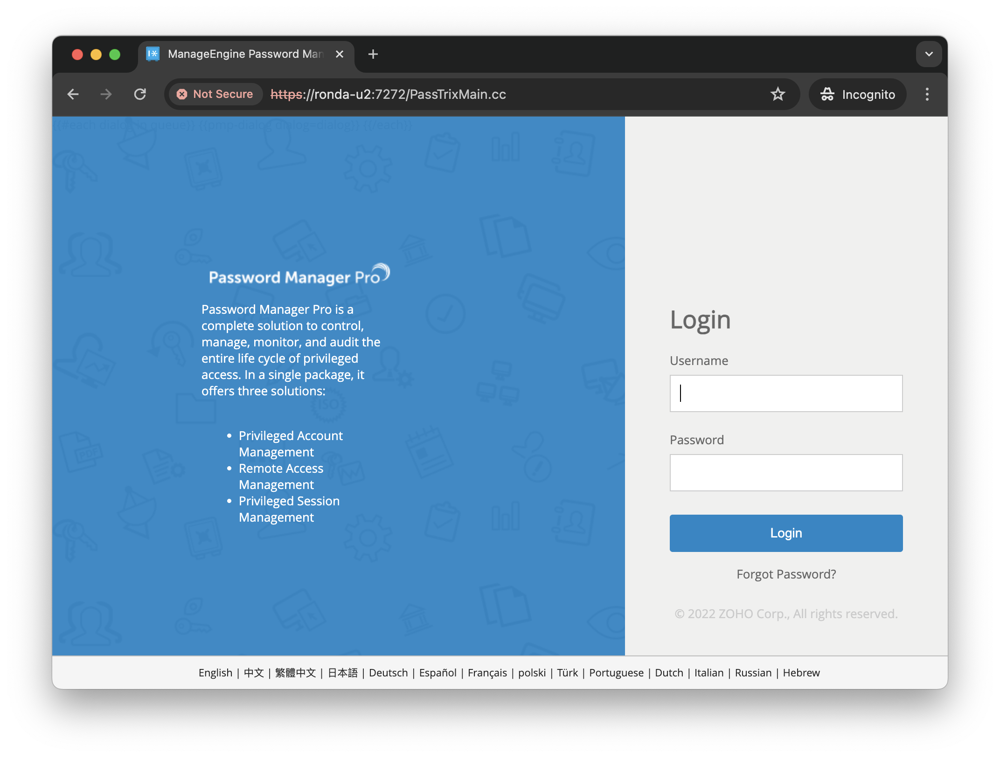
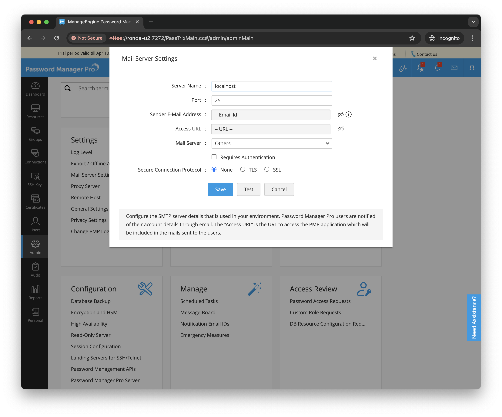

# About PMP

About ManageEngine Password Manager Pro including Linux server installation

## Notes

[ManageEngine Password Manager Pro](https://www.manageengine.com/products/passwordmanagerpro/)
is an on-premise enterprise password manager for credentials, secrets, and other digital identities.

The server is available for Windows and Linux. A 30-day free trial is available.

It can be used via:

* web interface
* iOS and android applications
* SSH CLI API
* XML API
* REST API

### Linux Installation Notes

I'm testing with a trial installation on Ubuntu 22.04.1.

Basic installation steps,
as covered in
[Installing Password Manager Pro - Linux](https://www.manageengine.com/products/passwordmanagerpro/help/installation.html#inst-lin):

Download and execute (this is the command line installer):

    chmod u+x ManageEngine_PMP_64bit.bin
    ./ManageEngine_PMP_64bit.bin -i console

Installation options:

* Default Install Folder: $HOME/ManageEngine/PMP
* High Availability Primary Server

After installer has completed, configure the system service:

    $ sudo bash pmp.sh install
    Created symlink /etc/systemd/system/multi-user.target.wants/pmp.service → /etc/systemd/system/pmp.service.
    Password Manager Pro Service installed successfully !

I have UFW enabled. Add the default port to allow external access:

    $ sudo ufw allow 7272
    Rule added
    Rule added (v6)
    $ sudo ufw status
    Status: active

    To                         Action      From
    --                         ------      ----
    ...
    7272                       ALLOW       Anywhere
    ...
    7272 (v6)                  ALLOW       Anywhere (v6)
    ...

Start the PMP service:

    sudo systemctl start pmp.service

load the web console on `https:///<pmp-host>:7272`. Note that before setting up certificates,
the server will run with a self-signed cert. You must allow the browser to bypass the security warning.

See the
[ManageEngine Password Manager Pro - Getting Started Guide](https://www.manageengine.com/products/passwordmanagerpro/getting-started-guide.html)
for post-installation configuration.

The only step that is absolutely mandatory
is to configure mail server (even if given invalid details).
Without this, it is not possible to add users.

## Credits and References

* [ManageEngine Password Manager Pro](https://www.manageengine.com/products/passwordmanagerpro/)
* [Installing Password Manager Pro - Linux](https://www.manageengine.com/products/passwordmanagerpro/help/installation.html#inst-lin)
* [ManageEngine Password Manager Pro - Getting Started Guide](https://www.manageengine.com/products/passwordmanagerpro/getting-started-guide.html)
