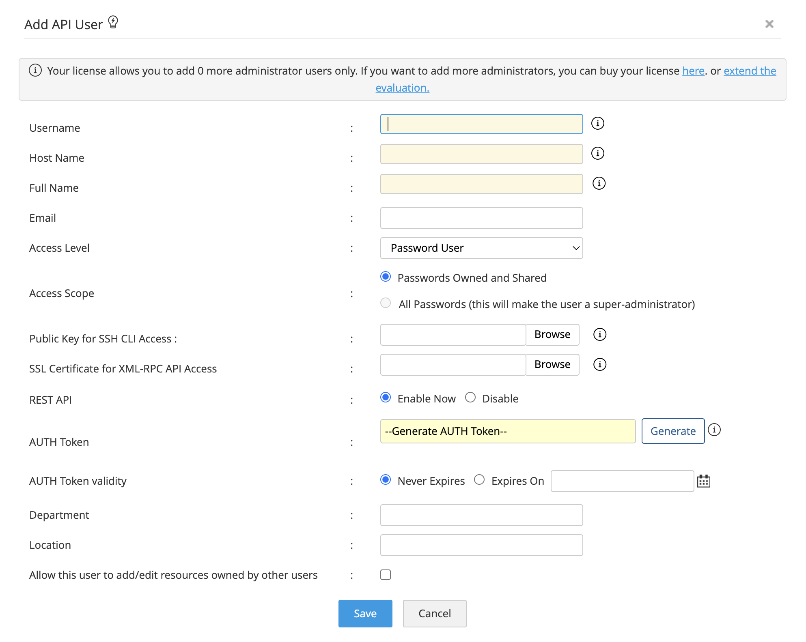

# #282 REST API

Notes on setting up and using the PMP REST API.

## Notes

The
[PMP REST API](https://www.manageengine.com/products/passwordmanagerpro/help/restapi.html)
makes most features of [ManageEngine Password Manager Pro](https://www.manageengine.com/products/passwordmanagerpro/)
manageable and usable with token-authenticated HTTP calls.

This is a quick overview and demonstration of the features using bash & curl.

### Setting Up PMP User for REST API access

API users are created with the `Add User > Add API User` option in the Users view `/PassTrixMain.cc#/UserQuickView/UserView`.

Critical configuration aspects:

* Host Name
    * while it may be entered as either IP address or host name
    * it __must__ be resolvable. If the address does not resolve in DNS, then API requests will be rejected with no result returned to the client i.e. not even an error payload (this appears to be a PMP bug)

### Example Script

The [pmp_api.sh](./pmp_api.sh) script is a simple example of various API calls with curl.

JSON responses can be prettified if the `jq` utility or similar is installed.
To optionally install json formatter (macOS with homebrew):

    brew install jq

## Auth Failure

If an invalid token is provided:

    $ AUTHTOKEN=dummy-token ./pmp_api.sh resources
    {
      "operation": {
        "result": {
          "message": "API key received is not associated to any user. Authentication failed.",
          "status": "Failed"
        },
        "name": "Authentication"
      }
    }

If a token is provided for a user that is not authorised to call from this host

    $ AUTHTOKEN=valid-key-wrong-host ./pmp_api.sh resources
    {
      "operation": {
        "result": {
          "message": "User is not allowed to access from this host",
          "status": "Failed"
        },
        "name": "Authentication"
      }
    }

## Get the Resources Owned and Shared to a User

[`../resources` endpoint](https://www.manageengine.com/products/passwordmanagerpro/help/restapi.html#getresource)

    $ ./pmp_api.sh resources
    {
      "operation": {
        "result": {
          "message": "Resources fetched successfully",
          "status": "Success"
        },
        "Details": [
          {
            "RESOURCE DESCRIPTION": "",
            "RESOURCE TYPE": "Linux",
            "RESOURCE ID": "1",
            "RESOURCE NAME": "res1",
            "NOOFACCOUNTS": "1"
          }
        ],
        "name": "GET RESOURCES",
        "totalRows": 1
      }
    }

## Search the Resources Owned and Shared to a User

[`../resources` endpoint](https://www.manageengine.com/products/passwordmanagerpro/help/restapi.html#getresource)

    ./pmp_api.sh resources search res

There is an as-yet undocumented search syntax. A query string parameter `INPUT_DATA` expects a JSON search in the form:

    {"operation":{"Details":{"SEARCHCOLUMN":"RESOURCENAME","SEARCHVALUE":"find me","SEARCHTYPE":"RESOURCE"}}}

## Get the Accounts that are Part of a Resource

[`../resources/<Resource ID>/accounts` endpoint](https://www.manageengine.com/products/passwordmanagerpro/help/restapi.html#getaccounts)

    $ ./pmp_api.sh resource 1
    {
      "operation": {
        "result": {
          "message": "Resource details with account list fetched successfully",
          "status": "Success"
        },
        "Details": {
          "LOCATION": "",
          "RESOURCE DESCRIPTION": "",
          "RESOURCE TYPE": "Linux",
          "RESOURCE ID": "1",
          "ACCOUNT LIST": [
            {
              "ACCOUNT_DESCRIPTION": "",
              "ISFAVPASS": "false",
              "ACCOUNT ID": "1",
              "AUTOLOGONLIST": [
                "SSH",
                "Telnet"
              ],
              "ACCOUNT NAME": "admin",
              "PASSWORDREQUEST_REASON_MANDATORY": "true",
              "PASSWORD STATUS": "****",
              "ISREMOTEAPPONLY": "false",
              "ACCOUNT PASSWORD POLICY": "Strong",
              "IS_USER_WITH_COMMAND_CONTROL_ROLE": "false",
              "AUTOLOGONSTATUS": "ALLOWED",
              "IS_TICKETID_REQD_ACW": "false",
              "IS_COMMAND_CONTROL_CONFIGURED": "false",
              "PASSWDID": "1",
              "IS_TICKETID_REQD_MANDATORY": "false",
              "IS_TICKETID_REQD": "false",
              "ISREASONREQUIRED": "false"
            }
          ],
          "DEPARTMENT": "",
          "PASSWORDREQUEST_REASON_MANDATORY": "true",
          "RESOURCE OWNER": "admin",
          "RESOURCE PASSWORD POLICY": "Strong",
          "IS_LOCAL_ACCOUNTS_AUTOLOGON_RESTRICTED": "false",
          "RESOURCE URL": "",
          "IS_SSH_RESTRICTED": "false",
          "NEWSSHTERMINAL": "false",
          "DOMAIN NAME": "",
          "ALLOWOPENURLINBROWSER": "true",
          "RESOURCE NAME": "res1",
          "DNS NAME": "1.2.3.4",
          "ISRDPRESTRICTED": "true"
        },
        "name": "GET RESOURCE ACCOUNTLIST"
      }
    }

## Get Details of an Account

[`../resources/<Resource ID>/accounts/<Account ID>` endpoint](https://www.manageengine.com/products/passwordmanagerpro/help/restapi.html#getaccountdetails)

    $ ./pmp_api.sh resource 1 account 1
    {
      "operation": {
        "result": {
          "message": "Account details fetched successfully",
          "status": "Success"
        },
        "Details": {
          "DESCRIPTION": "N/A",
          "PASSWDID": "1",
          "LAST MODIFIED TIME": "N/A",
          "EXPIRY STATUS": "Valid",
          "COMPLIANT REASON": "Minimum length must be 8",
          "PASSWORDREQUEST_REASON_MANDATORY": "true",
          "PASSWORD STATUS": "****",
          "PASSWORD POLICY": "Strong",
          "COMPLIANT STATUS": "Non-Compliant",
          "LAST ACCESSED TIME": "N/A"
        },
        "name": "GET RESOURCE ACCOUNT DETAILS"
      }
    }

## Get the Password of an Account that is Part of a Resource

[`../resources/<Resource ID>/accounts/<Account ID>/password` endpoint](https://www.manageengine.com/products/passwordmanagerpro/help/restapi.html#getpwd)

    $ ./pmp_api.sh resource 1 account 1 password
    {
      "operation": {
        "result": {
          "message": "Password fetched successfully",
          "status": "Success"
        },
        "Details": {
          "PASSWORD": "admin"
        },
        "name": "GET PASSWORD"
      }
    }

## Get Audit Details

[`../audit` endpoint](https://www.manageengine.com/products/passwordmanagerpro/help/restapi.html#togetauditdetails)

    $ ./pmp_api.sh audit
    {
      "operation": {
        "result": {
          "message": "Audits fetched successfully.",
          "status": "Success"
        },
        "Details": [
          {
            "Resource Name": "Resources Associated with Landing Servers (Custom Report)",
            "Operation Type": "Custom Report Created",
            "User Account": "N/A",
            "User Name": "N/A",
            "Audit ID": "1",
            "Client Type": "Web Client",
            "TIME": "1710222344835",
            "User Account ID": "0",
            "Reason": "Custom Report Resources Associated with Landing Servers is added",
            "Operated by": "System",
            "IP Address": "localhost",
            "Resource ID": "0",
            "Time Stamp": "2024-03-12 13:45:44.835",
            "User's Full Name": "N/A",
            "Ticket ID": ""
          },
          {
            "Resource Name": "Failed Password Retrievals (Custom Report)",
            "Operation Type": "Custom Report Created",
            "User Account": "N/A",
            "User Name": "N/A",
            "Audit ID": "2",
            "Client Type": "Web Client",
            "TIME": "1710222344874",
            "User Account ID": "0",
            "Reason": "Custom Report Failed Password Retrievals is added",
            "Operated by": "System",
            "IP Address": "localhost",
            "Resource ID": "0",
            "Time Stamp": "2024-03-12 13:45:44.874",
            "User's Full Name": "N/A",
            "Ticket ID": ""
          }
        ],
        "name": "GET_AUDIT",
        "totalRows": 2
      }
    }

## Credits and References

* [PMP REST API Docs](https://www.manageengine.com/products/passwordmanagerpro/help/restapi.html)
