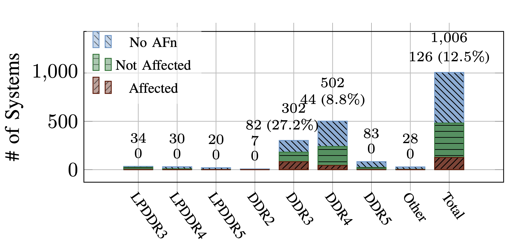
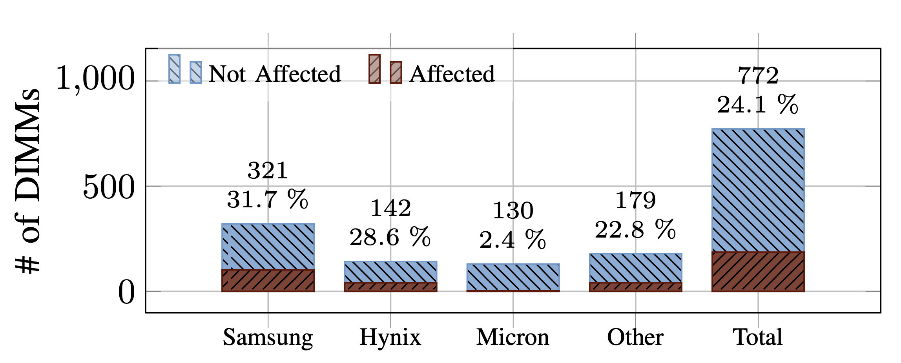

# #321 Rowhammer Then and Now

About a new study to analyze the prevalence of Rowhammer in real-world systems. Updated with results.

## Notes

[Rowhammer](https://en.wikipedia.org/wiki/Row_hammer) is a hardware vulnerability that has been looming over
the industry for the past decade, with it seems more bark than bite! The theoretical vulnerabilities have been proven,
but it has not become a real issue in the wild.

I heard about the [FLIPPYR.AM Study](https://flippyr.am/) on
[Security Now! #1017: Is YOUR System Vulnerable to Rowhammer?](https://www.grc.com/sn/sn-1017.htm).

It is crowd-sourcing the collection of data to try and assess the real-world
prevalence of the Rowhammer effects from machines around the world.

I've already run the test on a few machines. It will be interesting to see the results once they are published.

### About Rowhammer

[Rowhammer](https://en.wikipedia.org/wiki/Row_hammer) is a hardware-based security exploit that takes advantage of the way modern DRAM (Dynamic Random-Access Memory) is structured. It was first identified as a potential issue in the early 2010s, when researchers noticed that repeatedly accessing (or "hammering") specific rows of memory could cause bit flips in adjacent rows. This happens due to electrical interference, known as disturbance errors, caused by the high-density nature of modern DRAM chips. Essentially, by repeatedly reading from one area of memory, an attacker can induce errors in nearby memory locations, potentially leading to privilege escalation, data corruption, or even remote code execution.

The first major proof-of-concept exploit demonstrating Rowhammer’s real-world feasibility was published in 2014 by researchers at Google’s Project Zero. Their work showed that by leveraging Rowhammer, an attacker could flip bits in memory pages they shouldn't have access to, ultimately gaining root privileges on a system. This groundbreaking research led to further investigations, including the development of Flip Feng Shui, an advanced attack technique that allows Rowhammer to be used for targeted data corruption, affecting cryptographic keys or controlled memory regions in multi-tenant environments like cloud services.

Since its discovery, Rowhammer has continued to evolve, with researchers finding new variations and attack vectors, including TRRespass (bypassing manufacturer mitigations) and Half-Double (exploiting bit flips over a longer range). Hardware manufacturers and system designers have introduced mitigation techniques, such as error-correcting code (ECC) memory and TRR (Target Row Refresh), but these are not foolproof. As DRAM technology continues to scale down in size, Rowhammer remains a persistent security challenge, with researchers and adversaries continually exploring new ways to exploit or defend against it.

### 2025: the FLIPPYR.AM Study

The [FLIPPYR.AM Study](https://flippyr.am/) is a research study being conducted by the
[Hof University Graduate School](https://www.hof-university.de/) with the goal of assessing the real-world prevalence of the Rowhammer effect by crowd-sourcing the collection. Specifically:

> We want to invite everyone to contribute to solving one of the biggest unanswered questions about Rowhammer: What is the real-world prevalence of the Rowhammer effect? How many systems, in their current configurations, are vulnerable to Rowhammer? As large-scale studies with hundreds to thousands of systems are not easy to perform, such a study has not yet been performed. Therefore, we developed a new framework to check if your system is vulnerable to Rowhammer, incorporating the state-of-the-art Rowhammer techniques and tools. Thus, we invite everyone to participate in this unique opportunity to join forces and close this research gap together.

Participating in the study involves running the open-source
[FlippyRAM](https://github.com/iisys-sns/FlippyRAM) testing system on candidate machines.

FlippyRAM is an automated framework for testing and analyzing Rowhammer vulnerabilities in DRAM. It combines rowhammer tools and supports both Docker and ISO-based execution, making it a powerful resource for hardware security research.

### Making the Bootable USB

I flashed a bootable USB on macOS
per <https://wiki.archlinux.org/title/USB_flash_installation_medium#In_macOS>

    $ diskutil list
    ...
    /dev/disk4 (external, physical):
      #:                       TYPE NAME                    SIZE       IDENTIFIER
      0:     FDisk_partition_scheme                        *4.0 GB     disk4
      1:                 DOS_FAT_32 NO NAME                 4.0 GB     disk4s1

    $ diskutil unmountDisk /dev/disk4
    Unmount of all volumes on disk4 was successful
    $ sudo dd if=./hammeriso.iso of=/dev/disk4 bs=1m
    1068+1 records in
    1068+1 records out
    1119879680 bytes transferred in 210.295650 secs (5325263 bytes/sec)
    $ diskutil unmountDisk /dev/disk4

### Running it on an old Dell Inspiron 15 (3520)

I booted from the USB stick and ran the default 8-hour test, and let it upload the dataset for the study.

I've examined the log files that it generates, and as far as I can tell, it passed with "Total Bit Flips: 0".

If you are interested in examining the data the test produces, I have included
my data set at
<https://github.com/tardate/LittleCodingKata/tree/main/security/rowhammer/data/>.
Note: I have redacted some personal information and also truncated the large, repetitive activity logs to keep the data set relatively small.

### Results

2025-11-02: the preprint version of the paper has been published on the FlippyR.AM website - [available here](https://flippyr.am/FlippyRAM.pdf).

Some of the key insights:

* 126 (12.5 %) out of 1 006 datasets are vulnerable to fully-automated Rowhammer attacks, based on our analysis.
* For DDR3, simple patterns and hammering as fast as possible, implemented by RowhammerJS, were the most effective strategies in terms of the number of bit flips. Since most DDR4 DIMMs have TRR, pattern fuzzing strategies like Blacksmith were the most effective ones and found most bit flips.
* The minimum time the first bit flip occurred ranges from 0 min to 115 min on average, depending on the system configuration, which is a practical attack time frame on real-world systems.
* DRAM from Samsung, Hynix, and third-party resellers is similarly affected by Rowhammer. We found bit flips in only 2.4 % if Micron DIMMs. This contrasts prior work that did not find such a stark difference between the three manufacturers.

## Credits and References

* [Security Now! #1017: Is YOUR System Vulnerable to Rowhammer?](https://www.grc.com/sn/sn-1017.htm)
* <https://flippyr.am/>
* <https://flippyr.am/FlippyRAM.pdf>
