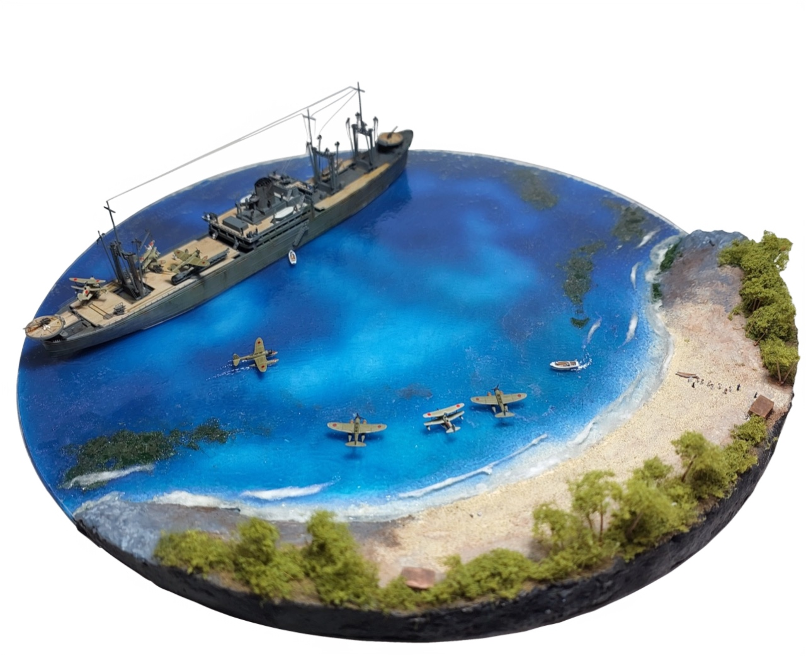

# AI Tools

A collection of AI tools that I've either used or would like to check out at some point.

## Notes

Given how hot the topic of AI is these days, This list will go out of date immediately.
It is not trying to be comprehensive - just a collection of tools I have come across and
either use, or would like to check out at some point.

See also [AI Stash](https://www.aistash.co/) - the AI Tools directory.

### Developer Tools

* [GitHub Copilot](https://github.com/features/copilot)
* <https://www.make.com/>
    * "From tasks and workflows to apps and systems, build and automate anything in one powerful visual platform."

### Chat LLMs

* <https://openai.com/chatgpt/>
* <https://writesonic.com/chat>
    * "the ChatGPT Team alternative for enterprises, offering real-time web search, PDF, image and website engagement. One App multiple LLMs"

### Text/Content Tools

* [creaitor](https://www.creaitor.ai/)
    * "Save hours on writing content and get out of the idea jam"
* [designrr](https://designrr.io/)
    * "Create eBooks & Leadmagnets to Reach More People"
    * "Transform your Blog posts, Podcasts, Videos and PDFs into eBooks, Show Notes, Dynamic Flipbooks, Transcripts, PDFs and Web pages."
* <https://rytr.me/>
    * "Rytr's AI generates original and compelling content that sounds like you, not a robot."
* [Writesonic](https://writesonic.com/)
    * "Unified AI Content Creation & Advanced SEO toolset for Marketers, Agencies, and Enterprises"
    * <https://writesonic.com/ai-article-writer-generator>
        * "Write Factually Accurate Articles with Real-Time Data"
* <https://www.slidesai.io/>
    * "Create Presentation Slides with AI in seconds"
* <https://www.beautiful.ai/aipresentationmaker>
    * "AI presentations that mean business"
* <https://prezi.com/features/ai/>
    * "Make a great presentation in no time"
* <https://www.tldrthis.com/>
    * "TLDR This helps you summarize any piece of text into concise, easy to digest content so you can free yourself from information overload."
* <https://www.deepl.com/en/translator>
    * "Translate texts & full document files instantly. Accurate translations for individuals and Teams. Millions translate with DeepL every day."
* <https://gamma.app/>
    * "Beautiful presentations, documents, and websites. No design or coding skills required."
    * Example 1:
        * I got it to generate a presentation based on <https://leap.tardate.com/electronics101/windbellkit/>
        * With little customisation, it generated this presentation:
            * <https://gamma.app/docs/Wobbly-Wind-Bell-Kit-A-Mesmerizing-LED-Oscillator-Project-mgmij0rqk877858?mode=doc>
            * [PDF](./assets/Wobbly-Wind-Bell-Kit-A-Mesmerizing-LED-Oscillator-Project.pdf)

### Image

* [DALL·E 3](https://openai.com/index/dall-e-3/)
* <https://openart.ai/home>
* <https://writesonic.com/photosonic-ai-art-generator>
    * "AI Art Generator"
* <https://getimg.ai/>
    * "Generate images from text in seconds, edit photos with words, expand pictures beyond their borders, animate images or train custom AI models"
* <https://cleanup.pictures/>
    * "Remove any unwanted object, defect, people or text from your pictures in seconds"
* <https://clipdrop.co/cleanup>
    * "Remove object, defect, people, or text from your pictures in seconds"
* <https://www.pixelcut.ai/cleanup-pictures>
    * "Remove objects, text or people from your images to get clean photos!"

#### <https://www.recraft.ai/>

* "AI for Pro Designers: Premium image generation and editing tool."

Background removal: tested with an image from <https://leap.tardate.com/kraft/ijn/kamikawamaru/>:

Generating vector art with prompt:

> Market scenes in contemporary Lao paintings, reflecting the gradual shift towards a market economy and the revival of economic activity

#### <https://klingai.com/>

* "Next Generation AI Creative Suite"

Prompt:

> Kamikawa Maru seaplane tender is at anchor in Deboyne Lagoon. We see the crew winching an Aichi E13A Jake float plan aboard using the ship's crane.

> an Aichi E13A Jake floatplane coming in to land at Deboyne Lagoon. Use an accurate representation of an Aichi E13A. Show the plane at the point it is touching down to land.

Even when selecting for "relevance" over "creativity", the AI
does not seem to understand the specifics of the prompt. Or perhaps has not been trained on IJN equipment, or has this content filtered?

It seems to do much better with more generic prompts. For example:

> a sad robot walking down a cyberpunk alleyway in some dystopian future

### Sound and Music

* <https://www.beatoven.ai/>
    * "Create unique background music that you can call your own"
* <https://play.ht/>
    * "Generate AI voices, Indistinguishable from Humans"
* <https://writesonic.com/ai-voice-generator>
    * "Realistic Text to Speech in 30+ Languages"

### Video

* <https://www.heygen.com/>
    * "AI-powered video creation at scale"
* <https://pictory.ai/>
    * "Create highly engaging videos in minutes using the power of AI. No video editing experience required."
* <https://videogen.io/>
    * "Generate professional videos in one click."
