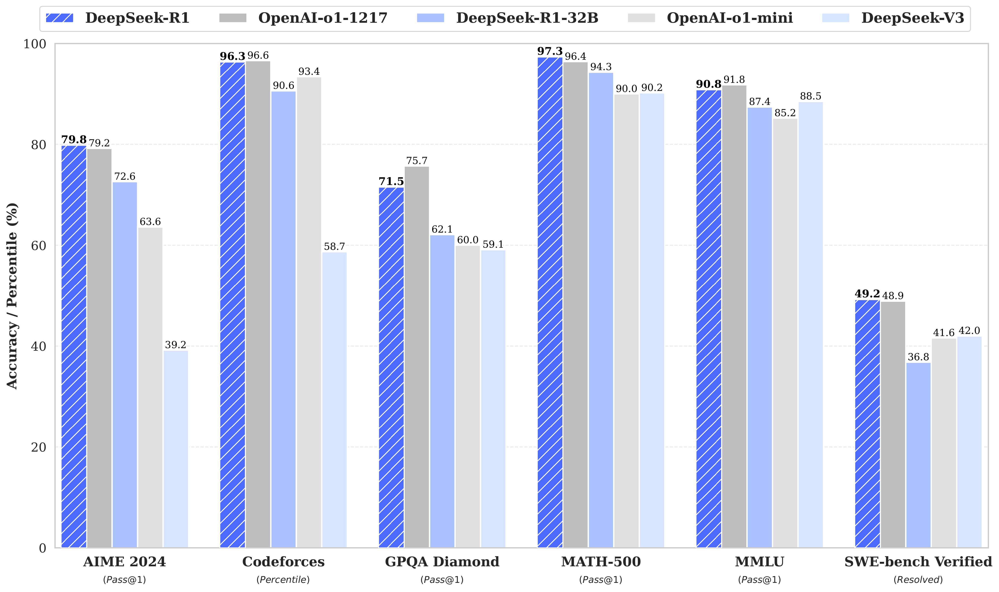

# #319 DeepSeek AI

A first look at DeepSeek 深度求索: its history, source, and a demonstration of running locally (macOS/apple silicon)

## Notes

[DeepSeek-V3](https://www.deepseek.com/) achieves a significant breakthrough in inference speed over previous models. It tops the leaderboard among open-source models and rivals the most advanced closed-source models globally.

Stock markets have noticed! See for example:
[What’s DeepSeek, China’s AI startup sending shockwaves through global tech?](https://www.aljazeera.com/economy/2025/1/28/why-chinas-ai-startup-deepseek-is-sending-shockwaves-through-global-tech)

DeepSeek was founded by Liang Wenfeng in 2023 in Hangzhou, Zhejiang as a "side project" of the Chinese hedge fund [High-Flyer](https://en.wikipedia.org/wiki/High-Flyer).

History of DeepSeek in a nutshell:

* High-Flyer hedge fund was founded in 2015 by three engineers from Zhejiang University (Liang Wenfeng, Xu Jin, Zheng Dawei)
    * The company has two regulated subsidiaries, Zhejiang High-Flyer Asset Management Co., Ltd. and Ningbo High-Flyer Quant Investment Management Partnership LLP with over 450 investment products
    * From 2016 experimented with a multi-factor price-volume model, tested in trading the following year and then more broadly adopted machine learning-based strategies
    * In 2020, established "Fire-Flyer I" supercomputer that focused on AI deep learning. It cost approximately 200 million Yuan.
    * In 2021, replaced by Fire-Flyer II which cost 1 billion Yuan. It contained 10,000 Nvidia A100 GPUs.
    * In 2021/2022, market volatility caused issues with the models and performance of over 100 of its investment products declined by over 10%.
    * From 2018 to 2024, High-Flyer has consistently outperformed the CSI 300 Index. However after the regulatory crackdown on quantitative funds in February 2024, High-Flyer’s funds have trailed the index by 4 percentage points
* In April 2023, High-Flyer announced a new research body "DeepSeek" to explore artificial general intelligence. It would not be used to perform stock trading.
    * DeepSeek-LLM
        * 2023-11-02, released its first series of model, DeepSeek-Coder (MIT license). The series includes 8 models, 4 pretrained (Base) and 4 instruction-finetuned (Instruct).
        * 2023-11-29, released the DeepSeek-LLM series of models, with 7B and 67B parameters in both Base and Chat forms
    * V2
        * 2024-05, released the DeepSeek-V2 series. The series includes 4 models, 2 base models (DeepSeek-V2, DeepSeek-V2-Lite) and 2 chatbots (-Chat).
    * V3
        * 2024-12, released a base model DeepSeek-V3-Base and a chat model DeepSeek-V3. The model architecture is essentially the same as V2.
    * R1
        * 2024-11-20, DeepSeek-R1-Lite-Preview became accessible via DeepSeek's API and <https://chat.deepseek.com/>
            * trained for logical inference, mathematical reasoning, and real-time problem-solving
        * 2025-01-20, DeepSeek-R1 and DeepSeek-R1-Zero were released, initialised from V3
        * ai world goes a little nuts

## DeepSeek Sources

<https://github.com/deepseek-ai/DeepSeek-R1>

* introduces the first-generation reasoning models, DeepSeek-R1-Zero and DeepSeek-R1
* Model Summary, Downloads, Evaluation Results, usage and license (MIT)

<https://github.com/deepseek-ai/DeepSeek-V3>

* introduces DeepSeek-V3, a strong Mixture-of-Experts (MoE) language model with 671B total parameters with 37B activated for each token

## Running DeepSeek Locally

### Install Ollama

[Ollama](https://ollama.com/) runs Llama 3.3, DeepSeek-R1, Phi-4, Mistral, Gemma 2, and other models, locally.

To install on macOS (Apple Silicon), it just requires a download, unzip and drap the ollama.app to the Applications folder.

Running the Ollama app for first time setup (it will subsequently run on system startup unless disabled (System Preferences : General : Login Items & Extensions)

### Running llama3.2

Before trying deepseek, a quick test of llama from the command line:

    $ ollama run llama3.2
    pulling manifest
    pulling dde5aa3fc5ff... 100%
    pulling 966de95ca8a6... 100%
    pulling fcc5a6bec9da... 100%
    pulling a70ff7e570d9... 100%
    pulling 56bb8bd477a5... 100%
    pulling 34bb5ab01051... 100%
    verifying sha256 digest
    writing manifest
    success
    >>> Send a message (/? for help)
    >>> tell me about the llama ai model

Here's the output it provided:

#### ">>> tell me about the llama ai model"

Llama is an artificial intelligence (AI) model developed by Meta, a technology company. It's a type of large language model that uses transformer architecture to process and
generate human-like text. Here are some key features and facts about Llama:

**Architecture:**

* Llama is based on the Transformer-XL architecture, which is an extension of the original Transformer model.
* The model consists of a sequence encoder and a sequence decoder.
* It has 12 layers, each with 2 self-attention heads.

**Training Data:**

* Llama was trained on a massive dataset of text from various sources, including but not limited to:

* Web pages
* Books
* Articles
* User-generated content

**Key Features:**

* **Text Generation:** Llama can generate human-like text based on input prompts or context.
* **Conversational AI:** The model is designed for conversational AI, enabling it to respond to user queries and engage in discussions.
* **Language Translation:** Llama can translate text from one language to another.
* **Summarization:** The model can summarize long pieces of text into concise summaries.

**Advantages:**

* **High-Quality Output:** Llama's output is often considered to be more coherent, accurate, and engaging than other AI models.
* **Efficient Processing:** The model uses transformer architecture, which allows it to process sequential data efficiently.
* **Flexibility:** Llama can handle a wide range of tasks, from simple text generation to complex conversations.

**Limitations:**

* **Data Quality:** Llama's performance is heavily dependent on the quality and diversity of its training data.
* **Contextual Understanding:** While Llama excels at generating text, it may struggle with understanding context and nuances in human communication.
* **Emotional Intelligence:** The model lacks emotional intelligence, which can lead to insensitive or unnatural responses.

**Applications:**

* **Customer Service Chatbots:** Llama can power chatbots that provide 24/7 customer support and answer frequently asked questions.
* **Content Generation:** The model is used in content generation applications, such as generating articles, social media posts, and product descriptions.
* **Language Translation:** Llama is used for language translation, enabling users to communicate across languages.

**Challenges:**

* **Data Privacy:** With great power comes great responsibility. Ensuring data privacy and security is crucial when using AI models like Llama.
* **Bias and Fairness:** As with any AI model, there's a risk of bias and unfairness in the output.
* **Regulatory Compliance:** The use of Llama and other AI models must comply with relevant regulations and laws.

Overall, Llama is an impressive AI model that has demonstrated its capabilities in text generation, conversational AI, and language translation. However, like any AI model,
it's essential to acknowledge its limitations and potential risks to ensure responsible development and deployment.

### Running deepseek-r1:1.5b

Now trying deepseek-r1. There are various size models available:

* deepseek-r1:1.5b
* deepseek-r1:8b
* deepseek-r1:14b
* deepseek-r1:32b
* deepseek-r1:70b

I'll start with the smallest:

    $ ollama run deepseek-r1:1.5b
    pulling manifest
    pulling aabd4debf0c8... 100%
    pulling 369ca498f347... 100%
    pulling 6e4c38e1172f... 100%
    pulling f4d24e9138dd... 100%
    pulling a85fe2a2e58e... 100%
    verifying sha256 digest
    writing manifest
    success
    >>> Send a message (/? for help)
    >>> >>> /show info
    Model
      architecture        qwen2
      parameters          1.8B
      context length      131072
      embedding length    1536
      quantization        Q4_K_M

    Parameters
      stop    "<｜begin▁of▁sentence｜>"
      stop    "<｜end▁of▁sentence｜>"
      stop    "<｜User｜>"
      stop    "<｜Assistant｜>"

    License
      MIT License
      Copyright (c) 2023 DeepSeek

## Using DeepSeek locally with a Chat GUI

### Install Chatbox AI

[Chatbox AI](https://chatboxai.app/) is an AI client application and smart assistant. Compatible with many cutting-edge AI models and APIs. Available on Windows, MacOS, Android, iOS, Web, and Linux.

It provides a DMG download for macOS (Apple Silicon) for installation:

After running Chatbox app, select "Use My Own API Key / Local Model"

and choose the deepseek-r1:1.5b model

## First concersation with deepseek-r1:1.5b: "tell me about the trolley problem"

This is the response I got from deepseek-r1:1.5b:

The Trolley Problem is a fundamental philosophical dilemma that explores a person's decision between two morally similar but potentially harmful outcomes. It typically presents a scenario where a trolley heading towards an intersection with a dangerous traffic light must choose between killing another individual at the crossing or avoiding it to prevent harm. The key ethical issues revolve around whether this choice should result in killing the individual, which would lead to death or injury, or letting them cause an accident.

### Key Aspects of the Trolley Problem

1. **Moral Dilemma**: The problem highlights that there is no clear choice that avoids harm. Both options involve potentially serious consequences, making it difficult to determine what is most important in that moment.

2. **Personal Decision-Making**: The dilemma emphasizes the individual's ability to make a decision based on personal values and beliefs. Some argue that even though both choices lead to harm, the severity of the situation might influence one side more than the other.

3. **Ethical Theories**:
   * **Kantian Perspective**: This view emphasizes universal moral judgment, requiring individuals to kill the individual at the crossing regardless of their position in the trolley problem.
   * **Self-Determination Approach**: It allows individuals to make choices based on personal values, accepting that the dilemma is part of their decision-making process.

4. **Historical Context**: The Trolley Problem has been addressed in various societies, reflecting different ethical frameworks and moral judgments. Some societies viewed it as requiring universal moral judgment, while others accepted it as part of personal choice without clear guidance from laws or ethics.

5. **Real-World Application**: In everyday life, the dilemma is seen as a moment where one can risk an outcome to protect oneself. The Trolley Problem is more about personal decision-making and what is most important in that specific moment rather than universal moral judgment.

### Conclusion

The Trolley Problem is a fundamental ethical issue that touches on personal choice, moral judgment, and societal norms. It reflects the complexities of making decisions based on immediate consequences versus broader ethical principles. While it emphasizes the importance of individual choices, its resolution often depends on one's personal values and perspective.

## Credits and References

* <https://www.deepseek.com/>
* <https://ollama.com/>
* <https://chatboxai.app/>
* <https://en.wikipedia.org/wiki/DeepSeek>
