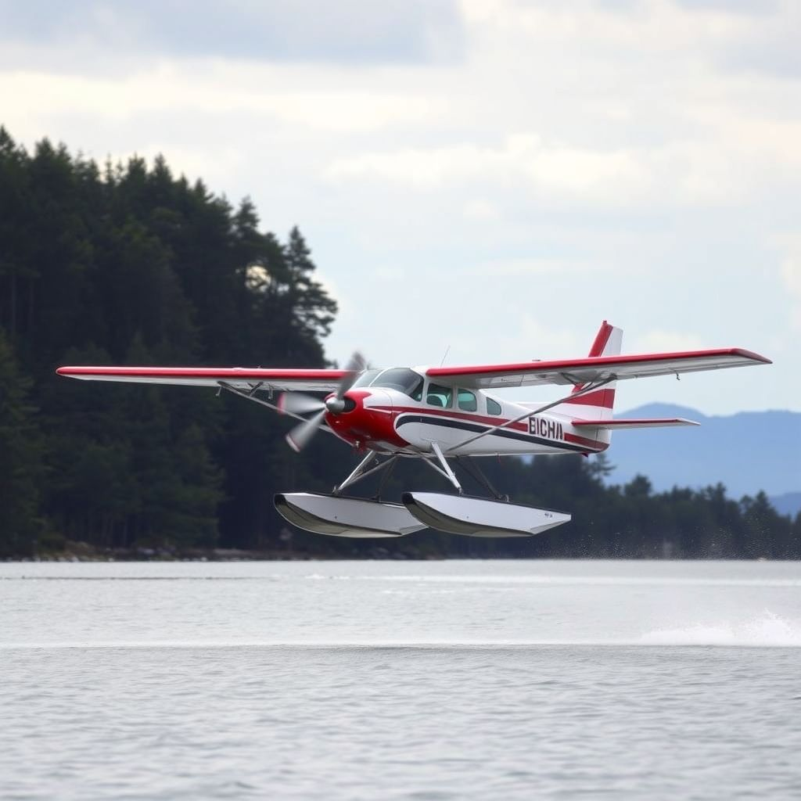

# #365 Flux AI

A quick review and test drive of Flux AI.

## Notes

See [Flux AI](https://flux-ai.io/)

> Start your image & video creation journey now with Flux AI – the ultimate all-in-one creative solution.

### Flux AI Image Generator

See <https://flux-ai.io/flux-ai-image-generator/>

> Create stunning images with Flux.1 Pro, Flux.1 Dev and Flux.1 Schnell models.

On copyright: Paid users own their image rights. A [paid plan](https://flux-ai.io/pricing/) is required for:

* non-public
* Commercial Right

A quick test with a generic prompt:

> a sad robot walking down a cyberpunk alleyway in some dystopian future

Quick test with a very specific prompt:

> an Aichi E13A Jake floatplane coming in to land at Deboyne Lagoon. Use an accurate representation of an Aichi E13A. Show the plane at the point it is touching down to land.

The result has convincing detail about the action of a float plane coming into land, but the landscape and plane model are totally wrong:

## Credits and References

* <https://flux-ai.io/>
* <https://flux-ai.io/flux-ai-image-generator/>
