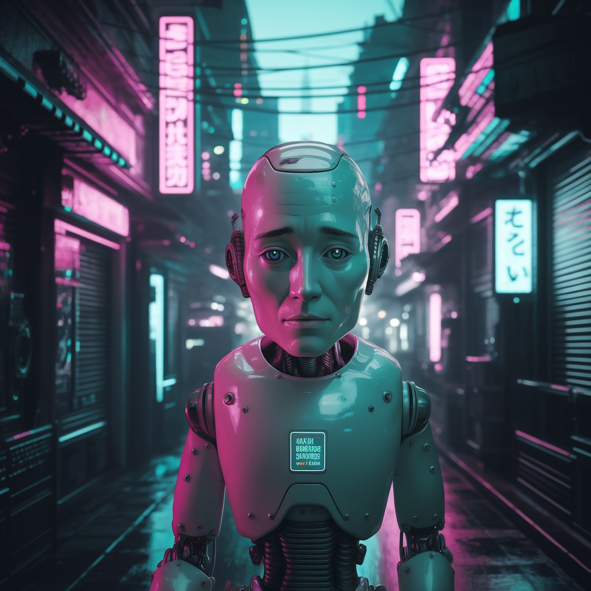

# #364 Ideogram AI

A quick review and test drive of ideogram.ai.

## Notes

<https://ideogram.ai/> offers:

> text to image model with industry leading capabilities in generating realistic images, graphic design, typography, and more

At least a [basic  plan](https://ideogram.ai/pricing) is required for:

* Download original quality PNGs
* Upscale
* Custom aspect ratios

At least a [plus plan](https://ideogram.ai/pricing) is required for:

* Private generation
* Image deletion

On copyright:

> We do not claim any ownership rights over the images generated, nor do we restrict your ability to use them. You are free to use the images as you wish. However, you are responsible for ensuring that your content does not violate any laws or third-party rights or our Terms of Service.

A quick test with a generic prompt:

> a sad robot walking down a cyberpunk alleyway in some dystopian future

Quick test with a very specific prompt:

> an Aichi E13A Jake floatplane coming in to land at Deboyne Lagoon. Use an accurate representation of an Aichi E13A. Show the plane at the point it is touching down to land.

Not bad, generated convincing action and environment, but the plane is completely wrong.

## Credits and References

* <https://ideogram.ai/>
