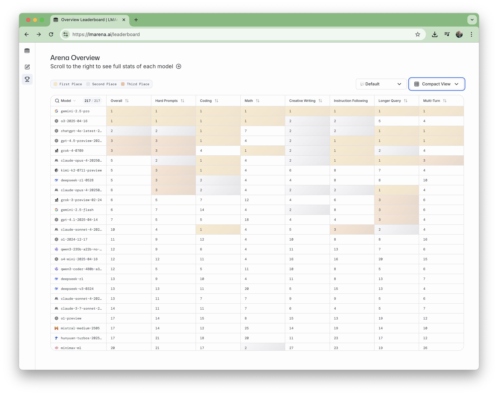
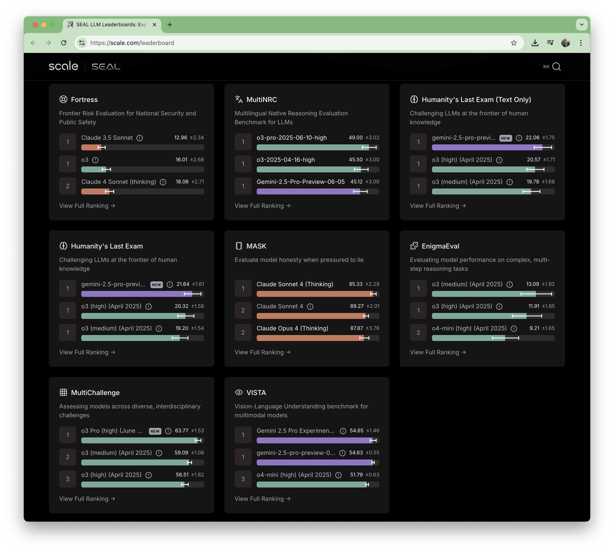

# #343 AI Leaderboards

Tracking some of the main AI leaderboards

## Notes

## LMArena Leaderboard

<https://lmarena.ai/leaderboard>

Created by researchers from UC Berkeley, LMArena is an open platform where everyone can easily access, explore and interact with the world's leading AI models. By comparing them side by side and casting votes for the better response, the community helps shape a public leaderboard, making AI progress more transparent, and grounded in real-world usage.

Snapshot as of 2025-07-29:

## SEAL LLM Leaderboards

<https://scale.com/leaderboard>

SEAL LLM Leaderboards evaluate frontier LLM capabilities. These leaderboards provide insight into models through robust datasets and precise criteria to benchmark the latest AI advancements.

Snapshot as of 2025-07-29:

## Credits and References

* [LMArena Leaderboard](https://lmarena.ai/leaderboard)
* [SEAL LLM Leaderboards](https://scale.com/leaderboard)
