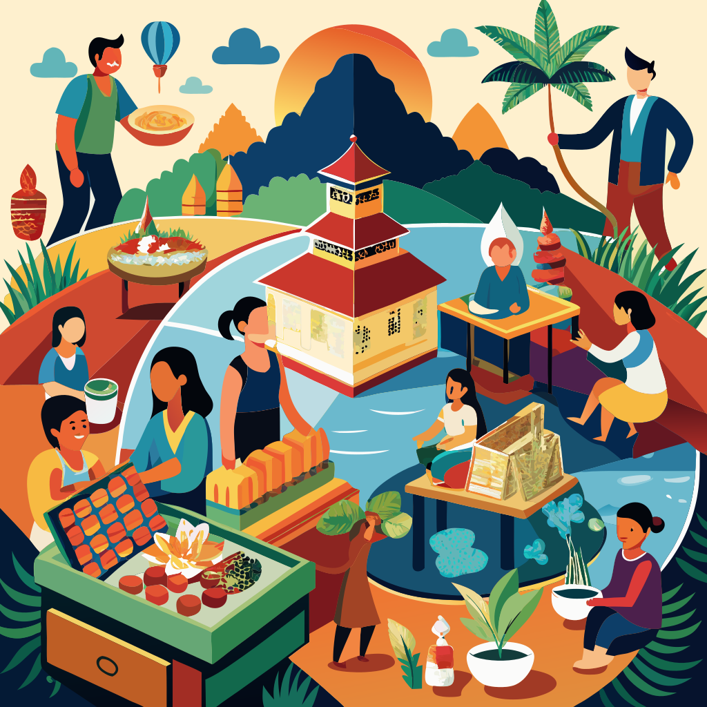

# #366 Recraft AI

A quick review and test drive of recraft.ai for image generation and editing.

## Notes

See <https://www.recraft.ai/>:

> AI for Pro Designers: Premium image generation and editing tool.

A [paid plan](https://www.recraft.ai/pricing) is required for:

* Generated images are private
* Full ownership and commercial rights to any generation

Background removal: tested with an image from <https://leap.tardate.com/kraft/ijn/kamikawamaru/>:

Generating vector art with prompt:

> Market scenes in contemporary Lao paintings, reflecting the gradual shift towards a market economy and the revival of economic activity

## Credits and References

* <https://www.recraft.ai/>
