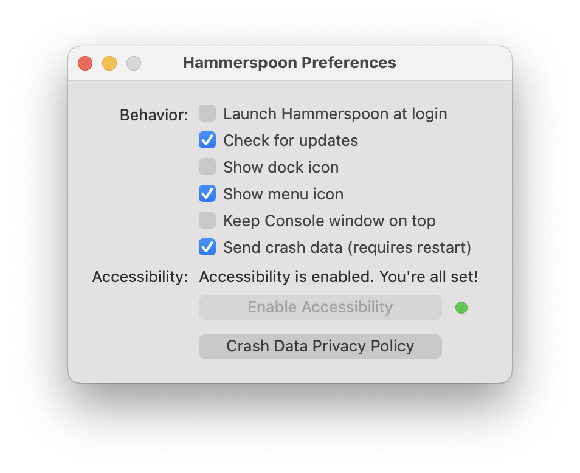
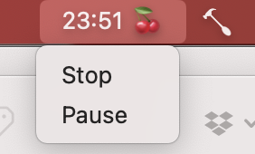

# #298

Test driving Hammerspoon for automation on macOS

## Notes

Reading posts from [Hillel Wayne](https://www.hillelwayne.com/post/ahk-scripts-project/)
on his use of (Windows-only) [AutoHotkey](https://www.autohotkey.com/)
finally motivated me to search out an equivalent for macOS.

The option that immediately caught my attention was [Hammerspoon](https://www.hammerspoon.org/).

### About Hammerspoon

Coincidentally, Hammerspoon just celebrated its 10th anniversary with a
[1.0.0](https://github.com/Hammerspoon/hammerspoon/releases/tag/1.0.0)
release.

What does it do?

* uses Lua code to interacts with macOS APIs for applications, windows, mouse pointers, filesystem objects, audio devices, batteries, screens, low-level keyboard/mouse events, clipboards, location services, wifi, and more.
* allows you to implement custom automations by writing Lua code, or use pre-existing ["Spoons"](https://www.hammerspoon.org/Spoons/)

### Installation

* [Download the latest](https://github.com/Hammerspoon/hammerspoon/releases/tag/1.0.0)
* unzip and drag `Hammerspoon.app` to the Applications folder
* run `Hammerspoon.app` for initial launch and to configure preferences

### Getting Started

Edit `~/.hammerspoon/init.lua` (also available via "Open Config" from Hammerspoon menu).
A first example from the [Getting Started Guide](https://www.hammerspoon.org/go/)
simply displays a notification popup when a hotkey combo is pressed:

    hs.hotkey.bind({"cmd", "alt", "ctrl"}, "W", function()
      hs.alert.show("Hello World!")
    end)

Attempting a more involved example. This binds the cmd-shift-L key combo to
a function that  copies the selected text in the Terminal application, converts it to lowercase,
and puts it on the clipboard.

    -- Convert currently selected text in the Terminal to lowercase and put on the clipboard
    -- Hammerspoon will need accessibility permissions in macOS to control other apps.
    hs.hotkey.bind({"cmd", "shift"}, "L", function()
      -- Get the currently focused window
      local focusedWindow = hs.window.focusedWindow()
      local app = focusedWindow:application()

      -- Check if the focused application is Terminal
      if app:name() == "Terminal" then
          -- Simulate Cmd+C to copy the selected text to the clipboard
          hs.eventtap.keyStroke({"cmd"}, "C")

          -- Wait a short time to ensure the clipboard is updated
          hs.timer.usleep(10000)  -- 10 milliseconds

          -- Get the clipboard content
          local selectedText = hs.pasteboard.getContents()

          if selectedText then
              -- Convert the selected text to lowercase
              local lowerText = string.lower(selectedText)

              -- Set the clipboard to the lowercase text
              hs.pasteboard.setContents(lowerText)

              -- Show a notification
              hs.alert.show(lowerText .. " is now in the clipboard")
          end
      else
          hs.alert.show("Focus on Terminal to use this shortcut. Current focus:" .. app:name())
      end
    end)

### Using a "Spoon"

Let's try a Spoon.
I'm going to install [Cherry](https://www.hammerspoon.org/Spoons/Cherry.html).
Cherry tomato (a tiny Pomodoro) -- a Pomodoro Timer for the menubar

To install it:

* download the zip file from our Spoon repository: <https://github.com/Hammerspoon/Spoons/raw/master/Spoons/Cherry.spoon.zip>
* unzip `Cherry.spoon.zip`
* double click the `Cherry.spoon` file - Hammerspoon will install it amd remove the `Cherry.spoon` file

It needs to be enabled in `~/.hammerspoon/init.lua`, e.g:

    -- Load the Cherry Spoon with default settings and hotkey (cmd-alt-ctrl-c)
    hs.loadSpoon("Cherry")
    spoon.Cherry:bindHotkeys()

Then a default 25-minute pomodoro timer can be started with the hotkey or selecting "Start" from the cherry menubar item.

## Credits and References

* [Hammerspoon](https://www.hammerspoon.org/) - a tool for powerful automation of macOS
    * <https://github.com/Hammerspoon/hammerspoon> - sources
    * [Getting Started Guide](https://www.hammerspoon.org/go/)
    * ["Spoons"](https://www.hammerspoon.org/Spoons/)
* [Learn AutoHotKey by stealing my scripts](https://www.hillelwayne.com/post/ahk-scripts-project/)
* [AutoHotkey](https://www.autohotkey.com/) - the ultimate automation scripting language for Windows
