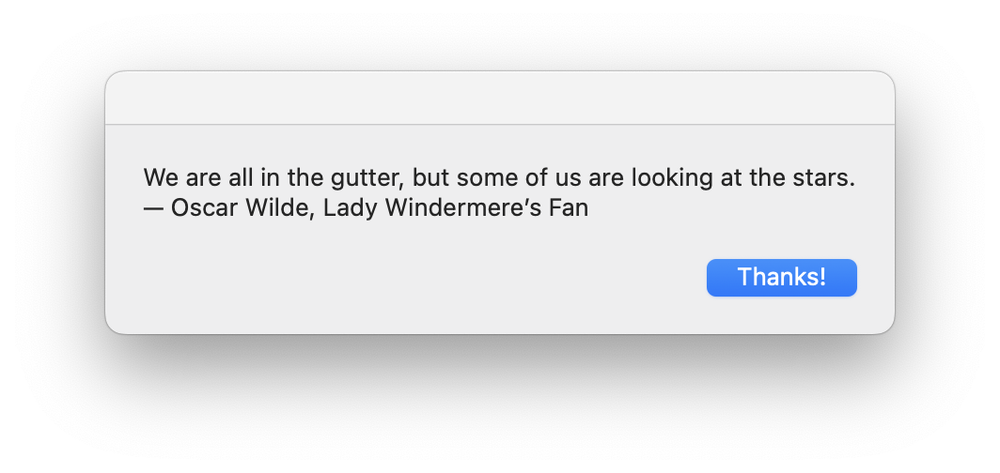

# #329 Scripting macOS

About options for scripting and automating macOS.

## Notes

macOS offers a variety of scripting tools for automating system tasks, ranging from long-established legacy options to modern, GUI-driven alternatives.
The main options with native macOS capabilities are:

* AppleScript - very much the legacy option
* Shortcuts - the modern option, but suited for end-user GUI use, not scripting
* JavaScript for Automation (JXA) - introduced as a modern alternative to AppleScript, but is lacking support
* Swift - advanced users and developers may prefer writing automation tools in Swift, can leverage full macOS APIs and integrate deeply with system features
* 3rd party tools such as Keyboard Maestro, [Hammerspoon](../../hammerspoon/), and BetterTouchTool

In practice, however, does anyone really try to script macOS using these tools?
The main advantage of using a platform-specific tool is the promise of being able to call platform APIs.
However all of these solutions suffer from the fact that recent macOS releases have increasingly broken or degraded AppleScript support,
and Apple has shown little interest in fixing these regressions.

This has become a major concern among longtime Mac automation users.
See my [attempt to automate wallpaper shuffling](../shuffle_wallpaper/)
for an example of how once-reliable API support is now quite broken.

Key examples of broken or degraded Apple API support:

* System Events and UI Scripting Instability
    * macOS Monterey and Ventura introduced bugs and instability in UI scripting via System Events, often resulting in scripts failing intermittently or not being able to interact with certain UI elements at all.
* Finder Scripting Bugs
* Mail.app Scripting Problems
    * Mail's AppleScript dictionary hasn’t been well-maintained
* Calendar and Reminders Automation
    * Both apps saw reduced scriptability. Changes in data handling (likely due to tighter iCloud and privacy integration) made previously functioning scripts unreliable or inoperative.
* Inconsistent Application Dictionaries
    * Some apps now ship with AppleScript dictionaries that are incomplete, outdated, or simply broken—meaning even well-formed scripts can't be guaranteed to work.

Perhaps the most common approach is to avoid all of the platform-specific options, and automate most tasks where possible with the
widely available and well-supported general scripting tools such as bash, python, ruby, node.js etc.

### AppleScript

One of the oldest and most recognizable scripting languages on macOS is AppleScript. Known for its natural-language-like syntax, AppleScript was designed to let users automate complex tasks across system and application boundaries. It excels at tasks like batch-renaming files in Finder, manipulating Mail messages, or orchestrating workflows between multiple apps. However, in recent years, AppleScript has suffered from poor maintenance, with newer macOS releases introducing regressions and bugs that are often left unpatched. As a result, while still functional in many cases, it’s considered a legacy tool and may not be the best choice for new automation projects.

AppleScript is definitely niche these days, but it's not entirely obsolete. Here's who still uses it and why:

Who uses AppleScript today:

* Mac power users and IT admins: For automating tasks across macOS apps (especially legacy ones like Finder, Mail, or Safari).
* Audio/video professionals: Some still rely on AppleScript to automate tools like Final Cut Pro or Logic Pro, where AppleScript support remains.
* Businesses with legacy systems: Where workflows were built years ago and still function well enough to not warrant rewriting in newer tools.
* Developers of automation tools: Like Keyboard Maestro or Automator, which can trigger AppleScripts for app control.

Why it’s less popular now:

* Limited app support: Fewer modern apps support AppleScript robustly.
* Better alternatives: Tools like Shortcuts, JavaScript for Automation (JXA), Python with PyObjC, or third-party APIs are often more powerful and cross-platform.
* Aging syntax: AppleScript’s English-like syntax can be more confusing than helpful.

AppleScript isn’t dead, but it’s definitely a legacy tool now, kept alive by specific use cases and users who need deep macOS automation. If you're starting fresh, it's rarely the best choice.

See also:

* [Introduction to AppleScript Language Guide](https://developer.apple.com/library/archive/documentation/AppleScript/Conceptual/AppleScriptLangGuide/introduction/ASLR_intro.html)

#### AppleScript Example

Apple script can be written and tested using the Apple "Script Editor" tool.
By default, scripts are saved in a binary ".scpt" format,
but can also be written as plain text ".applescript" files.

For a simple example, see [daily_quote.applescript](./daily_quote.applescript):

```applescript
set quotes to { "It is never too late to be what you might have been.— George Eliot (Mary Ann Evans)", "Not all those who wander are lost. — J.R.R. Tolkien, The Fellowship of the Ring", "There is no friend as loyal as a book. — Ernest Hemingway", "We are all in the gutter, but some of us are looking at the stars. — Oscar Wilde, Lady Windermere’s Fan" }

set randomIndex to random number from 1 to (count of quotes)
set dailyQuote to item randomIndex of quotes
display dialog dailyQuote buttons {"Thanks!"} default button "Thanks!"
```

To run from the command line:

```sh
osascript daily_quote.applescript
```



### Shortcuts

Apple’s more recent focus is on Shortcuts, a visual automation environment originally developed for iOS and now deeply integrated into macOS. Shortcuts offers a user-friendly interface for creating automations without writing code, making it accessible to non-programmers. It supports a growing range of system-level actions and third-party app integrations. However, its capabilities can be limited compared to script-based solutions, and more complex tasks often require workarounds or external tools.

See also:

* <https://support.apple.com/en-sg/guide/shortcuts/welcome/ios>

### JavaScript for Automation (JXA)

For users seeking more power and flexibility, scripting in JavaScript for Automation (JXA) or writing native macOS tools in Swift provides greater control and reliability. JXA allows you to write automation scripts in JavaScript, accessing the same automation frameworks as AppleScript but with a modern syntax.

Meanwhile, advanced users and developers may prefer writing automation tools in Swift, which can leverage full macOS APIs and integrate deeply with system features. Additionally, third-party tools like Keyboard Maestro, Hammerspoon, and BetterTouchTool offer robust alternatives that often outperform Apple’s own solutions in terms of reliability and extensibility.

JavaScript for Automation was a new thing in macOS Yosemite. However, its documentation covers the basics of using JavaScript to interact with the Open Scripting Architecture. For many tasks in scripting, there's a lot to figure out, and many different documentations to refer to.

See also:

* [Introduction to JavaScript for Automation Release Notes](https://developer.apple.com/library/archive/releasenotes/InterapplicationCommunication/RN-JavaScriptForAutomation/Articles/Introduction.html)
* [Getting Started with JavaScript for Automation on Yosemite](https://www.macstories.net/tutorials/getting-started-with-javascript-for-automation-on-yosemite/)
* [JavaScript for Automation Cookbook](https://github.com/JXA-Cookbook/JXA-Cookbook)
* [Automating macOS with Javascript for Automation (JXA)](https://github.com/josh-/automating-macOS-with-JXA-presentation/blob/master/Automating%20macOS%20with%20Javascript%20for%20Automation%20(JXA).md)

#### JavaScript for Automation  Example

It's possible to get pretty lower-level control from Javascript, even, for example, using the Cocoa C libraries.

The [formatted_date.js](./formatted_date.js)
example is from
<https://www.macscripter.net/t/run-javascript-for-automation-jxa-snippets-from-applescript/73622/3>

```sh
$ cat formatted_date.js
ObjC.import('Cocoa')
rightNow = $.NSDate.date
dtFormatter = $.NSDateFormatter.alloc.init
dtFormatter.dateStyle = $.NSDateFormatterFullStyle
dtFormatter.timeStyle = $.NSDateFormatterMediumStyle

formattedDate = dtFormatter.stringFromDate(rightNow)
console.log(ObjC.unwrap(formattedDate));
$ osascript -l JavaScript formatted_date.js
Thursday, 22 May 2025 at 9:56:46 PM
```

## Credits and References

* [Apple Developer Documentation](https://developer.apple.com/documentation)
