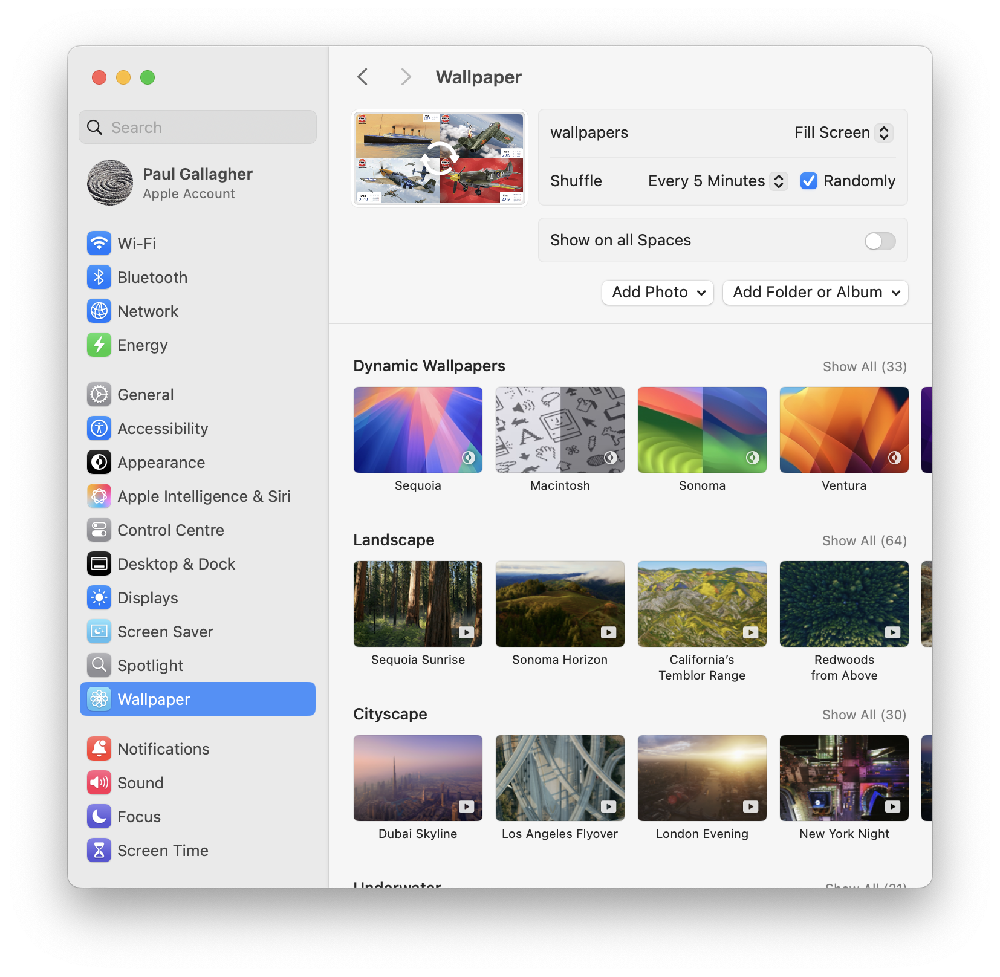
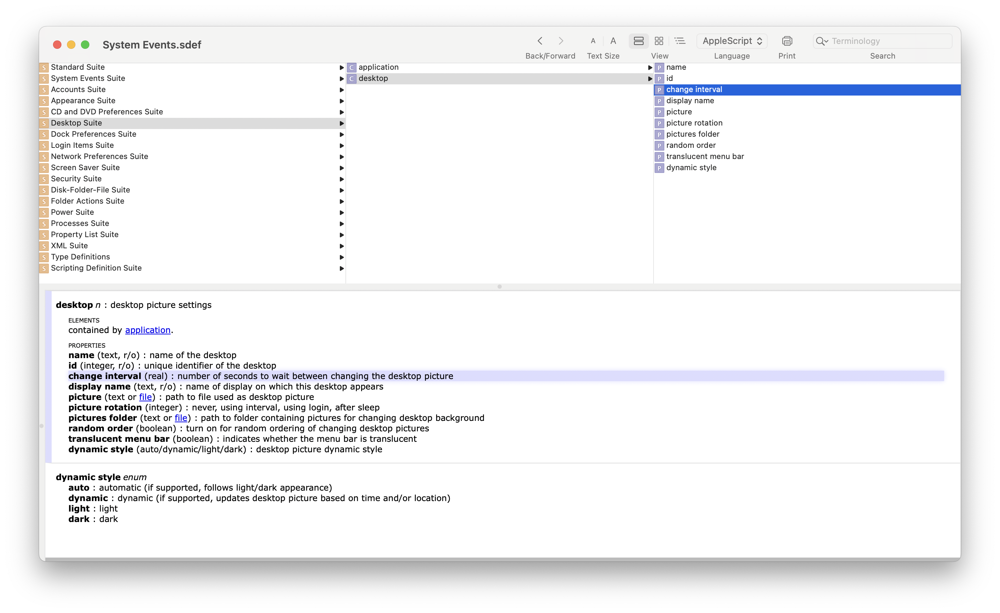

# #330 Shuffle Wallpaper

I thought triggering the immediate shuffle of the wallpaper on a macOS would be a quick scripting task. After wasting too much tim on this,
I discovered that it used to be possible, but since at last macOS Sonoma, the System Events API has not kept up with the OS implementation, and now it is totally broken, with no fix in sight.

## Notes

I have my macOS Wallpaper configured to automatically shuffle a bunch of pictures I have in a folder.



They are set to change on a fixed time cycle, but I really wanted a way to trigger an immediate shuffle.
I thought this would be a quick scripting task, and indeed a quick google yielded quote a number of posts and AppleScript examples showing exactly this.

### AppleScript

[How to manually trigger background image change?](https://apple.stackexchange.com/questions/12117/how-to-manually-trigger-background-image-change) - seemed like the business.
A simple trick: re-write the "change interval" triggers an immediate change of the image.
Lots of people reporting how they got it working,
though I did note

> Asked 14 years, 1 month ago

```applescript
tell application "System Events"
  tell current desktop
    set intervalSeconds to get change interval
    set change interval to intervalSeconds
  end tell
end tell
```

Did it work for me? No! Two problems:

* any attempt to write the "change interval" causes the picture settings to be clobbered
* the "change interval" API is not reflecting the current setting - always reports 1800.0 seconds, even if the shuffle time is set to 5 minutes, for example.

The [desktop-settings.applescript](./desktop-settings.applescript) script shows the values before and after attempting to write "change interval":

```sh
$ osascript desktop-settings.applescript
Name: iMac
ID: 1
Display Name: iMac
Pictures Folder: /Users/paulgallagher/Pictures
Picture: /Users/paulgallagher/Pictures/wallpapers
Picture Rotation: 1
Random Order: true
Translucent Menu Bar: missing value
Dynamic Style: auto
Change Interval: 1800.0
$ osascript shuffle.applescript
$ osascript desktop-settings.applescript
Name: iMac
ID: 1
Display Name: iMac
Pictures Folder: /~
Picture: /~/Pictures
Picture Rotation: 1
Random Order: true
Translucent Menu Bar: missing value
Dynamic Style: auto
Change Interval: 1800.0
```

Loading and inspecting the System Events dictionary in the Script Editor does not shed any light, except to confirm that we are apparently calling the API correctly.



After some further research, it does appear confirmed that the
System Events API for desktop settings was
[broken by Apple as far back as the macOS Sonoma](https://www.reddit.com/r/applescript/comments/17aasg8/sonoma_140_change_to_desktop_suite_cant_set/)
release. And if anything, it's been broken badder since!

### JavaScript for Automation (JXA)

Apple introduced JavaScript for Automation (JXA) to update and replace AppleScript.
I tried a similar wallpaper shuffle in
[shuffle.js](./shuffle.js), but only confirmed that it has exactly the same problems.

```sh
$ cat shuffle.js
// Get reference to System Events
const systemEvents = Application('System Events');

// Get the current desktop
const currentDesktop = systemEvents.desktops[0];

// Get the current picture setting
console.log(`Current picture setting: ${currentDesktop.picture()}`);

// Get the change interval setting
const changeInterval = currentDesktop.changeInterval();
console.log(`Current change interval setting: ${changeInterval}`);

console.log('Reset the change interval')
currentDesktop.changeInterval = changeInterval;

console.log(`Current picture setting: ${currentDesktop.picture()}`);
console.log(`Current change interval setting: ${currentDesktop.changeInterval()}`);
```

Executing the script in the terminal with `osascript`:

```sh
$ osascript -l JavaScript shuffle.js
Current picture setting: /Users/paulgallagher/Pictures/wallpapers
Current change interval setting: 1800
Reset the change interval
Current picture setting: /~/Pictures
Current change interval setting: 1800
```

It is looking very much like Apple have broken the System Events API itself,
so it doesn't matter which language one uses to call it - it ain't going to work.

In fact, it is quite apparent that every time an attempt to write "change interval" is made,
the picture folder path is set to its parent folder:

```sh
$ osascript -l JavaScript shuffle.js
Current picture setting: /Users/paulgallagher/Pictures/wallpapers
Current change interval setting: 1800
Reset the change interval
Current picture setting: /~/Pictures
Current change interval setting: 1800
$ osascript -l JavaScript shuffle.js
Current picture setting: /~/Pictures
Current change interval setting: 1800
Reset the change interval
Current picture setting: /~
Current change interval setting: 1800
$ osascript -l JavaScript shuffle.js
Current picture setting: /~
Current change interval setting: 1800
Reset the change interval
Current picture setting: /
Current change interval setting: 1800
$ osascript -l JavaScript shuffle.js
Current picture setting: /
Current change interval setting: 1800
Reset the change interval
Current picture setting: /..
Current change interval setting: 1800
```

### Hammerspoon

My last hurrah was to see if I could get this working with
[Hammerspoon](../../hammerspoon/).

Adding to `~/.hammerspoon/init.lua`:

```lua
-- Cycle desktop
hs.hotkey.bind({"cmd", "alt", "ctrl"}, "D", function()
  local current = hs.screen.mainScreen():desktopImageURL()
  hs.alert.show(current)
  hs.screen.mainScreen():desktopImageURL(current)
end)
```

And...same issue, any attempt to write `desktopImageURL` corrupts the Wallpaper settings.

The
[hammerspoon extension](https://github.com/Hammerspoon/hammerspoon/blob/master/extensions/screen/libscreen.m#L1295)
is calling the AppKit functions:

* [desktopImageURLForScreen:](https://developer.apple.com/documentation/appkit/nsworkspace/desktopimageurl(for:)?language=objc)
* [setDesktopImageURL:forScreen:options:error:](https://developer.apple.com/documentation/appkit/nsworkspace/setdesktopimageurl(_:for:options:)?language=objc)

And these are not working.

So  at this point I have totally given up on the idea of being able to script the shuffling of wallpaper, but am left with a mighty "Apple, WTF???!!".

## Credits and References

* [How to manually trigger background image change?](https://apple.stackexchange.com/questions/12117/how-to-manually-trigger-background-image-change)
* [AppleScript Programming/System Events](https://en.wikibooks.org/wiki/AppleScript_Programming/System_Events)
<https://www.reddit.com/r/applescript/comments/17aasg8/sonoma_140_change_to_desktop_suite_cant_set/>
* [Introduction to AppleScript Language Guide](https://developer.apple.com/library/archive/documentation/AppleScript/Conceptual/AppleScriptLangGuide/introduction/ASLR_intro.html)
* <https://wiki.keyboardmaestro.com/manual/Scripting>
