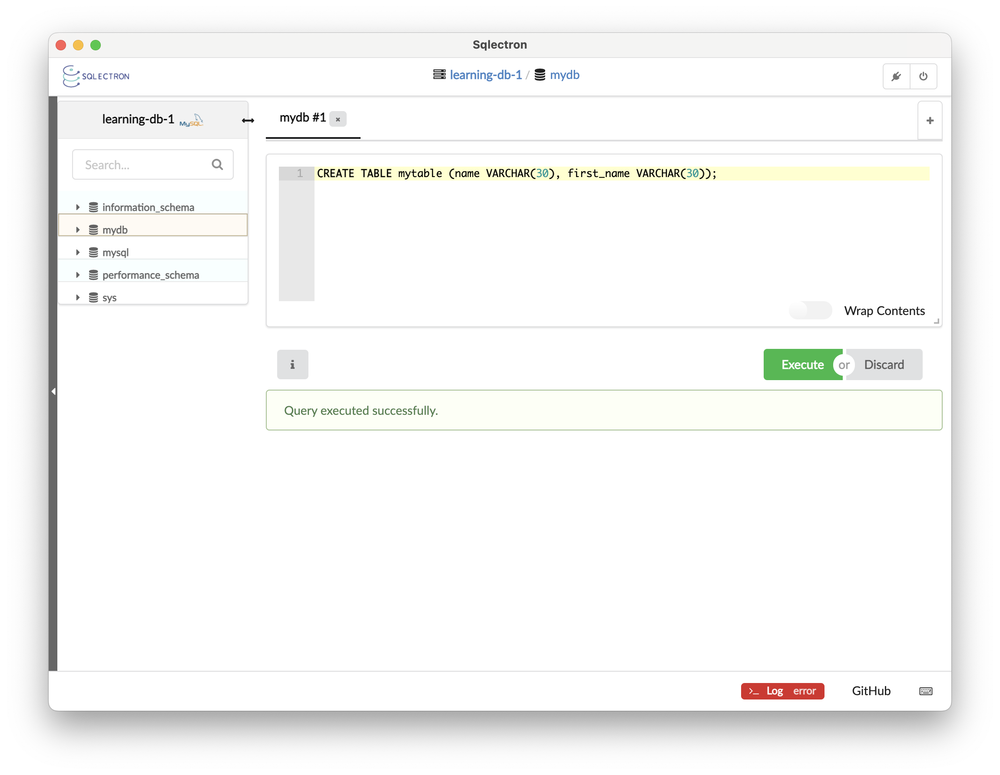

# #313 SQLECTRON

About SQLECTRON, the open-source SQL client for all dbs and all platforms.

## Notes

SQLECTRON is a simple and lightweight SQL client:

* desktop GUI and terminal versions
* open source (hosted on GitHub)
* cross-database
* cross-platform support (Linux, Mac and Windows)

Find it all at <https://sqlectron.github.io/>

### macOS GUI Installation

Downloads available from <https://github.com/sqlectron/sqlectron-gui/releases>
v1.38.0 is the latest at the time I'm making these notes.

There are two downloads that seem relevant for macOS.
These are the same app just packaged differently (I tried, and they both work for me on macOS on Apple Silicon):

* sqlectron-1.38.0-mac.zip - unzips the sqlectron.app, just needs to be moved to Applications folder
* sqlectron-1.38.0.dmg - standard disk image installer

On initial startup:

Creating a database connection (to an RDS MySQL database)

Available connections:

Creating a table

    CREATE TABLE mytable (name VARCHAR(30), first_name VARCHAR(30));

Inserting a row

    INSERT INTO mytable (name, first_name)
    VALUES ("Blow", "Joe");

Selecting rows

    SELECT * FROM mytable;

## Credits and References

* <https://sqlectron.github.io/>
