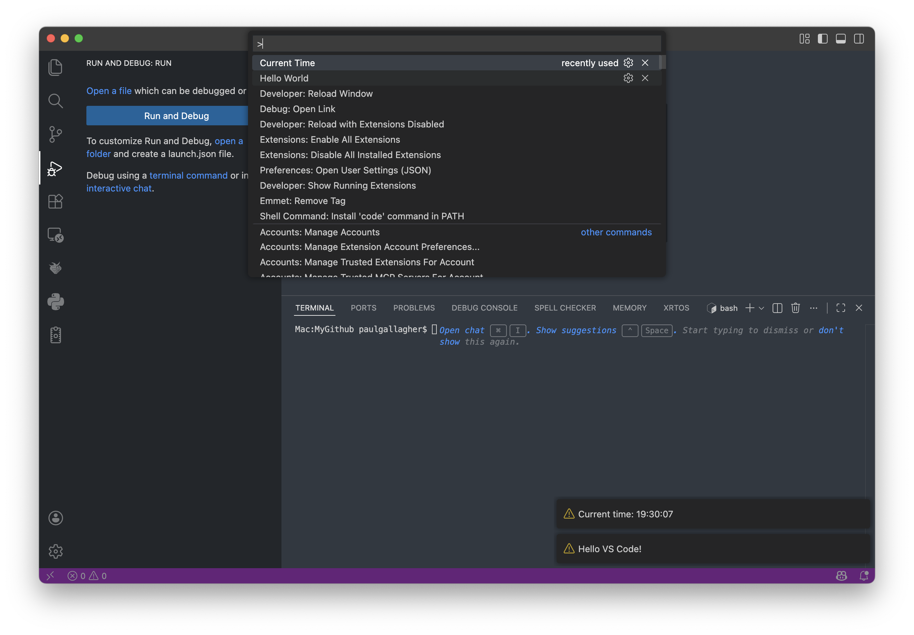

# #xxx VSCode Extensions with Typescript

An initial exploration of writing vscode extensions with Typescript.

## Notes

VS Code extensions are just Node.js packages that plug into the editor’s extensibility API.
With TypeScript you get type-safe access to that API, compile-time checks and first-class tooling.
The fastest way to start is to scaffold a project with the official Yeoman generator (`yo code`), choose “New Extension (TypeScript)”, and press F5 to launch a second VS Code window that already loads your extension for live debugging .

Key moving parts

- `src/extension.ts` – entry file; export an `activate()` (and optionally `deactivate()`) function.
- `package.json` – lists metadata, activation events and the commands your extension contributes.
- `vscode` module – gives you APIs for commands, editors, diagnostics, webviews, Language Server Protocol, etc.
- Extension Development Host – special VS Code instance spawned by F5 where your code runs; reload it with Ctrl-R to pick up changes.

Typical flow

1. Run `yo code`, pick TypeScript, name it, open the folder.
2. Open `src/extension.ts`, register a command with `vscode.commands.registerCommand`.
3. Add the command id to the `commands` and `activationEvents` arrays in `package.json`.
4. Press F5 → new window opens → Cmd-Shift-P → run your command → see the info message.
5. Iterate: edit, reload window, test.
6. When ready, `vsce package` (or `vsce publish`) to share the extension .

That’s it—about 20 lines of TypeScript give you a working command, and from there you can add language support, tree views, webviews, task providers, debug adapters, etc.

### The First Tutorial

Following along with
<https://code.visualstudio.com/api/get-started/your-first-extension>
...

Installing the generator

```sh
npm install --global yo generator-code
```

Running the generator:

```bash
$ yo code
# ? What type of extension do you want to create? New Extension (TypeScript)
# ? What's the name of your extension? HelloWorld
### Press <Enter> to choose default for all options below ###

# ? What's the identifier of your extension? helloworld
# ? What's the description of your extension? LEAVE BLANK
# ? Initialize a git repository? Y
# ? Which bundler to use? unbundled
# ? Which package manager to use? npm

# ? Do you want to open the new folder with Visual Studio Code? Open with `code`

```

The key generated components:

- [package.json](./helloworld/package.json)
- [src/extension.ts](./helloworld/src/extension.ts)

Running the extension:



## What Next

- [Testing](https://code.visualstudio.com/api/working-with-extensions/testing-extension)
    - a core part of the extension framework
- [Publishing checklist:](https://code.visualstudio.com/api/working-with-extensions/publishing-extension)
    - `vsce` CLI installed (`npm i -g vsce`).
    - `package.json` has `name`, `version`, `publisher`, `engines.vscode`, `repository` and a `README.md`.
    - Create a publisher ID once at marketplace.visualstudio.com → “Publish extensions”.
    - Generate a Personal Access Token (Pubs > Manage > Tokens) with `Marketplace` scope.
    - `vsce login` (paste token) → `vsce publish` (or `vsce package` to get a `.vsix` to side-load).
    - Done: extension is live in the Marketplace within a few minutes.

## Credits and References

- <https://code.visualstudio.com/api/get-started/your-first-extension>
