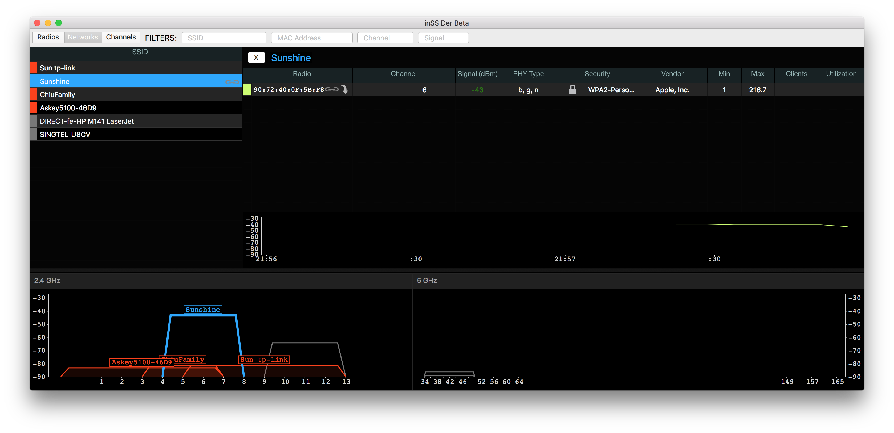

# #235 Scanners

A quick survey of WiFi scanners

## Notes

No scientific assessment here, just quick checks...

tldr: WiFi Explorer is the only one that gave me the full technical details (short of pulling out the big guns with wireshark)

#### [NetSpot](https://www.netspotapp.com/netspotpro.html)

* WiFi analyzer app for macOS offers the most visual and convenient heat maps and more.
* Android, iOS, Windows, MacOS
* commercial and free editions
* good for signal analysis but not config details

#### [WiFi Scanner for Mac OS](https://www.accessagility.com/wifi-scanner-mac-os)

* WiFi analyzer app for Mac that also detects access points and clients in ad-hoc mode in case the SSID is broadcasted.
* MacOS
* pretty expensive and no free trial?

#### [iStumbler for Mac](https://istumbler.net/)

* WiFi analyzer app for Mac will display networks according to their types, i.e. Bluetooth, Bonjour or AirPort.
* currently not available due to issues
* MacOS

#### [WiFi Explorer](https://www.intuitibits.com/products/wifiexplorer/)

* Detect issues that may be affecting connection and the performance of your network, such as channel conflicts, overlapping and configuration issues, etc.
* good for advanced details - allows inspection and export of full technical details of each network
* MacOS

#### [KisMAC](https://kismac-ng.org/)

* an open-source WiFi analyzer application for Mac OS that can map wireless networks and lay out the info on their performance so you can easily troubleshoot.
* ATTENTION! KisMAC WiFi scanner is no longer being updated or maintained! The latest version 0.3.3 released Feb 07, 2011
* MacOS
* source still available at <https://github.com/IGRSoft/KisMac2>

#### Mac Wireless Diagnostics Tool

* a built-in Mac WiFi analyzer that’s included in all version of macOS.
* MacOS

#### [inSSIDer](https://www.metageek.com/inssider/)

* the basic version of this WiFi analyzer allows Mac users to collect all essential information about nearby WiFi networks.
* MacOS, Windows
* failed to detect most networks when I tried it?!

#### [AirRadar](https://www.koingosw.com/products/airradar/)

* this free-to-try WiFi analyzer for Mac is great for performing large-scale WiFi site surveys.
* free trial
* basic details
* MacOS

### [WireShark](https://www.wireshark.org/)

* Not specifically for WiFi scanning, however if the need is to capture wifi traffic then it is ideal
* MacOS, Windows

