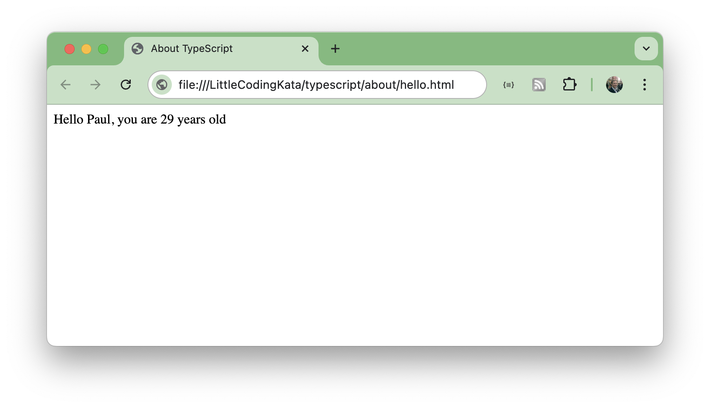

# #294 About TypeScript

TypeScript - my tl;dr summary, plus notes on getting started on macOS (Apple Silicon) and Ubuntu (x86).

## Notes

TypeScript is a strongly typed programming language that builds on JavaScript.
The main benefits it claims are:

* strongly typed programming language
* compiles down to standard Javascript that can runs anywhere JavaScript runs
* next-gen Javascript features compiled down for old browsers
* non-Javascript features like interfaces
* meta-programming features like decorators
* rich configuration options
* modern tooling the helps even in non-TypeScript projects

### Installation - macOS (Apple Silicon)

I use [Homebrew](https://brew.sh/) to manage software installations on my Mac. I'll use it here to install the node pre-requisites for typescript.

    $ arch
    arm64
    $ brew upgrade node
    ...
    $ node -v
    v22.5.1

Installing TypeScript, local to this folder

    $ npm install typescript --save-dev
    $ npx tsc --version
    Version 5.5.4

### Installation - Ubuntu (x86)

I'm currently running Ubuntu 22.04:

    $ uname -v
    #44~22.04.1-Ubuntu SMP PREEMPT_DYNAMIC Tue Jun 18 14:36:16 UTC 2

The version of Node.js included with Ubuntu 22.04, version 12.22.9, is an LTS release. It is technically outdated, but should be supported until the release of Ubuntu 24.04.

To install node v22, I'm using nvm:

    $ curl -o- https://raw.githubusercontent.com/nvm-sh/nvm/v0.39.7/install.sh | bash
    ..
    $ nvm install 22
    ..
    $ node -v
    v22.6.0

Then installing TypeScript:

    $ npm install typescript --save-dev
    $ npx tsc --version
    Version 5.5.4

### A Simple Example

A simple TypeScript example is in [hello.ts](./hello.ts) demonstrates custom types and typed parameters:

    type User = {name: string; age: number};

    function greet(user: User) {
      let message: string = 'Hello ' + user.name + ', you are ' + user.age + ' years old';
      const output_element = document.getElementById('output');
      output_element.innerText = message;
    }

    const user1: User = { name: 'Paul', age: 29 };
    greet(user1)

Compiled with `tsc` to produced the generated Javascript file [hello.js](./hello.js):

    npx tsc hello.ts

And then executed in a browser with a simple wrapper HTML file [hello.html](./hello.html):

## Credits and References

* [typescriptlang.org](https://www.typescriptlang.org/)
* [TypeScript Playground](https://www.typescriptlang.org/play)
* [The TypeScript Handbook](https://www.typescriptlang.org/docs/handbook/intro.html)
