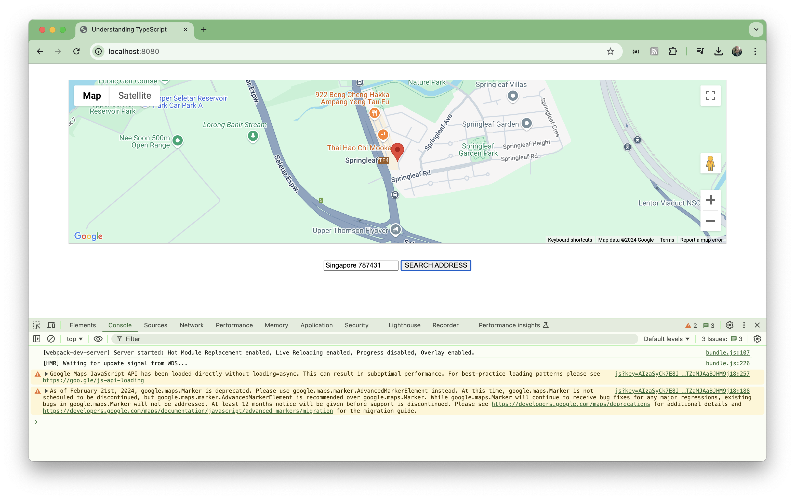
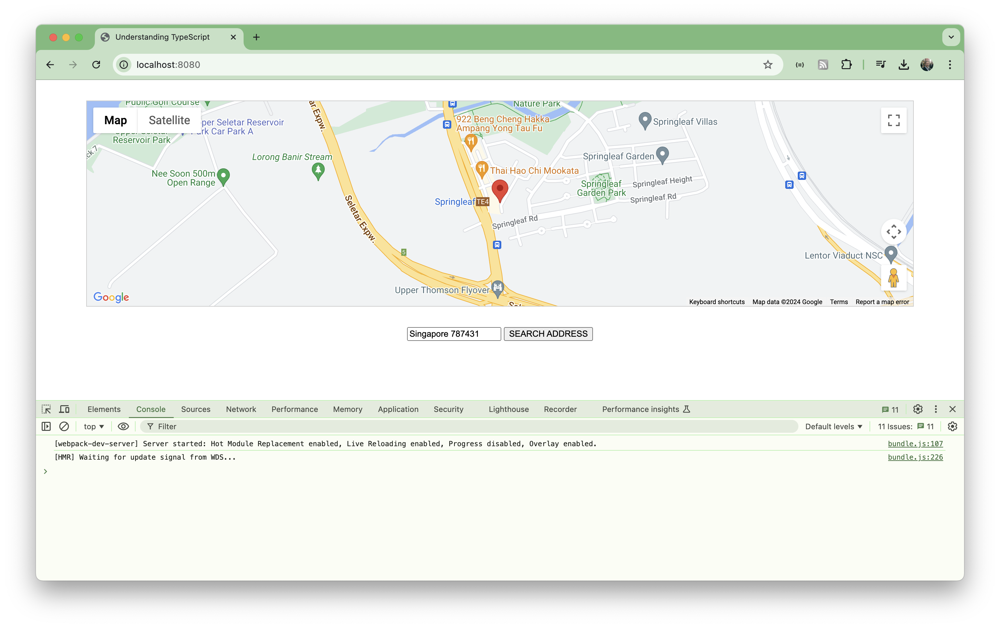

# Share a Place

Updating dependencies and API usage for the select and share a place app from the Understanding TypeScript course.

## Notes

This is an update of the "select and share a place" app
from the udemy course:
[Understanding TypeScript](https://www.udemy.com/course/understanding-typescript/)

It fixes some dependencies and API changes that now prevent the app working as shipped.
The purpose of these notes are to document the changes required.
If you are interested in exploring the app itself, I recommend taking the
[course](https://www.udemy.com/course/understanding-typescript/).

### Initial Installation

The app sources (final version from the course notes) were unpacked to [app](./app).

    $ npm install
    npm warn deprecated @types/googlemaps@3.43.3: Types for the Google Maps browser API have moved to @types/google.maps. Note: these types are not for the googlemaps npm package, which is a Node API.

    added 328 packages, and audited 329 packages in 1s

    39 packages are looking for funding
      run `npm fund` for details

    15 vulnerabilities (1 low, 4 moderate, 9 high, 1 critical)

    To address all issues, run:
      npm audit fix

    Run `npm audit` for details.

### Initial Run

Run the app unchanged

    $ npm start

    > understanding-typescript@1.0.0 start
    > webpack-dev-server

    <i> [webpack-dev-server] Project is running at:
    <i> [webpack-dev-server] Loopback: http://localhost:8080/
    <i> [webpack-dev-server] On Your Network (IPv4): http://192.168.10.68:8080/
    <i> [webpack-dev-server] On Your Network (IPv6): http://[fe80::1]:8080/
    <i> [webpack-dev-server] Content not from webpack is served from '/Users/paulgallagher/MyGithub/tardate/LittleCodingKata/typescript/shareplace/app' directory
    asset bundle.js 328 KiB [emitted] (name: main)
    runtime modules 26.5 KiB 12 modules
    modules by path ./node_modules/ 241 KiB
      modules by path ./node_modules/webpack-dev-server/client/ 55.8 KiB 12 modules
      modules by path ./node_modules/webpack/hot/*.js 4.59 KiB
        ./node_modules/webpack/hot/dev-server.js 1.88 KiB [built] [code generated]
        ./node_modules/webpack/hot/log.js 1.34 KiB [built] [code generated]
        + 2 modules
      modules by path ./node_modules/html-entities/lib/*.js 81.3 KiB
        ./node_modules/html-entities/lib/index.js 7.74 KiB [built] [code generated]
        ./node_modules/html-entities/lib/named-references.js 72.7 KiB [built] [code generated]
        + 2 modules
      ./node_modules/axios/dist/browser/axios.cjs 80.7 KiB [built] [code generated]
      ./node_modules/ansi-html-community/index.js 4.16 KiB [built] [code generated]
      ./node_modules/events/events.js 14.5 KiB [built] [code generated]
    ./src/app.ts 1.24 KiB [built] [code generated]
    webpack 5.75.0 compiled successfully in 640 ms

The app loads on <http://localhost:8080/> successfully but location query fails:

### Setting Up a Google API Key

A Google Maps API key is required. See <https://developers.google.com/maps/documentation/geocoding/overview>
Verify the API call using curl query:

    $ curl "https://maps.googleapis.com/maps/api/geocode/json?address=Singapore%20787431&key=${GOOGLE_MAPS_API_KEY}"
    {
      "results" :
      [
          {
            "address_components" :
            [
                {
                  "long_name" : "787431",
                  "short_name" : "787431",
                  "types" :
                  [
                      "postal_code"
                  ]
                },
                {
                  "long_name" : "Yishun",
                  "short_name" : "Yishun",
                  "types" :
                  [
                      "neighborhood",
                      "political"
                  ]
                },
                {
                  "long_name" : "Singapore",
                  "short_name" : "Singapore",
                  "types" :
                  [
                      "locality",
                      "political"
                  ]
                },
                {
                  "long_name" : "Singapore",
                  "short_name" : "SG",
                  "types" :
                  [
                      "country",
                      "political"
                  ]
                }
            ],
            "formatted_address" : "Singapore 787431",
            "geometry" :
            {
                "location" :
                {
                  "lat" : 1.397498,
                  "lng" : 103.818941
                },
                "location_type" : "APPROXIMATE",
                "viewport" :
                {
                  "northeast" :
                  {
                      "lat" : 1.398840980291502,
                      "lng" : 103.8203019802915
                  },
                  "southwest" :
                  {
                      "lat" : 1.396143019708498,
                      "lng" : 103.8176040197085
                  }
                }
            },
            "place_id" : "ChIJW98ZgFQR2jERVGn6lJC-vQ4",
            "types" :
            [
                "postal_code"
            ]
          }
      ],
      "status" : "OK"
    }

## Updating the API key in the app

The key currently needs to be hard-coded in 2 places in the app. Replace "PUT_API_KEY_HERE" with a valid key:

* index.html:9
* app.ts:2

Running the app, we can now lookup addresses but we're seeing warnings about the Google API:

> As of February 21st, 2024, google.maps.Marker is deprecated. Please use google.maps.marker.AdvancedMarkerElement instead. At this time, google.maps.Marker is not scheduled to be discontinued, but google.maps.marker.AdvancedMarkerElement is recommended over google.maps.Marker. While google.maps.Marker will continue to receive bug fixes for any major regressions, existing bugs in google.maps.Marker will not be addressed. At least 12 months notice will be given before support is discontinued. Please see <https://developers.google.com/maps/deprecations> for additional details and <https://developers.google.com/maps/documentation/javascript/advanced-markers/migration> for the migration guide.

### Google Maps API Update

Switched to "@types/google.maps": "^3.55.12". Install and run:

    $ npm install

    up to date, audited 329 packages in 631ms

    39 packages are looking for funding
      run `npm fund` for details

    15 vulnerabilities (1 low, 4 moderate, 9 high, 1 critical)

    To address all issues, run:
      npm audit fix

    Run `npm audit` for details.
    $ npm start

    > understanding-typescript@1.0.0 start
    > webpack-dev-server

    <i> [webpack-dev-server] Project is running at:
    <i> [webpack-dev-server] Loopback: http://localhost:8080/
    <i> [webpack-dev-server] On Your Network (IPv4): http://192.168.10.68:8080/
    <i> [webpack-dev-server] On Your Network (IPv6): http://[fe80::1]:8080/
    <i> [webpack-dev-server] Content not from webpack is served from '/Users/paulgallagher/MyGithub/tardate/LittleCodingKata/typescript/shareplace/app' directory
    asset bundle.js 328 KiB [emitted] (name: main)
    runtime modules 26.5 KiB 12 modules
    modules by path ./node_modules/ 241 KiB
      modules by path ./node_modules/webpack-dev-server/client/ 55.8 KiB 12 modules
      modules by path ./node_modules/webpack/hot/*.js 4.59 KiB
        ./node_modules/webpack/hot/dev-server.js 1.88 KiB [built] [code generated]
        ./node_modules/webpack/hot/log.js 1.34 KiB [built] [code generated]
        + 2 modules
      modules by path ./node_modules/html-entities/lib/*.js 81.3 KiB
        ./node_modules/html-entities/lib/index.js 7.74 KiB [built] [code generated]
        ./node_modules/html-entities/lib/named-references.js 72.7 KiB [built] [code generated]
        + 2 modules
      ./node_modules/axios/dist/browser/axios.cjs 80.7 KiB [built] [code generated]
      ./node_modules/ansi-html-community/index.js 4.16 KiB [built] [code generated]
      ./node_modules/events/events.js 14.5 KiB [built] [code generated]
    ./src/app.ts 1.29 KiB [built] [code generated]
    webpack 5.75.0 compiled successfully in 636 ms

Running without warnings:

## Credits and References

* [Understanding TypeScript (udemy)](https://www.udemy.com/course/understanding-typescript/)
