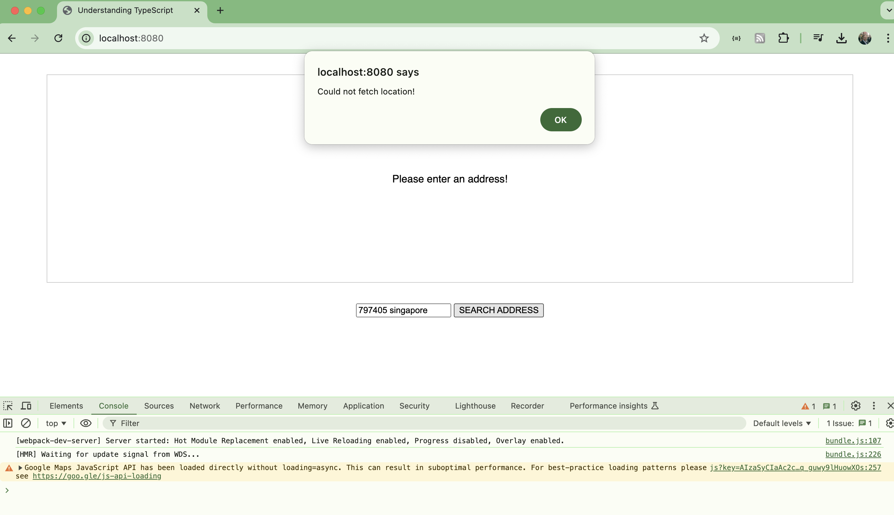

# Share a Place

Updating dependencies and API usage for the select and share a place app from the Understanding TypeScript course.

## Notes

This is an update of the "select and share a place" app
from the udemy course:
[Understanding TypeScript](https://www.udemy.com/course/understanding-typescript/)

It fixes some dependencies and API changes that now prevent the app working as shipped.
The purpose of these notes are to document the changes required.
If you are interested in exploring the app itself, I recommend taking the
[course](https://www.udemy.com/course/understanding-typescript/).

### Initial Installation

The app sources (final version from the course notes) were unpacked to [app](./app).

    $ npm install
    npm warn deprecated @types/googlemaps@3.43.3: Types for the Google Maps browser API have moved to @types/google.maps. Note: these types are not for the googlemaps npm package, which is a Node API.

    added 328 packages, and audited 329 packages in 1s

    39 packages are looking for funding
      run `npm fund` for details

    15 vulnerabilities (1 low, 4 moderate, 9 high, 1 critical)

    To address all issues, run:
      npm audit fix

    Run `npm audit` for details.

### Initial Run

Run the app unchanged

    $ npm start

    > understanding-typescript@1.0.0 start
    > webpack-dev-server

    <i> [webpack-dev-server] Project is running at:
    <i> [webpack-dev-server] Loopback: http://localhost:8080/
    <i> [webpack-dev-server] On Your Network (IPv4): http://192.168.10.68:8080/
    <i> [webpack-dev-server] On Your Network (IPv6): http://[fe80::1]:8080/
    <i> [webpack-dev-server] Content not from webpack is served from '/Users/paulgallagher/MyGithub/tardate/LittleCodingKata/typescript/shareplace/app' directory
    asset bundle.js 328 KiB [emitted] (name: main)
    runtime modules 26.5 KiB 12 modules
    modules by path ./node_modules/ 241 KiB
      modules by path ./node_modules/webpack-dev-server/client/ 55.8 KiB 12 modules
      modules by path ./node_modules/webpack/hot/*.js 4.59 KiB
        ./node_modules/webpack/hot/dev-server.js 1.88 KiB [built] [code generated]
        ./node_modules/webpack/hot/log.js 1.34 KiB [built] [code generated]
        + 2 modules
      modules by path ./node_modules/html-entities/lib/*.js 81.3 KiB
        ./node_modules/html-entities/lib/index.js 7.74 KiB [built] [code generated]
        ./node_modules/html-entities/lib/named-references.js 72.7 KiB [built] [code generated]
        + 2 modules
      ./node_modules/axios/dist/browser/axios.cjs 80.7 KiB [built] [code generated]
      ./node_modules/ansi-html-community/index.js 4.16 KiB [built] [code generated]
      ./node_modules/events/events.js 14.5 KiB [built] [code generated]
    ./src/app.ts 1.24 KiB [built] [code generated]
    webpack 5.75.0 compiled successfully in 640 ms

The app loads on <http://localhost:8080/> successfully but location query fails:

### Setting Up a Google API Key

A Google Maps API key is required. See <https://developers.google.com/maps/documentation/geocoding/overview>

The key needs to be updated in 2 places in the app. Replace "PUT_API_KEY_HERE" with a valid key:

* index.html:9
* app.ts:2

## Credits and References

* [Understanding TypeScript (udemy)](https://www.udemy.com/course/understanding-typescript/)
