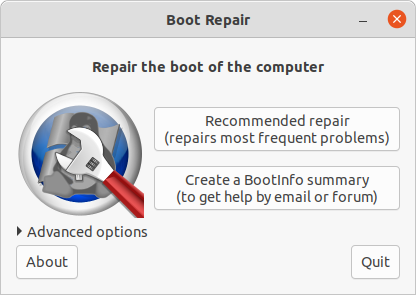

# #383 Fixing Ubuntu Boot Issues

When Windows, Dell, and Intel updates break your dual-boot Ubuntu ... Boot-Repair to the rescue!

## Notes

I just had an "Eek!" moment after letting Windows update do its thing on a dual-boot Windows-Ubuntu machine (Dell Inspiron 15).
After Windows had finished its thing (including applying BIOS and Dell firmware updates) ... Windows is OK, but Ubuntu won't boot:

```text
Platform does not support this image
Failed to read header: unsupported
Failed to load image: unsupported
start_image() returned unsupported
```

I briefly considered just blowing the whole install away and maybe trying [Linux Mint](https://linuxmint.com/) on the machine, but I hate leaving problems undiagnosed.

Googling the symptoms didn't reveal any specific known issue. Just a few "similar issues from 2022 and earlier.

I first checked BIOS (1.35.0) settings, but no issues there.

As far as I can tell, it appears that a BIOS/UEFI update has somehow invalidated the Ubuntu/grub bootloader.
It's not a secure boot issue - it was/is disabled for dual boot.

This is perhaps because I haven't booted this machine for a few weeks, and I ran the Windows update before the Ubuntu update.

### Boot Repair to the Rescue

I crossed my fingers and hoped that Ubuntu's [Boot Repair](https://help.ubuntu.com/community/Boot-Repair)
would be able to figure out and fix the issue.

I booted from an Ubuntu 22.04 image I had on a USB drive, and ran Boot Repair from the terminal:

```sh
sudo add-apt-repository ppa:yannubuntu/boot-repair && sudo apt update
sudo apt install -y boot-repair && boot-repair
```

I chose the "Recommended Repair" from the options:



It seemed to detect a grub update requirement. After completing it's activity and rebooting, all is good again.

The machine boots to the grub dual-boot menu and I can chose to run my Ubuntu or Windows installations as before.

### In Future

Perhaps run the Ubuntu updates first?

## Credits and References

* <https://linuxmint.com/>
* <https://help.ubuntu.com/community/Boot-Repair>
